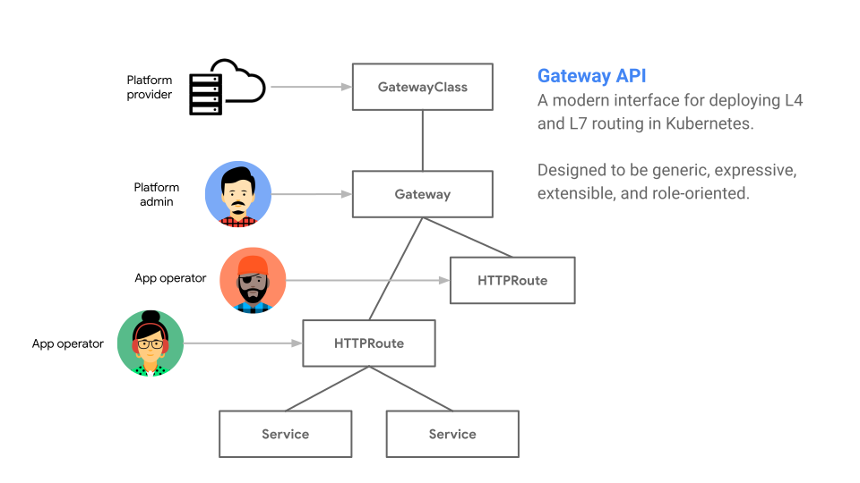
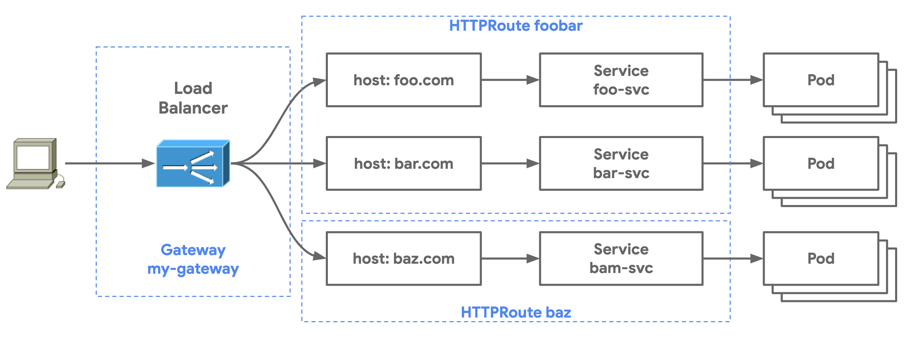
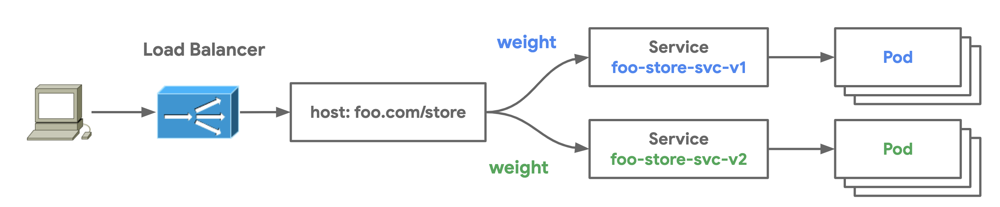

# Gateway API Tutorial

This guide shows how to use the open source Gateway API from the [service-apis Kubernetes SIG](https://kubernetes-sigs.github.io/service-apis/) to deploy routing to an istio-ingressgateway. The Gateway API is an effort by a consortioum of companies to evolve the current Kubernetes Ingress API. Gateway aims to improve upon Ingress by becoming a more expressive, extensible, role-oriented API while remaining a generic routing API that has many implementations and broad industry support. 

#### How does Gateway improve upon Ingress?

- **More expressive** - It includes core functionality for header-based matching, traffic weighting, and other capabilities that were only possible through custom means in the Ingress spec.
- **More extensible** - It allows for custom resources to be linked at multiple layers within its resources. This allows for more granular customization at the appropriate places within the API structure.
- **Role oriented** - It is broken into API resources that map to the types of roles that commonly deploy and configure load balancing.
- **Generic** - This isn't an improvement but rather something that should stay the same. Just as Ingress is a universal specification with [numerous implementations](https://kubernetes.io/docs/concepts/services-networking/ingress-controllers/), Gateway is designed to be a portable specification for many implementations.

Some other notable capabilities include ...

- **Shared Gateways** - It allows the sharing of load balancers and VIPs by permitting independent Route resources to bind to the same Gateway. This allows teams to share infrastructure safely without requiring direct coordination. 
- **Typed backend references** - With typed backend references Routes can reference Kubernetes Services, but also any kind of Kubernetes resource that is designed to be a Gateway backend.
- **Cross-Namespace references** - Routes across different Namespaces can bind to Gateways. This allows for shared networking infrastructure despite Namespace segementation for workloads.
- **Classes** - GatewayClasses formalize types of load balancing implementations. These classes make it easy and explicit for users to understand what kind of capabilities are available as a resource model itself.

The Gateway API is currently pre-Alpha. If you have feedback or would like to get involved, feel free to attend the [weekly community meetings](https://kubernetes-sigs.github.io/service-apis/community/#meetings) or [file issues](https://github.com/kubernetes-sigs/service-apis/issues/new/choose) against the service-apis repo. Below is a tutorial that demonstrates the usage of the Gateway API resources. We hope that you will find it helpful in understanding the core capabilities offered by this API.



### Tutorial Setup

The Gateway API is a generic interface that has no reference implementation. There are several implementations of Gateway that exist or are currently being built. To show a tangible and easily reproducable example, this tutorial uses the `istio` GatewayClass and is thus implemented via the Istio control plane. Throughout this guide you will install a minimal deployment of Istio as an Istio Gateway controller  (no sidecars), an example application [whereami](https://github.com/GoogleCloudPlatform/kubernetes-engine-samples/tree/master/whereami), and resources from the Gateway API to configure application routing. This tutorial was tested on Google Kubernetes Engine (GKE) 1.17.x, but could be deployed just as easily on any Kubernetes cluster.

#### Istio Installation Steps

```bash
# Install Kubernetes API CRDs. These will not be installed by Istio
kubectl apply -k 'github.com/kubernetes-sigs/service-apis/config/crd?ref=56154e7bfde5ebf1a04f45be7abdf983a11c6a32'
# Deploy Istio
kubectl apply -k 'github.com/howardjohn/service-apis-demo'
# Wait for things to get started
kubectl wait --for=condition=Available deployment --all --timeout=120s -n istio-system
```

#### Tutorial Variables

LoadBalancer

```shell
export INGRESS_HOST=$(kubectl -n istio-system get service istio -o jsonpath='{.status.loadBalancer.ingress[0].ip}')
export INGRESS_PORT=$(kubectl -n istio-system get service istio -o jsonpath='{.spec.ports[?(@.name=="http")].port}')
export INGRESS_PORT_HTTPS=$(kubectl -n istio-system get service istio -o jsonpath='{.spec.ports[?(@.name=="https")].port}')
```

NodePort

```shell
export INGRESS_HOST=$(kubectl -n istio-system get pod -lapp=istio -o jsonpath='{.items[0].status.hostIP}')
export INGRESS_PORT=$(kubectl -n istio-system get svc istio -ojsonpath='{.spec.ports[?(@.name=="http")].nodePort}')
export INGRESS_PORT_HTTPS=$(kubectl -n istio-system get svc istio -ojsonpath='{.spec.ports[?(@.name=="https")].nodePort}')
```


## Gateway Tutorial

The following tutorial explores different resources of the Gateway API. It goes through four different examples of Gateway that have increasing complexity to demonstrate aspects of the API.

- [Single Service Gateway](./single-service-gateway) shows the simplest possible Gateway which matches all traffic and sends it to a single Service.
- [Multi-Service Gateway](./multi-service-gateway) shows a very typical Gateway deployment where an HTTPRoute with multiple routing rules matches and routes traffic to a group of different Services.
- [Multi-Route Gateway](./multi-route-gateway) shows how a Gateway can be shared by multiple HTTPRoute resources to enable shared infrastructure between many independent groups of users.
- [Traffic Split](./traffic-split) demonstrates how traffic can be gracefully split between multiple Services to achieve blue-green traffic deployments.

Pull this repo to your local environment. All commands should be run from the `/service-apis-demo` folder. Before starting the tutorial install the demo application and gateway-demo Namespace in your cluster. Switch your context to the gateway-demo Namespace for easier configuration and inspection.

```bash
$ kubectl apply -f demo-app.yaml
namespace/gateway-demo created
deployment.apps/foo created
service/foo-svc created
deployment.apps/bar created
service/bar-svc created
deployment.apps/l7-default-backend created
service/default-backend created

$ kubectl config set-context --current --namespace=gateway-demo
Context "gke-us-east" modified.
```

You're now ready to begin the tutorial!

### GatewayClass

The `GatewayClass` is a resource that defines a template for L4 and L7 load balancers in a Kubernetes cluster. `GatewayClasses` are instantiated as `Gateways` which represent running load balancer instances. `Gateways` can be implemented by different controllers, often with different configuration. Each `Gateway` should specify a class, a reference to a `GatewayClass` resource that contains additional configuration including the name of the controller that should implement the class. `GatewayClass` resources contain an optional parameters field. This can be used to reference additional configuration for this class.

1. The following `istio GatewayClass` allows Gateways of this class type to be created in the cluster. Note that the `GatewayClass` exists in the cluster Namespace and thus could be deployed as a Gateway in any Namespace (if RBAC rules permit it). 

```yaml
apiVersion: networking.x-k8s.io/v1alpha1
kind: GatewayClass
metadata:
  name: istio
spec:
  controller: istio.io/gateway-controller
```

2. Deploy the GatewayClass in the cluster.

```bash
$ kubectl apply -f gatewayclass.yaml

gatewayclass.networking.x-k8s.io/istio created
```

### Gateway

A Gateway is the instantiation of a GatewayClass. Gateways route traffic to Services within the cluster. They process incoming requests defined by their Routes to Service backends. Gateways define where and how the load balancing data plane is listening for traffic. Gateways are deployed through the respective Gateway controller which could be a cluster-hosted software controller, a cloud Gateway controller, or a controller for hardware data planes. Routes are resources that bind to Gateways. This binding allows a Route to configure routing rules for how a Gateway processes traffic.

The following Gateway is of the `istio` GatewayClass. A Gateway listener is required which specifies the following Gateway attributes:

- The port where a Gateway is listening
- The protocol that the Gateway is listening for
- The type of resources that may bind to the Gateway. In this case the HTTPRoute resource is specified. Even more granular filters can be specified to limit what can bind to the `simple-gateway` including resource type, Namespace selection, and label selectors.

```yaml
apiVersion: networking.x-k8s.io/v1alpha1
kind: Gateway
metadata:
  name: my-gateway
  namespace: gateway-demo
spec:
  class: istio
  listeners:
  - port: 80
    protocol: HTTP
    routes:
      resource: httproutes
```

Gateways are flexible resources and they can be deployed in multiple ways depending on how the administration of a load balancer is shared or partitioned between different groups within an organization. This role-oriented design allows partitioning of portions of the load balancer configuration. The deployment of Gateways require the usage of three different resources:

- GatewayClass which defines the template for the Gateway
- Gateway which instantiates a load balancer
- *Route which defines routing rules and backends for the load balancer


### HTTPRoute

Route resources define protocol-specific rules for mapping requests from a Gateway to Kubernetes Services. A Route is pure configuration and has no effect unless it is bound to a Gateway.

A Route resource has a list of one or more route rules. Each rule has three clauses:

- **Match** defines a matching predicate such as `path = "/app"` or `headers["x-my-app"] == "bar"`. The match determines which kind of traffic is being filtered for in this route rule.
- **Filter** modifies the request or response inline with the request flow. Filters might rewrite paths or add additional headers.
- **Action** defines the final destination for the request. The most common action will be to direct matching traffic to a specific Kubernetes Service, but other actions are also possible such as specific response status codes, redirects, or custom extensions.

Note that the match and filter clauses are optional while action is required so that the Gateway knows how to direct and process the traffic. The following HTTPRoute has a hostname match for `foo.com`. For all `foo.com` traffic it also applies matches for the `env: stage` and `env: canary` headers, sending the traffic to respective stage and canary Services.

```yaml
kind: HTTPRoute
apiVersion: networking.x-k8s.io/v1alpha1
metadata:
 name: header-match-route
spec:
 hosts:
  - hostnames: [foo.com]
    rules:
    - match:
        headers:
          env: stage
      action:
        forwardTo:
        - targetRef:
            name: foo-svc-stage
    - match:
        headers:
          env: canary
      action:
        forwardTo:
        - targetRef:
            name: foo-svc-canary
```


### Gateway Deployment Models

The flexibility of the Gateway API allows for many different deployment models depending on the use-case and the organizational boundaries and ownership of applications and infrastructure. The following deployment models show how Routes and Gateways can be combined to create different ownership boundaries.

- **Single-Service Gateways** in which the Gateway and the Route map to a single Service or application
- **Multi-Service Gateways** in which a Gateway and Route map to multiple backend Services through host, path, or header-based routing
- **Multi-Route Gateways** in which multiple Route resources share the same Gateway. This allows for multiple independent teams to share the same underlying load balancer without any direct coordination.

#### Single-Service Gateways

Single-Service Gateways have a single owner that deploys both the Route and the Gateway. 

3. Deploy the `simple-gateway` example was shown earlier.

```bash
$ kubectl apply -f single-service-gateway/gateway.yaml

gateway.networking.x-k8s.io/simple-gateway created
```

We'll deploy the following HTTPRoute. It matches for traffic all traffic and has a single route rule which forwards that traffic to `foo-svc`.

```yaml
apiVersion: networking.x-k8s.io/v1alpha1
kind: HTTPRoute
metadata:
  name: simple-route
  namespace: gateway-demo
spec:
  hosts:
  - hostnames: ["*"]
    rules:
    - action:
        forwardTo:
        - targetRef:
            name: foo-svc
```

4. Deploy `simple-route` in your cluster:

```bash
$ kubectl apply -f single-service-gateway/httproute.yaml

httproute.networking.x-k8s.io/simple-route created
```

Once a Gateway and Route are deployed to your Kubernetes cluster, the Gateway controller will configure load balancer and routing rules within the data plane.


5. Now send traffic to the load balancer IP and port that was captured in the lab setup. Since all traffic is captured by this Gateway and HTTPRoute, no additional host headers are necessary. This Gateway will capture all HTTP traffic to its listeners, no matter what the HTTP traffic is.

```bash
$ curl http://$INGRESS_HOST:$INGRESS_PORT -s | jq .

{
  "cluster_name": "gke-us-east",
  "host_header": "35.236.237.225",
  "metadata": "foo",
  "node_name": "gke-gke-us-east-default-pool-96ad63bd-p6lc.c.church-243723.internal",
  "pod_name": "foo-5cc954d898-ltxp6",
  "pod_name_emoji": "🔶",
  "project_id": "church-243723",
  "timestamp": "2020-08-16T17:01:24",
  "zone": "us-east4-a"
}
```


### Multi-Service Gateways

Multi-Service Gateways are simply Gateways with Routes that have more than one routing rule. These Gateways will map to multiple Services and thus multiple application backends. The following HTTPRoute matches on `foo.com` and `bar.com` and sends traffic to foo-svc and bar-svc respectively. Any traffic to the Gateway that doesn't match will be sent to the default-backend Service which is configured to respond with an HTTP 404.

```yaml
apiVersion: networking.x-k8s.io/v1alpha1
kind: HTTPRoute
metadata:
  name: foobar-route
  namespace: gateway-demo
spec:
  hosts:
  - hostnames: ["foo.com"]
    rules:
    - action:
        forwardTo:
        - targetRef:
            name: foo-svc
  - hostnames: ["bar.com"]
    rules:
    - action:
        forwardTo:
        - targetRef:
            name: bar-svc
  - rules:
    - action:
        forwardTo:
        - targetRef:
            name: default-backend
```

The following steps will deploy foobar-route to demonstrate more complex routing logic than the single Service Gateway.

6. First, delete the previous HTTPRoute that was configured. Because both the Gateway and HTTPRoute match on all traffic, we want to remove these broad matches to avoid Route merging (at this stage in the example anyways).

```bash
$ kubectl delete httproute simple-route

httproute.networking.x-k8s.io "simple-route" deleted
```

7. Now deploy foobar-route in your cluster.

```bash
$ kubectl apply -f multi-service-gateway/httproute.yaml

httproute.networking.x-k8s.io/foobar-route created
```

The following routing rules should now be configured on your load balancer.


8. We can test traffic against these routing rules with the following queries. The returned metadata field proves that traffic is being returned by the correct backends.

```
$ curl http://$INGRESS_HOST:$INGRESS_PORT -H "host: foo.com" -s | jq .metadata
"foo"

$ curl http://$INGRESS_HOST:$INGRESS_PORT -H "host: bar.com" -s | jq .metadata
"bar"
```


#### Multi-Route Gateways

Multi-route Gateways are Gateways referenced by multiple routes. Unlike the Ingress resource, Gateway and Route resources are independent of each other which allows a one-to-many relationship between a Gateway and Routes. This allows teams to safely share load balancer infrastructure without direct coordination. The following steps will deploy multiple HTTPRoute resources against a shared Gateway. Furthermore, the HTTPRoute and Service are hosted in a separate Kubernetes Namespace illustrating the capability for cross-Namespace reference between Gateways and HTTPRoutes.



9. Deploy the `baz` application with the following command:

```bash
$ kubectl apply -f multi-route-gateway/baz-demo-app.yaml

deployment.apps/baz created
service/baz-svc created
```

This HTTPRoute defines traffic matching for `baz.com`. It also matches specific paths and applies headers for those paths.

```yaml
apiVersion: networking.x-k8s.io/v1alpha1
kind: HTTPRoute
metadata:
  name: baz-route
  namespace: gateway-demo
spec:
  hosts:
  - hostnames: ["baz.com"]
    rules:
    - match:
        path: /store
      action:
        forwardTo:
        - targetRef:
            name: baz-svc
    - match:
        path: /profile
      action:
        forwardTo:
        - targetRef:
            name: baz-svc
```

10. Apply this HTTPRoute to your cluster.

```bash
$ kubectl apply -f multi-route-gateway/baz-httproute.yaml

httproute.networking.x-k8s.io/baz-route created
```

11. Now send some traffic to verify that the right traffic is being matched by your Gateway.

```bash
$ curl http://$INGRESS_HOST:$INGRESS_PORT/store -H "host: baz.com" -s | jq .metadata

"baz"
```

Multi-Route Gateways are powerful because they allow application owners to share the same load balancing infrastructure without direct coordination and in a safe manner. Individual path matches or header rewrites can be controlled entirely by a single team through their own HTTPRoute resource without having to fully manage an entire load balancer. The Gateway can still be controlled by an infrastructure team, independently of the application owners.

### Traffic Splitting

HTTPRoutes also have the capability to define weights which split traffic between different targets within a route rule. `weight` is part of the `action.forwardTo` clause which can define multiple weighted targets as a part of a single route rule. The following HTTPRoute resource specifieds an 80/20 traffic split between two versions of an application. In simplified terms, of the traffic sent to the Gateway's listeners that matches `foo.com/store`, 80% of it will be sent to `foo-store-svc-v1` and 20% of it will be sent to `foo-store-svc-2`.



```yaml
apiVersion: networking.x-k8s.io/v1alpha1
kind: HTTPRoute
metadata:
  name: foo-store-route
  namespace: gateway-demo
spec:
  hosts:
  - hostnames: ["foo.com"]
    rules:
    - match:
        path: /store
      action:
        forwardTo:
        - targetRef:
            name: foo-store-svc-v1
          weight: 80
        - targetRef:
            name: foo-store-svc-v2
          weight: 20
```

12. To try out traffic splitting in action, deploy the following manifest which deploys two different versions of the same application into the `gateway-demo` Namespace.

```bash
$ kubectl apply -f traffic-split/foo-store-demo-app.yaml

deployment.apps/foo-store-v1 created
service/foo-store-svc-v1 created
deployment.apps/foo-store-v2 created
service/foo-store-svc-v2 created
```

13. Now apply step 1 of the traffic split Route. When we inspect `foo-store-route` we can see that 100% of the traffic is configured to go to v1.

```bash
$ kubectl apply -f traffic-split/traffic-split-httproute-1.yaml
httproute.networking.x-k8s.io/foo-store-route created

$ kubectl describe httproute foo-store-route
Name:         foo-store-route
Namespace:    gateway-demo
Labels:       <none>
API Version:  networking.x-k8s.io/v1alpha1
Kind:         HTTPRoute
Spec:
  Hosts:
    Hostnames:
      foo.com
    Rules:
      Action:
        Forward To:
          Target Ref:
            Group:     core
            Name:      foo-store-svc-v1
            Resource:  services
          Weight:      100
          Target Ref:
            Group:     core
            Name:      foo-store-svc-v2
            Resource:  services
          Weight:      0
      Match:
        Path:  /store
```

14. In a separate shell, start a continuous curl to demonstrate the traffic split. At this point in time all responses should be coming from v1 of the application.

```bash
$ while true; do curl http://$INGRESS_HOST:$INGRESS_PORT/store -H "host: foo.com" -s | jq '[.pod_name, .timestamp]' -cr; sleep 1; done

["foo-store-v1-66df6b4f69-v6m9k","2020-08-16T19:53:22"]
["foo-store-v1-66df6b4f69-v6m9k","2020-08-16T19:53:23"]
["foo-store-v1-66df6b4f69-v6m9k","2020-08-16T19:53:25"]
...
```

15. Now apply the 2nd stage of the traffic split to start gracefully shifting 20% of the traffic to v2.

```bash
$ kubectl apply -f traffic-split/traffic-split-httproute-2.yaml
httproute.networking.x-k8s.io/foo-store-route configured
```

In the other shell, observe the change in traffic behavior. You should now see that roughly 20% of the responses are coming from v2.

```bash
["foo-store-v2-77fbd98c7f-5qk6c","2020-08-16T19:55:50"]
["foo-store-v1-66df6b4f69-v6m9k","2020-08-16T19:55:51"]
["foo-store-v1-66df6b4f69-v6m9k","2020-08-16T19:55:53"]
["foo-store-v2-77fbd98c7f-5qk6c","2020-08-16T19:55:54"]
["foo-store-v1-66df6b4f69-v6m9k","2020-08-16T19:55:55"]
["foo-store-v1-66df6b4f69-v6m9k","2020-08-16T19:55:56"]
["foo-store-v1-66df6b4f69-v6m9k","2020-08-16T19:55:58"]
...
```

16. Now that we've observed that v2 responses are performing as expected without errors, we can apply the final step of the traffic split and shift all traffic over to v2.

```bash
$ kubectl apply -f traffic-split/traffic-split-httproute-3.yaml
httproute.networking.x-k8s.io/foo-store-route configured
```

Again, validate the responses in the other shell to ensure that v2 is now handilng all of the traffic.

```bash
...
["foo-store-v2-77fbd98c7f-5qk6c","2020-08-16T19:58:05"]
["foo-store-v2-77fbd98c7f-5qk6c","2020-08-16T19:58:07"]
["foo-store-v2-77fbd98c7f-5qk6c","2020-08-16T19:58:08"]
["foo-store-v2-77fbd98c7f-5qk6c","2020-08-16T19:58:09"]
...
```


### Clean up

To delete everything that was created in the `gateway-demo` Namespace, issue the following command.

```bash
$ kubectl delete -R -f ./service-apis-demo -n gateway-demo
namespace "gateway-demo" deleted
deployment.apps "foo" deleted
service "foo-svc" deleted
deployment.apps "bar" deleted
service "bar-svc" deleted
deployment.apps "l7-default-backend" deleted
service "default-backend" deleted
namespace "istio-system" deleted
service "istio" deleted
deployment.apps "istio" deleted
serviceaccount "istio" deleted
clusterrole.rbac.authorization.k8s.io "istio" deleted
clusterrolebinding.rbac.authorization.k8s.io "istio" deleted
configmap "istio" deleted
gatewayclass.networking.x-k8s.io "istio" deleted
secret "service-apis-cert" deleted
ingress.networking.k8s.io "ingress" deleted
namespace "service-apis-demo" deleted
deployment.apps "httpbin" deleted
service "httpbin" deleted
deployment.apps "baz" deleted
service "baz-svc" deleted
httproute.networking.x-k8s.io "baz-route" deleted
httproute.networking.x-k8s.io "foobar-route" deleted
gateway.networking.x-k8s.io "simple-gateway" deleted
```

