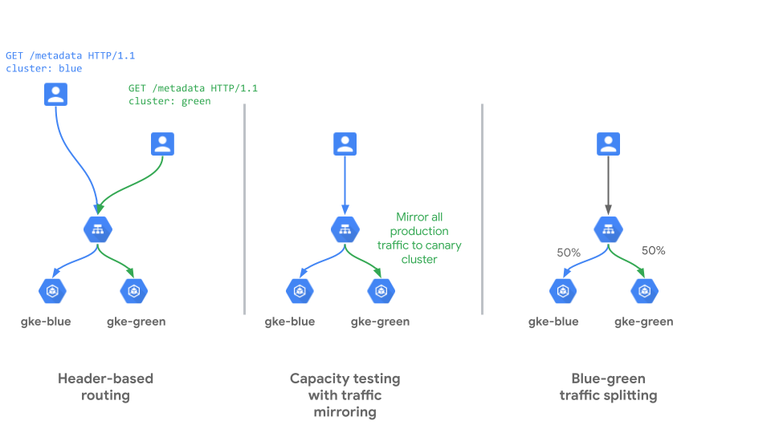

# Multi-Cluster Gateway Blue/Green Cluster Pattern (internal)

Multi-cluster Gateway for GKE is a cloud-hosted [Gateway API](https://gateway-api.sigs.k8s.io/) controller for GKE clusters. It's a Google-hosted service that supports deploying shared load balancing resources across clusters and across regions.

> Note: in this guide, *MCG* will be used as shorthand for Multi-cluster Gateway.

### Use-case

The MCG Blue/Green cluster pattern is designed to address Kubernetes cluster lifecycle use cases where a given GCP region has two or more GKE clusters hosting the same application(s). 

Redundant GKE clusters are commonly deployed so that one cluster can be removed from service at a time, upgraded, and returned to service, while the other cluster(s) continue to service client traffic. Within this example recipe, we will leverage the Gateway API's expressive feature surface to implement the following:

- Traffic mirroring to a new set of resources to confirm readiness for release
- Traffic weighting across clusters to enable the [canary release](https://martinfowler.com/bliki/CanaryRelease.html) pattern
- Header-based routing to target specific clusters



In this example, both clusters reside in the same GCP region to demonstrate a blue/green upgrade pattern where one cluster at a time can be removed from service, upgraded, and returned to service, all while clients can continue to access a given application. Additionally, this example uses a `GatewayClass` of type `gke-l7-rilb-mc`, meaning the MCG endpoint will be a *private* IP address within your VPC. For testing, the infrastructure build instructions include the deployment of a GCE virtual machine in the same VPC that will be used as the test client.

### Relevant documentation

- [Gateway API](https://cloud.google.com/kubernetes-engine/docs/concepts/gateway-api)
- [Gateway API resources](https://cloud.google.com/kubernetes-engine/docs/concepts/gateway-api#gateway_resources)
- [Deploying Gateways](https://cloud.google.com/kubernetes-engine/docs/how-to/deploying-gateways)

### Manifest samples

Before you get hands-on, let's look at some snippets of the various Custom Resources used in this recipe to understand what you'll be building.

A `Gateway` resource represents a load balancing resource and its associated configuration. The following example references the `GatewayClass` of type `gke-l7-rilb-mc`, meaning the `Gateway` is a multi-cluster [internal Layer 7 load balancer on GCP](https://cloud.google.com/load-balancing/docs/l7-internal):
```YAML
kind: Gateway
apiVersion: networking.x-k8s.io/v1alpha1
metadata:
  name: multi-cluster-gateway
  namespace: mcgi-bg
spec:
  gatewayClassName: gke-l7-rilb-mc # Layer 7 internal load balancer, accessible via private IPs within its VPC
  listeners:  
  - protocol: HTTP
    port: 80 # listening on port 80
    routes:
      kind: HTTPRoute
      selector:
        matchLabels:
          gateway: multi-cluster-gateway
```

A `ServiceExport` resource is used to expose a Kubernetes [service](https://kubernetes.io/docs/concepts/services-networking/service/) in a given cluster for use in a multi-cluster gateway:
```YAML
# expose the sample-app-blue service to a multi-cluster gateway
kind: ServiceExport
apiVersion: net.gke.io/v1
metadata:
  name: sample-app-blue # maps to a service object
  namespace: mcgi-bg
```

A `ServiceImport` resource is used to consume a `ServiceExport` from a given cluster for use in a multi-cluster gateway when it is referenced in an `HTTPRoute` resource. The `HTTPRoute` resource specifies how requests to a given `Gateway` are routed to backend services:
```YAML
kind: HTTPRoute
apiVersion: networking.x-k8s.io/v1alpha1
metadata:
  name: sample-app-route
  namespace: mcgi-bg
  labels:
    gateway: multi-cluster-gateway # attached to a Gateway
spec:
  rules:
  - forwardTo:
    - backendRef: 
        group: net.gke.io
        kind: ServiceImport
        name: sample-app-blue # maps to a ServiceExport (in this case, from gke-blue)
      port: 8080
      weight: 100
```

### Try it out

1. Download this repo and navigate to this folder

    ```bash
    $ git clone https://github.com/GoogleCloudPlatform/gke-networking-recipes.git
    Cloning into 'gke-networking-recipes'...

    $ cd gke-networking-recipes/multi-cluster-gateway/multi-cluster-gateway-internal-bluegreen
    ```

2. Deploy and configure your GCP project, the two clusters (`gke-blue` and `gke-green`) and your client VM (`client-vm`), as specified in [environment setup](./environment-setup.md)

3. Deploy the application to the `gke-blue` & `gke-green` clusters

    ```bash
    $ kubectl --context gke-blue apply -f cluster-blue-app.yaml
    namespace/mcgi-bg created
    deployment.apps/sample-app created
    service/sample-app-blue created
    serviceexport.net.gke.io/sample-app-blue created
    service/sample-app created
    serviceexport.net.gke.io/sample-app created
    ```
    ```bash
    $ kubectl --context gke-green apply -f cluster-green-app.yaml
    namespace/mcgi-bg created
    deployment.apps/sample-app created
    service/sample-app-green created
    serviceexport.net.gke.io/sample-app-green created
    service/sample-app created
    serviceexport.net.gke.io/sample-app created
    ```
4. Deploy the `gateway` resource to the config cluster (in this case, `gke-blue`)

    ```bash
    $ kubectl --context gke-blue apply -f gateway.yaml
    namespace/mcgi-bg unchanged
    gateway.networking.x-k8s.io/multi-cluster-gateway created
    ```

5. Capture the [private IP address](https://en.wikipedia.org/wiki/Private_network) of the Multi-cluster Gateway

    ```bash
    $ kubectl --context gke-blue -n mcgi-bg get gateway multi-cluster-gateway -o=jsonpath="{.status.addresses[0].value}"
    10.128.0.27 # example - save this for use in step 7
    ```

6. Deploy step 1 of the `HTTPRoute` configuration, where we are routing traffic only to `gke-blue`

    ```bash
    $ kubectl --context gke-blue apply -f route-step-1-single-cluster.yaml
    httproute.networking.x-k8s.io/sample-app-route created
    ```

7. SSH to the `client-vm` and run `curl` a few times against the private IP from step 5 to verify responses from `gke-blue`

    ```bash
    $ export MCG_IP=10.128.0.27 # replace with the private IP from step 5 - this will vary based on deployment
    $ curl $MCG_IP
    {
    "cluster_name": "gateway-test-01", 
    "host_header": "vpc-proxy-fund7nzpqa-uc.a.run.app", 
    "metadata": "sample-app-blue", 
    "node_name": "gke-gateway-test-01-default-pool-77e722e1-1ehu.c.am01-gateway-test.internal", 
    "pod_name": "sample-app-57659bccc-br952", 
    "pod_name_emoji": "🗄", 
    "project_id": "am01-gateway-test", 
    "timestamp": "2021-04-22T06:57:33", 
    "zone": "us-central1-f"
    }
    ```

8. Before we add `gke-green` to the service, mirror traffic to the pods on `gke-green` so we can verify that it's handling traffic correctly

    ```bash
    $ kubectl --context gke-blue apply -f route-step-2-mirroring.yaml
    ```

    From your `client-vm`, start sending requests continuously
    ```bash
    $ while true; curl http://$MCG_IP; done
    ```

    Back on your workstation, tail the pod logs on `gke-green` to validate that it's receiving the mirrored traffic

    > Note: the `WARNING` messages in the pod logs are expected
    ```bash
    $ kubectl --context gke-green -n mcgi-bg logs -f deployment/sample-app --all-containers=true --since=1m
    2021-04-22 17:43:12,355 - werkzeug - INFO - 35.191.8.79 - - [22/Apr/2021 17:43:12] "GET / HTTP/1.1" 200 -
    2021-04-22 17:43:12,623 - root - WARNING - Unable to capture pod namespace.
    2021-04-22 17:43:12,623 - root - WARNING - Unable to capture pod IP address.
    2021-04-22 17:43:12,623 - root - WARNING - Unable to capture pod KSA.
    2021-04-22 17:43:12,623 - werkzeug - INFO - 35.191.8.85 - - [22/Apr/2021 17:43:12] "GET / HTTP/1.1" 200 -
    2021-04-22 17:43:12,935 - root - WARNING - Unable to capture pod namespace.
    2021-04-22 17:43:12,935 - root - WARNING - Unable to capture pod IP address.
    2021-04-22 17:43:12,936 - root - WARNING - Unable to capture pod KSA.
    2021-04-22 17:43:12,936 - werkzeug - INFO - 10.6.240.21 - - [22/Apr/2021 17:43:12] "GET / HTTP/1.1" 200 -
    2021-04-22 17:43:15,050 - root - WARNING - Unable to capture pod namespace.
    2021-04-22 17:43:15,050 - root - WARNING - Unable to capture pod IP address.
    2021-04-22 17:43:15,050 - root - WARNING - Unable to capture pod KSA.
    2021-04-22 17:43:15,051 - werkzeug - INFO - 10.6.240.19 - - [22/Apr/2021 17:43:15] "GET / HTTP/1.1" 200 -
    ```

9. Now perform a canary release to `gke-green` by sending 10% of traffic to the `sample-app-green` `ServiceImport`
    ```bash
    $ kubectl --context gke-blue apply -f route-step-3-canary.yaml
    ```

    From your `client-vm`, start sending continous requests to the `metadata` path of your service, which will filter out the response to only include information about source of the response. If the canary is working correctly, roughly 10% of the responses should be from `gke-green`

    ```bash
    $ while true; curl http://$MCG_IP/metadata; printf "\n"; done
    sample-app-blue
    sample-app-blue
    sample-app-blue
    sample-app-green # <----- coming from gke-green
    sample-app-blue
    sample-app-blue
    sample-app-blue
    sample-app-blue
    ```

10. Now that you know that `gke-green` is handling traffic correctly, we can move to an explicit 50/50 split of traffic between the clusters

    ```bash
    $ kubectl --context gke-blue apply -f route-step-4a-explicit-even-split.yaml
    ```

    On the `client-vm`, verify that there's a roughly 50/50 split

    ```bash
    $ while true; curl http://$MCG_IP/metadata; printf "\n"; done
    sample-app-blue
    sample-app-green
    sample-app-blue
    sample-app-green
    sample-app-green
    sample-app-blue
    sample-app-green
    ```

11. Transition from an *explicit* 50/50 traffic split (that reference two different, cluster-specific `ServceImports`) to an *implicit* 50/50 traffic split by using a common `ServiceImport` across both clusters

    ```bash
    $ kubectl --context gke-blue apply -f route-step-4b-implicit-even-split.yaml
    ```

12. Complete this tutorial by enabling header-based routing to specific clusters in your `HTTPRoute` configuration

    ```bash
    $ kubectl --context gke-blue apply -f route-step-5-header-routing.yaml
    ```

    Now, from the `client-vm`, include a `Cluster` header in your requests. This can be used to explicitly route requests to a given cluster

    ```bash
    $ curl http://$MCG_IP/metadata --Header "Cluster: cluster-blue"
    sample-app-blue
    $ curl http://$MCG_IP/metadata --Header "Cluster: cluster-green"
    sample-app-green
    ```

13. If you're done testing out this recipe, please clean up the infrastructure resources associated with it