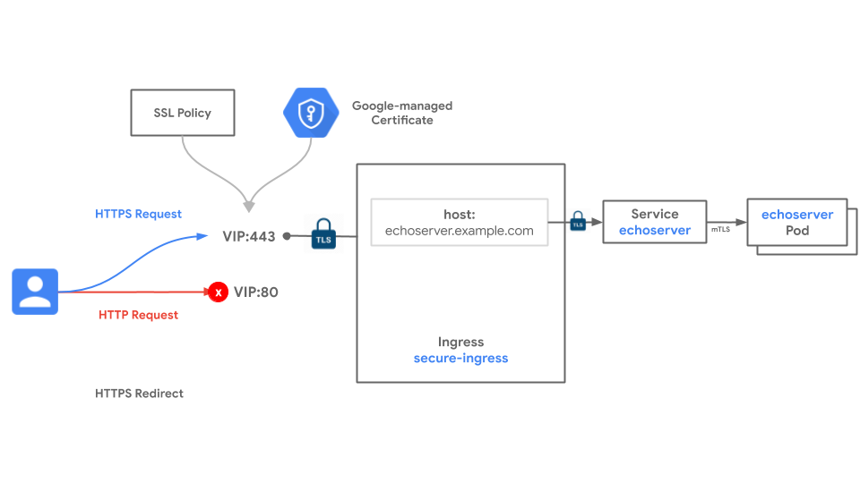

# Istio Ingress End to End TLS

[Istio Ingress Gateway](https://istio.io/v1.7/docs/tasks/traffic-management/ingress/ingress-control/) is typically used to expose applications inside an Istio Mesh to the outside world. Default installations deploys the Istio Ingress Gateway behind a Network Load Balancer (L4 LB) on GCP and have the Ingress gateway perform L7 capabilities like terminating TLS and path based routing. This recipe demonstrate how we can deploy an Istio Ingress Gateway behind a GCLB with Ingress, how to configure End to End Encryption From the User to the application pod and how to take advantage of some [GKE Ingress features](https://cloud.google.com/kubernetes-engine/docs/how-to/ingress-features#request_headers) to define policies and customize HealthCheck.

Deploying the Istio Ingress Gateway behind GCLB has many advantages:
- Defense on the edge instead of inside the Cluster using Google Global Load Balancers.
- Using [Cloud Armor](https://cloud.google.com/armor) to implement WAF or IP/Location restrictions on the edge
- Using [Google Managed Certificates](https://cloud.google.com/kubernetes-engine/docs/how-to/managed-certs) on the edge which are trusted by most clients. Although in this recipes we will also configure TLS between GCLB and the Mesh, those certificates are only used internally and cab self-signed.

### Use-cases

- Deploying Istio with an Ingess Gateway and mTLS enabled 
- Exposing the Istio Ingress Gateway behind an HTTPS encrypted Load Balancer
- Configuring encryption between the Load Balancers and the Istio Ingress Gateway
- Granular control of HTTPS functionality through SSL Policies.
- Customizing GCLB HealthCheck paths and ports 

### Relevant documentation

- [GKE Ingress Concepts](https://cloud.google.com/kubernetes-engine/docs/concepts/ingress)
- [GKE Ingress Features](https://cloud.google.com/kubernetes-engine/docs/how-to/ingress-features)
- [Ingress for External HTTP(S) Load Balancing](https://cloud.google.com/kubernetes-engine/docs/concepts/ingress-xlb)
- [Google-managed SSL Certificates](https://cloud.google.com/kubernetes-engine/docs/how-to/managed-certs)
- [Secure Istio Gateway](https://istio.io/v1.7/docs/tasks/traffic-management/ingress/secure-ingress/)

#### Versions & Compatibility

- The [BackendConfig CRD](https://cloud.google.com/kubernetes-engine/docs/how-to/ingress-features#associating_backendconfig_with_your_ingress)  is only supported on GKE 1.16.15-gke.4091+.
- This recipes uses the latest release of [Istio 1.7](https://istio.io/v1.7/). It should also work with Istio 1.6.
- This Recipe have been tested and validated with [GKE 1.16.15-gke.4901](https://cloud.google.com/kubernetes-engine/docs/release-notes#november_12_2020_r37) and [Istio 1.7.5](https://istio.io/v1.7/) on Dec 2nd 2020

This recipe exposes one Service hosted on GKE to the internet through an Ingress resource. The Ingress leverages HTTPS to encrypt all traffic between the internet client and the Google Cloud load balancer. This recipe also leverages [Google-managed certificates](https://cloud.google.com/load-balancing/docs/ssl-certificates/google-managed-certs) to autogenerate the public certificate and attach it to the Ingress resource. This removes the need to self-generate and provide certificates for the load balancer. 

In addition to encrpting the client to GCLB traffic, we are also enabling [Secure Istio Gateways](https://istio.io/v1.7/docs/tasks/traffic-management/ingress/secure-ingress/) with a self-signed certificate. Additional security policies are used to more granularly control the HTTPS behavior. [SSL policies](https://cloud.google.com/load-balancing/docs/ssl-policies-concepts) give the administrator the ability to define what kind of SSL and TLS negotiations that are permitted with this Ingress resource. Lastly we are enabling [mTLS](https://istio.io/v1.7/docs/reference/config/istio.mesh.v1alpha1/#MeshConfig) on Istio to ensure traffic between the Istio Ingress Gateway and the application pod is encrypted and authenticated, effectively acheiving End-2-End Encryption



### Istio Manifest

You will be using the [Istio Operator API](https://istio.io/latest/docs/setup/install/operator/) to customize the Istio installation.

Looking at the operator file below, here a breakdown of the cutomization needed.

- `enableAutoMtls`: enabled mTLS everywhere
- `k8s`: ovveride the Service definition of the `istio-ingressgateway` and enabled two ports. `443` for application traffic and `15021` for health-check. We are disabling port `80` here.
- `service_annotations`: there are three annotations:
  - `cloud.google.com/neg`: Enables [Container Native Load Balancing](https://cloud.google.com/kubernetes-engine/docs/how-to/container-native-load-balancing).
  - `cloud.google.com/backend-config`: Associates a `BackenConfig` with `istio-ingressgateway` the Service. See below for more details.
  - `cloud.google.com/app-protocols`: Indicates to the LoadBalancer that the backend if HTTPS.

```yaml
apiVersion: install.istio.io/v1alpha1
kind: IstioOperator
spec:
  profile: default
  meshConfig:
    accessLogFile: /dev/stdout
    outboundTrafficPolicy: 
      mode: ALLOW_ANY
    enableAutoMtls: true
  components:
    ingressGateways:
    - name: istio-ingressgateway
      enabled: true
      k8s:
        service:
          type: ClusterIP
          ports:
          - name: status-port
            port: 15021
            targetPort: 15021
          - name: https
            port: 443
            targetPort: 8443
        service_annotations:
          cloud.google.com/neg: '{"ingress": true}'
          cloud.google.com/backend-config: '{"default":"istio-ingress-be-config"}'
          cloud.google.com/app-protocols: '{"https":"HTTPS"}'
```

### Networking Manifests

Several declarative Kubernetes resources are used in the deployment of this recipe. The primary one is the Ingress resource. It uses the following annotations to enable the security features mentioned above:

- `kubernetes.io/ingress.global-static-ip-name` deploys the Ingress with a static IP. This allows the IP address to remain the same even if the Ingress is redeployed in the future.
- `networking.gke.io/managed-certificates` references a managed certificate resource which generates a public certificate for the hostnames in the Ingress resource.
- `networking.gke.io/v1beta1.FrontendConfig` references a policy resource used to enable HTTPS redirects and an SSL policy.
- `kubernetes.io/ingress.allow-http` disables port 80 on the LoadBalancer VIP.

The Ingress resource also has single route rules for `whereami.${DOMAIN}.com`. Note that Google-managed certificates requires that you have ownership over the certificate DNS domains. To complete this recipe will require that you replace `${DOMAIN}` with a domain you control.  This DNS domain must be mapped to the IP address used by the Ingress. This allows Google to do domain validation against it which is required for certificate provisioning. [Google domains](https://domains.google/) can be used to acquire domains that you can use for testing. refer to this [doc](https://cloud.google.com/kubernetes-engine/docs/how-to/managed-certs#troubleshooting) for more details

The backend of the Ingress is the `istio-ingressgateway` Service which points to the `istio-ingressgateway` pods in the `istio-system` namespace. This mean all the traffic coming from the LoadBalancer will be sent to the Ingress Gateway Pods. From there we route traffic toward the application pod using the `Gateway` and `VirtualService` Istio resources (more details about these below).

```yaml
apiVersion: networking.k8s.io/v1beta1
kind: Ingress
metadata:
  name: istio-ingress
  namespace: istio-system
  annotations:
    kubernetes.io/ingress.global-static-ip-name: gke-istio-ingress
    networking.gke.io/managed-certificates: istio-ingress-cert
    networking.gke.io/v1beta1.FrontendConfig: "istio-ingress-fe-config"
    kubernetes.io/ingress.allow-http: "false"
spec:
  backend:
    serviceName: istio-ingressgateway
    servicePort: 443
```

The next resource is the `FrontendConfig` which provides configuration for the [frontend of the Ingress](https://cloud.google.com/kubernetes-engine/docs/how-to/ingress-features#associating_frontendconfig_with_your_ingress).This config references an SSL policy. You'll create an SSL policy as a separate Google Cloud resource where you can specify which ciphers can be negotiated in the TLS connection. Note that this just an examples, please refer to the documentation above for more info of on the `FrontendConfig` Resource.

```yaml
apiVersion: networking.gke.io/v1beta1
kind: FrontendConfig
metadata:
  name: istio-ingress-fe-config
  namespace: istio-system
spec:
  sslPolicy: gke-ingress-ssl-policy
```

Next resource is the [BackendConfig](https://cloud.google.com/kubernetes-engine/docs/how-to/ingress-features#direct_health) which customizes the LoadBalancer HealthCheck path and port to the ones supported by the `istio-ingressgateway`. The `istio-ingressgateway` serves traffic on ports `443` (and optionaly 80 which is out of scope of this recipe) on the `/` path in this case. But the HealthCheck status is served on port `15021` on the `/healthz/ready path`

```yaml
apiVersion: cloud.google.com/v1
kind: BackendConfig
metadata:
  name: istio-ingress-be-config
  namespace: istio-system
spec:
  healthCheck:
    checkIntervalSec: 3
    timeoutSec: 1
    healthyThreshold: 3
    unhealthyThreshold: 2
    type: HTTP
    requestPath: /healthz/ready
    port: 15021
```

The managed certificate generation is goverened via the [ManagedCertificate resource.](https://cloud.google.com/kubernetes-engine/docs/how-to/managed-certs) The spec below will create a single SSL certificate resource for the whereami.${DOMAIN}.com Domain

```yaml
apiVersion: networking.gke.io/v1beta2
kind: ManagedCertificate
metadata:
  name: istio-ingress-cert
  namespace: istio-system
spec:
  domains:
    - whereami.${DOMAIN}.com
```

The `Gateway` Object performs the following:

- Accepts traffic coming via the LoadBalancer via the `hosts` value set to `*`
- Presents a TLS certificate to the LoadBalancer, the Certificate and private Key are store in Kubernetes secrets under `whereami-credentials`.
- Set the minimum protocol Version of TLS to 1.2

```yaml
apiVersion: networking.istio.io/v1alpha3
kind: Gateway
metadata:
  name: istio-ingressgateway
  namespace: default
spec: 
  selector:
    istio: ingressgateway
  servers:
  - port:
      number: 443
      name: https
      protocol: HTTPS
    tls:
      mode: SIMPLE
      credentialName: whereami-credentials #Must exist as a secret in the istio-system namespace
      minProtocolVersion: TLSV1_2
    hosts:
    - "*"
```

The `VirtualService` Object is configured to route all traffic accepted by the `Gateway` to the whereami Service on port 8080. In the istio World this is where you can configure more intelligent routing based on paths and headers. refer to [Istio VirtualService](https://istio.io/latest/docs/reference/config/networking/virtual-service/) doc for more details

```yaml
apiVersion: networking.istio.io/v1alpha3
kind: VirtualService
metadata:
  name: whereami
  namespace: default
spec:
  hosts:
  - "whereami.${DOMAIN}.com"
  gateways:
  - istio-ingressgateway
  http:
  - match:
    - uri:
        prefix: /
    route:
      - destination:
          port:
            number: 8080
          host: whereami.default.svc.cluster.local
```

With these resources, you are capable of securing your Ingress for production-ready traffic.

### Try it out

1. Download this repo and navigate to this folder

```bash
$ git clone https://github.com/GoogleCloudPlatform/gke-networking-recipes.git
Cloning into 'gke-networking-recipes'...

$ cd gke-networking-recipes/ingress/istio-ingress-e2e-tls
```

2. Deploy the cluster `gke-1` as specified in [cluster setup](../../cluster-setup.md)

3. Setup Istio

    * Download the Istio release.
      ```bash
      $ curl -L https://istio.io/downloadIstio | ISTIO_VERSION=1.7.5 sh -
      ```

    * [Prepare the GKE Cluster](https://istio.io/v1.7/docs/setup/platform-setup/gke/) to install Istio.

    * Install istio using the provided Operator file. For more details on how to cutomize Istio installation via the Operator API refer to this [doc](https://istio.io/latest/docs/setup/install/operator/)
      ```bash
      $ istioctl install -f operator.yaml
      ```
    
    * Verify the Istio installation
      ```bash
      $ kubectl get pods -n istio-system
      ```
    
    * Your output will be different but both the `istio-ingressgateway` and `istiod` should be installed and running

    * Enable Automatic sidecar injection on the default namespace
      ```bash
      $ kubectl label namespace default istio-injection=enabled 
      ```

4. Create a static public IP address in your project.

```bash
$ gcloud compute addresses create --global gke-istio-ingress
```

5. Get the reserved public IP address and register it with your domain. The remaining of this recipes will assume that whereami.${DOMAIN}.com resolves to the Public IP of the Ingress.

```bash
gcloud compute addresses describe --global gke-istio-ingress 
```

6. Create an SSL policy. This policy specifies a broad set of modern ciphers and requires that clients negotiate using TLS 1.2 or higher.

```bash
$ gcloud compute ssl-policies create gke-ingress-ssl-policy \
    --profile MODERN \
    --min-tls-version 1.2
```
7. Create the TLS root certificate, certificates and private keys for the Istio-Ingressgateway. This is the TLS certificates that will be used by the GCLB to encrypt traffic before sending it to the Ingress-gateway. Replace ${DOMAIN} with the appropriate value.

```bash
$ mkdir certs
$ openssl req -x509 -sha256 -nodes -days 365 -newkey rsa:2048 -subj '/O=${DOMAIN}.com Inc./CN=.com' -keyout certs/${DOMAIN}.com.key -out certs/${DOMAIN}.com.crt
$ openssl req -out certs/whereami.${DOMAIN}.com.csr -newkey rsa:2048 -nodes -keyout certs/whereami.${DOMAIN}.com.key -subj "/CN=whereami.${DOMAIN}.com/O=${DOMAIN} organization"
$ openssl x509 -req -days 365 -CA certs/${DOMAIN}.com.crt -CAkey certs/${DOMAIN}.com.key -set_serial 0 -in certs/whereami.${DOMAIN}.com.csr -out certs/whereami.${DOMAIN}.com.crt
```

8. Add the certificate and key to the istio-system namespace

```bash
$ kubectl create -n istio-system secret tls whereami-credentials --key=certs/whereami.${DOMAIN}.com.key --cert=certs/whereami.${DOMAIN}.com.crt
```

9. Now that all the Google Cloud resources have been created you can deploy your Kubernetes resources. Deploy the following manifest which deploys the whereami app and Service, the FrontendConfig and BackendConfig Objects, the ManagedCertificate, Ingress resource and Istio Objects (Gateway and VirtualService).

```bash
$ kubectl apply -f istio-ingress.yaml
managedcertificate.networking.gke.io/istio-ingress-cert created
frontendconfig.networking.gke.io/istio-ingress-fe-config created
backendconfig.cloud.google.com/istio-ingress-be-config created
ingress.networking.k8s.io/istio-ingress created
gateway.networking.istio.io/istio-ingressgateway created
virtualservice.networking.istio.io/whereami created
service/whereami created
deployment.apps/whereami created
```

10. It will take up to 15 minutes for everything to be provisioned. You can determine the status by checking the Ingress resource events. When it is ready, the events should look like the following:


```bash
$ kubectl describe ingress istio-ingress -n istio-system                  
Name:             istio-ingress
Namespace:        istio-system
Address:          34.120.200.50
Default backend:  istio-ingressgateway:443 (10.8.2.4:8443)
Rules:
  Host        Path  Backends
  ----        ----  --------
  *           *     istio-ingressgateway:443 (10.8.2.4:8443)
Annotations:  ingress.gcp.kubernetes.io/pre-shared-cert: mcrt-0300f011-c7a0-482f-81d6-27f96bf9a254
              ingress.kubernetes.io/backends: {"k8s1-8076ec74-istio-system-istio-ingressgateway-443-fcd32a34":"HEALTHY"}
              ingress.kubernetes.io/https-forwarding-rule: k8s2-fs-e0h00a6m-istio-system-istio-ingress-2j9y43h7
              ingress.kubernetes.io/https-target-proxy: k8s2-ts-e0h00a6m-istio-system-istio-ingress-2j9y43h7
              ingress.kubernetes.io/ssl-cert: mcrt-0300f011-c7a0-482f-81d6-27f96bf9a254
              ingress.kubernetes.io/url-map: k8s2-um-e0h00a6m-istio-system-istio-ingress-2j9y43h7
              kubernetes.io/ingress.allow-http: false
              kubernetes.io/ingress.global-static-ip-name: gke-istio-ingress
              networking.gke.io/managed-certificates: istio-ingress-cert
              networking.gke.io/v1beta1.FrontendConfig: istio-ingress-fe-config
Events:
  Type    Reason  Age                    From                     Message
  ----    ------  ----                   ----                     -------
  Normal  Sync    4m34s (x153 over 24h)  loadbalancer-controller  Scheduled for sync
```

11. Now use curl to connect your URL (remember to use your own domain for this) over HTTPS. The `whereami` app returns the output in JSON format so you also have to use `jq` to format it properly

```bash
curl -s https://whereami.${DOMAIN}.com
```

Your output should look something like:

```html
{
  "cluster_name": "gke-1",
  "headers": {
    "Accept": "*/*",
    "Content-Length": "0",
    "Host": "gke1.abdel.cloud",
    "User-Agent": "curl/7.72.0",
    "Via": "1.1 google",
    "X-B3-Parentspanid": "c9ccc927380735e6",
    "X-B3-Sampled": "0",
    "X-B3-Spanid": "ab35269f0f58964a",
    "X-B3-Traceid": "d56ac3dfe97c3f66c9ccc927380735e6",
    "X-Cloud-Trace-Context": "2c51f4218ff4ba563148c44c8f5409d4/9153278612683363795",
    "X-Envoy-Attempt-Count": "1",
    "X-Envoy-External-Address": "130.211.2.44",
    "X-Forwarded-Client-Cert": "By=spiffe://cluster.local/ns/default/sa/default;Hash=c25f091ddda2fec64169fa12412c2b2e56fa5e691394a97e4a4313f4a418a7a0;Subject=\"\";URI=spiffe://cluster.local/ns/istio-system/sa/istio-ingressgateway-service-account",
    "X-Forwarded-For": "80.216.72.128, 34.120.200.50,130.211.2.44",
    "X-Forwarded-Proto": "https",
    "X-Request-Id": "d0de1361-fc33-4340-b0cd-cf61afca854e"
  },
  "host_header": "gke1.abdel.cloud",
  "metadata": "echo_headers_enabled",
  "node_name": "gke-gke-1-default-pool-94ebed87-q2z9.c.lbg-project-278414.internal",
  "pod_name": "whereami-555cc58d9c-slkxr",
  "pod_name_emoji": "🇻",
  "project_id": "lbg-project-278414",
  "timestamp": "2020-12-04T09:23:11",
  "zone": "us-west1-a"
}
```

The `whereami` app we used return a lot of useful headers, here is an explanation of some of them:
- `X-Forwarded-Client-Cert`: Shows details on the mTLS authenticate chain. Since the traffic from the client to the whereami pod went throught the GCLB, the Istio-Ingressgateway than the application pod. We can see the identity of `whereami` pod (spiffe://cluster.local/ns/default/sa/default) and the `istio-ingressgateway` (spiffe://cluster.local/ns/istio-system/sa/istio-ingressgateway-service-account)
- `X-Forwarded-For`: Shows the chain of IP addresses from the client (80.216.72.128) to the GCLB IP(34.120.200.50,130) to the GCLB proxy IP (130.211.2.61). Yours will be different.
- `X-Forwarded-Proto`: Show that the connection from the GCLB to the istio-ingressgateway was made over https. The whereami app see's this as the call was forwarded from the istio-gateway.

12. You can try to reach your application on HTTP but you won't be able to.

```bash
$ curl -v http://whereami.${DOMAIN}.com

<!DOCTYPE html>
<html lang=en>
  <meta charset=utf-8>
  <meta name=viewport content="initial-scale=1, minimum-scale=1, width=device-width">
  <title>Error 404 (Not Found)!!1</title>
  <a href=//www.google.com/><span id=logo aria-label=Google></span></a>
  <p><b>404.</b> <ins>That’s an error.</ins>
  <p>The requested URL <code>/</code> was not found on this server.  <ins>That’s all we know.</ins>
```

This means the `allow-http` annotation is blocking http on the LoadBalancer.

### Cleanup

```bash
$ kubectl delete -f istio-ingress.yaml
$ gcloud compute addresses delete --global gke-istio-ingress
$ gcloud compute ssl-policies delete gke-ingress-ssl-policy
```