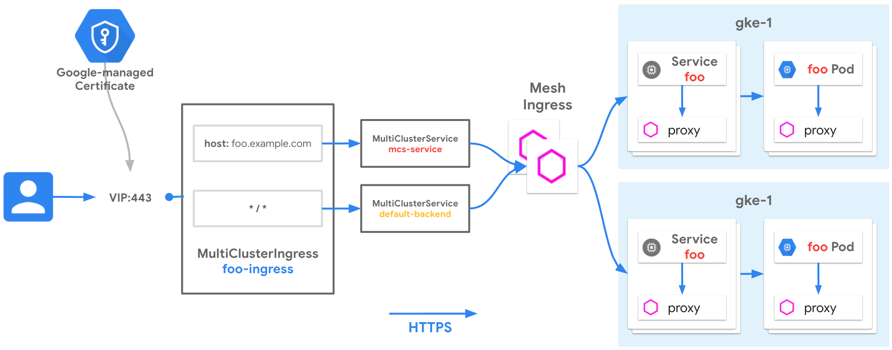

# Exposing Service Mesh Application using Multi-cluster Ingress

[Multi-cluster Ingress](https://cloud.google.com/kubernetes-engine/docs/concepts/ingress-for-anthos) for GKE is a cloud-hosted Ingress controller for GKE clusters. It's a Google-hosted service that supports deploying shared load balancing resources across clusters and across regions.

[Anthos Service Mesh](https://cloud.google.com/anthos/service-mesh) is a managed service mesh, based on Istio, that provides a security-enhanced, observable, and standardized communication layer for applications. A service mesh provides a holistic communications platform for clients that are communicating in the mesh.  

[Mesh ingress gateway](https://istio.io/latest/docs/concepts/traffic-management/#gateways) provides a dedicated set of proxies whose ports are exposed to traffic coming from outside the service mesh. These mesh ingress proxies let you control L4 exposure behavior separately from application routing behavior.  

To manage this external traffic, you need a load balancer that is external to the mesh. This receipee uses Google Cloud Load Balancing provisioned through Multi-cluster Ingress resources to automate deployment.  

## Use-cases

- Exposing an application to clients by combining Cloud Load Balancing with Anthos Service Mesh
- Configure GKE Ingress to terminate public HTTPS traffic
- Configure HTTPS traffic between GKE Ingress and Mesh ingress gateway.
- Disaster recovery for internet traffic across clusters or regions
- Low-latency serving of traffic to globally distributed GKE clusters

## Relevant documentation

- [Multi-cluster Ingress Concepts](https://cloud.google.com/kubernetes-engine/docs/concepts/multi-cluster-ingress)
- [Setting Up Multi-cluster Ingress](https://cloud.google.com/kubernetes-engine/docs/how-to/multi-cluster-ingress-setup)
- [Deploying Ingress Across Clusters](https://cloud.google.com/kubernetes-engine/docs/how-to/multi-cluster-ingress)
- [Google Cloud External HTTP(S) Load Balancing](https://cloud.google.com/load-balancing/docs/https)
- [Anthos Service Mesh Concepts](https://cloud.google.com/service-mesh/docs/overview)
- [Setting Up Ingress with Anthos Service Mesh](https://cloud.google.com/service-mesh/docs/unified-install/install-anthos-service-mesh)  

## Versions

- GKE clusters on GCP
- ASM on GKE clusters
- All versions of GKE supported
- All versions of ASM supported
- Tested and validated with GKE version 1.25.4-gke.1600 and ASM version 1.15.3-asm.6 on Jan 3rd 2023

## Networking Manifests

This recipe demonstrates deploying Multi-cluster Ingress across two clusters to expose a service hosted across both clusters. The cluster `gke-1` is in `REGION#1` and `gke-2` is hosted in `REGION#2`, demonstrating multi-regional load balancing across clusters.  

There is one application in this example, foo. It is deployed on both clusters. The External HTTPS load balancer is designed to route traffic to the closest (to the client) available backend with capacity. Traffic from clients will be load balanced to the closest backend cluster depending on the traffic matching specified in the MultiClusterIngress resource.  

The two clusters in this example can be backends to MCI only if they are registered through Hub. Hub is a central registry of clusters that determines which clusters MCI can function across. A cluster must first be registered to Hub before it can be used with MCI.

<!-- Fix Me -->


There are two Custom Resources (CRs) that control multi-cluster load balancing - the MultiClusterIngress (MCI) and the MultiClusterService (MCS).  

### Multi-cluster Ingress

The MCI below describes the desired traffic matching and routing behavior. Similar to an Ingress resource, it can specify host and path matching with Service(s). This MCI specifies one host rule and a default backend which will receive all traffic that does not have a match. The `serviceName` field in this MCI specifies the name of an MCS resource.

The MCI below also defines via annotations:

- `networking.gke.io/pre-shared-certs: "mci-certs"` refers to [Google-Managed Certificate](https://cloud.google.com/kubernetes-engine/docs/how-to/multi-cluster-ingress#google-managed_certificates) that was provisioned
- `networking.gke.io/static-ip: x.x.x.x` refers to public [Static IP](https://cloud.google.com/compute/docs/ip-addresses/reserve-static-external-ip-address) used to provision Google-Managed Certificates

```yaml
apiVersion: networking.gke.io/v1
kind: MultiClusterIngress
metadata:
  name: gke-ingress
  namespace: asm-ingress
  annotations:
    networking.gke.io/static-ip: x.x.x.x
    networking.gke.io/pre-shared-certs: "mci-certs" 
spec:
  template:
    spec:
      backend:
        serviceName: mcs-service
        servicePort: 443
      rules:
      - host: "foo.endpoints.$PROJECT-ID.cloud.goog"
        http:
          paths:
          - backend:
              serviceName: mcs-service
              servicePort: 443
```

### Multi Cluster Service

Similar to the Kubernetes Service, the MultiClusterService (MCS) describes label selectors and other backend parameters to group pods in the desired way. This `mcs-service` MCS specifies that all Pods with the following characteristics will be selected as backends for `mcs-service`:

- Pods with the label `asm: ingressgateway`
- In the `asm-ingress` Namespace
- In any of the clusters that are registered as members to the Hub

If more clusters are added to the Hub, then any Pods in those clusters that match these characteristics will also be registered as backends to `mcs-service`.

The MCS below also defines via annotations:

- `beta.cloud.google.com/backend-config: '{"default":"ingress-backendconfig"}'` refers to the name of a custom resource called BackendConfig. The Ingress controller uses BackendConfig to set parameters on the Google Cloud BackendService resource.
- `cloud.google.com/app-protocols: '{"https":"HTTPS"}'` directs the GFE to connect to the service mesh's ingress gateway using HTTPS with TLS as described in [Ingress for External HTTP(S) Load Balancing](https://cloud.google.com/kubernetes-engine/docs/concepts/ingress-xlb#https_tls_between_load_balancer_and_your_application) and [External HTTP(S) Load Balancing overview](https://cloud.google.com/load-balancing/docs/https#protocol_to_the_backends), for an additional layer of encryption.  

```yaml
apiVersion: networking.gke.io/v1
kind: MultiClusterService
metadata:
  name: mcs-service
  namespace: asm-ingress
  annotations:
     beta.cloud.google.com/backend-config: '{"default":"ingress-backendconfig"}'
     networking.gke.io/app-protocols: '{"https":"HTTPS"}'
spec:
  template:
    spec:
      selector:
        asm: ingressgateway
      ports:
        - name: https
          protocol: TCP
          port: 443
          targetPort: 443
```

### BackendConfig

A BackendConfig allows settings specific to a Service to be configured. We use it here to configure the health check that the Google Cloud load balancer uses.

```yaml
apiVersion: cloud.google.com/v1
kind: BackendConfig
metadata:
  name: ingress-backendconfig
  namespace: asm-ingress
spec:
  healthCheck:
    requestPath: /healthz/ready
    port: 15021
    type: HTTP
```

### Ingress Deployment

This Deployment has its own ServiceAccount with associated Role and RoleBinding allowing the gateway to access certificates.

```yaml
apiVersion: apps/v1
kind: Deployment
metadata:
  name: asm-ingressgateway
  namespace: asm-ingress
spec:
  selector:
    matchLabels:
      asm: ingressgateway
  template:
    metadata:
      annotations:
        # This is required to tell Anthos Service Mesh to inject the gateway with the
        # required configuration.
        inject.istio.io/templates: gateway
      labels:
        asm: ingressgateway
    spec:
      containers:
      - name: istio-proxy
        image: auto # The image will automatically update each time the pod starts.
        resources:
          limits:
            cpu: 2000m
            memory: 1024Mi
          requests:
            cpu: 100m
            memory: 128Mi
      serviceAccountName: asm-ingressgateway
---
apiVersion: rbac.authorization.k8s.io/v1
kind: Role
metadata:
  name: asm-ingressgateway
  namespace: asm-ingress
rules:
- apiGroups: [""]
  resources: ["secrets"]
  verbs: ["get", "watch", "list"]
---
apiVersion: rbac.authorization.k8s.io/v1
kind: RoleBinding
metadata:
  name: asm-ingressgateway
  namespace: asm-ingress
roleRef:
  apiGroup: rbac.authorization.k8s.io
  kind: Role
  name: asm-ingressgateway
subjects:
  - kind: ServiceAccount
    name: asm-ingressgateway
---
apiVersion: v1
kind: ServiceAccount
metadata:
  name: asm-ingressgateway
  namespace: asm-ingress
```

### Ingress Gateway

Gateways are proxies running at the edge of the mesh, providing fine-grained control over traffic entering and leaving the mesh.

Note that you must use the wildcard * entry in the hosts field in the Gateway. GCLB does not use SNI extension to the backends. Using the wildcard entry sends the encrypted packet (from GCLB) to the ASM ingress gateway. ASM Ingress gateway decrypts the packet and uses the HTTP Host Header (in the decrypted packet) to make routing decisions (based on VirtualService entries).

```yaml
apiVersion: networking.istio.io/v1alpha3
kind: Gateway
metadata:
    name: asm-ingressgateway
    namespace: asm-ingress
spec:
  selector:
    asm: ingressgateway
  servers:
  - port:
      number: 443
      name: https
      protocol: HTTPS
    hosts:
    - "*" # IMPORTANT: Must use wildcard here when using SSL
    tls:
      mode: SIMPLE
      credentialName: edge2mesh-credential
```

### Cloud Endpoints DNS

To create a stable, human-friendly mapping to your Ingress IP, you must have a public DNS record. You can use any DNS provider and automation that you want. This recipe uses Endpoints instead of creating a managed DNS zone. Endpoints provides a free Google-managed DNS record for a public IP.

```yaml
swagger: "2.0"
info:
  description: "Cloud Endpoints DNS"
  title: "Cloud Endpoints DNS"
  version: "1.0.0"
paths: {}
host: "foo.endpoints.$PROJECT-ID.cloud.goog"
x-google-endpoints:
- name: "foo.endpoints.$PROJECT-ID.cloud.goog"
  target: "$GCLB_IP"
```

Now that you have the background knowledge and understanding of MCI and ASM, you can try it out yourself.

## Try it out

1. Download this repo and navigate to this folder:

    ```bash
    git clone https://github.com/GoogleCloudPlatform/gke-networking-recipes.git
    Cloning into 'gke-networking-recipes'...

    cd gke-networking-recipes/ingress/multi-cluster/mci-asm-https-e2e
    ```

2. Set up Environment variables:

    ```bash
    export PROJECT=$(gcloud config get-value project) # or your preferred project
    export GKE1_ZONE=GCP_CLOUD_ZONE # Pick a supported Zone for cluster gke-1
    export GKE2_ZONE=GCP_CLOUD_ZONE # Pick a supported Zone for cluster gke-2
    gcloud config set project $PROJECT
    ```

    NB: This tutorial uses Zonal Clusters, you can also use Regional Clusters. Replace a Zone with a region and use the `--region` flag instead of `--zone` in the next steps

3. Deploy the two clusters `gke-1` and `gke-2` as specified in [cluster setup](../../../cluster-setup.md#multi-cluster-environment-basic). Once done, come back to the next step:

4. Download the Anthos Service Mesh installation file and install Anthos Service Mesh:

    Follow the steps in [Installing Anthos Service Mesh](https://cloud.google.com/service-mesh/docs/unified-install/install) on GKE to use a Google-provided script to install Anthos Service Mesh.

    For example:

    ```bash
    ./asmcli install \
        --project_id ${PROJECT} \
        --cluster_name gke-1 \
        --cluster_location $GKE1_ZONE \
        --enable_all

    ./asmcli install \
        --project_id ${PROJECT} \
        --cluster_name gke-2 \
        --cluster_location $GKE2_ZONE \
        --enable_all 
    ```

5. Ensure that all deployments are up and running:

    ```bash
    kubectl --context=gke-1 wait --for=condition=available --timeout=600s deployment --all -n istio-system
    
    kubectl --context=gke-1 wait --for=condition=available --timeout=600s deployment --all -n asm-system

    kubectl --context=gke-2 wait --for=condition=available --timeout=600s deployment --all -n istio-system
    
    kubectl --context=gke-2 wait --for=condition=available --timeout=600s deployment --all -n asm-system
    ```

    The output is similar to the following:

    ```bash
    deployment.apps/istiod-asm-1112-17 condition met
    deployment.apps/canonical-service-controller-manager condition met
    deployment.apps/istiod-asm-1112-17 condition met
    deployment.apps/canonical-service-controller-manager condition met    
    ```

6. Create a dedicated `asm-ingress` namespace:

    ```bash
    kubectl --context=gke-1 create namespace asm-ingress

    kubectl --context=gke-2 create namespace asm-ingress
    ```

7. Annotate the `asm-ingress` namespace with the ASM revision label:

    ```bash
    export ASM_REVISION=$(kubectl --context=gke-1 get deploy -n istio-system \
    -l app=istiod \
    -o jsonpath='{.items[*].metadata.labels.istio\.io\/rev}{"\n"}')

    kubectl --context=gke-1 label namespace asm-ingress istio-injection- istio.io/rev=${ASM_REVISION} --overwrite

    kubectl --context=gke-2 label namespace asm-ingress istio-injection- istio.io/rev=${ASM_REVISION} --overwrite
    ```

    The output is similar to the following:

    ```bash
    label "istio-injection" not found.
    namespace/asm-ingress labeled

    label "istio-injection" not found.
    namespace/asm-ingress labeled
    ```

8. Deploy `ingress-deployment.yaml` in your cluster to create the Deployment resource for Ingress Gateway:

    ```bash
    kubectl --context=gke-1 apply -f ingress-deployment.yaml

    kubectl --context=gke-2 apply -f ingress-deployment.yaml
    ```

    The output is similar to the following:

    ```bash
    deployment.apps/asm-ingressgateway created
    role.rbac.authorization.k8s.io/asm-ingressgateway created
    rolebinding.rbac.authorization.k8s.io/asm-ingressgateway created
    serviceaccount/asm-ingressgateway created
    ```

9. Ensure that all deployments are up and running:

    ```bash
    kubectl --context=gke-1 wait --for=condition=available --timeout=600s deployment --all -n asm-ingress

    kubectl --context=gke-2 wait --for=condition=available --timeout=600s deployment --all -n asm-ingress
    ```

    The output is similar to the following:

    ```bash
    deployment.apps/asm-ingressgateway condition met
    ```

10. Create a global static IP for the Google Cloud load balancer:

    ```bash
    gcloud compute addresses create ingress-ip --global
    ```

    This static IP is used by the Ingress resource and allows the IP to remain the same, even if the external load balancer changes.

11. Get the static IP address:

    ```bash
    export GCLB_IP=$(gcloud compute addresses describe ingress-ip --global --format=json | jq -r '.address')
    echo $GCLB_IP
    ```

12. Edit the dns-spec.yaml file and update `$PROJECT-ID` value with your project id and `$GCLB_IP` with public IP that was created to create Endpoints.

13. Deploy the `dns-spec.yaml` file in your Cloud project:  
    The YAML specification defines the public DNS record in the form of foo.endpoints.PROJECT-ID.cloud.goog, where PROJECT-ID is your unique project number.

    ```bash
    gcloud endpoints services deploy dns-spec.yaml
    ```

14. Provision Google-Managed Certificates
    We will use Google-Managed Certificates in this example to provision an HTTPS load balancer, run the following command.

    ```bash
    gcloud compute ssl-certificates create mci-certs --domains=foo.endpoints.${PROJECT}.cloud.goog --global
    ```

    Check that the certificates have been created

    ```bash
    gcloud compute ssl-certificates list
    ```

    The `MANAGED_STATUS` will indicate `PROVISIONNING` This is normal, the certificates will be provisionned when you deploy the MCI.

15. Create the private key and certificate using openssl. It will enable MCI to establish a TLS connection to the service mesh's ingress gateway:

    ```bash
    mkdir certs
    openssl req -new -newkey rsa:4096 -days 365 -nodes -x509 \
    -subj "/CN=foo.endpoints.${PROJECT}.cloud.goog/O=${PROJECT} Inc" \
    -keyout certs/foo.endpoints.${PROJECT}.cloud.goog.key \
    -out certs/foo.endpoints.${PROJECT}.cloud.goog.crt
    ```

16. Create the Secret in the `asm-ingress` namespace in both clusters:

    ```bash
    kubectl --context=gke-1 -n asm-ingress create secret tls edge2mesh-credential \
    --key=certs/foo.endpoints.${PROJECT}.cloud.goog.key \
    --cert=certs/foo.endpoints.${PROJECT}.cloud.goog.crt

    kubectl --context=gke-2 -n asm-ingress create secret tls edge2mesh-credential \
    --key=certs/foo.endpoints.${PROJECT}.cloud.goog.key \
    --cert=certs/foo.endpoints.${PROJECT}.cloud.goog.crt
    ```

17. Deploy `ingress-gateway.yaml` in your cluster to create the service mesh's Gateway:  

    ```bash
    kubectl --context=gke-1 apply -f ingress-gateway.yaml

    kubectl --context=gke-2 apply -f ingress-gateway.yaml
    ```

18. Install sample application by deploying `app.yaml` manifest:

    ```bash
    kubectl --context=gke-1 apply -f app.yaml

    kubectl --context=gke-2 apply -f app.yaml
    ```

    The output is similar to the following:

    ```bash
    deployment.apps/foo created
    service/foo created
    ```

19. Edit the `istio-service.yaml` file and update `$PROJECT-ID` value with your project id:

20. Create service mesh's `VirtualService` by deploying `istio-service.yaml` manifest:

    ```bash
    kubectl --context=gke-1 apply -f istio-service.yaml

    kubectl --context=gke-2 apply -f istio-service.yaml
    ```

    The output is similar to the following:

    ```bash
    virtualservice.networking.istio.io/foo-ingress created
    ```

21. Edit `mci-mcs.yaml` file and update `x.x.x.x` with your IP address and `$PROJECT-ID` with your project id.

22. Deploy `mci-mcs.yaml` to create `MultiClusterIngress` `MultiClusterService` and `BackendConfig`

    ```bash
    kubectl --context=gke-1 apply -f mci-mcs.yaml
    ```

23. Inspect the `MultiClusterIngress` resource:

    ```bash
    kubectl --context=gke-1 describe mcs mcs-service -n asm-ingress
    ```

    The output is similar to the following:

    ```bash
    Name:         mcs-service
    Namespace:    asm-ingress
    Labels:       <none>
    Annotations:  beta.cloud.google.com/backend-config: {"default":"ingress-backendconfig"}
                networking.gke.io/app-protocols: {"https":"HTTPS"}
    API Version:  networking.gke.io/v1
    Kind:         MultiClusterService
    Metadata:
    Creation Timestamp:  2021-12-04T00:01:03Z
    Finalizers:
        mcs.finalizer.networking.gke.io
    Generation:  1
    Managed Fields:
        API Version:  networking.gke.io/v1beta1
        Fields Type:  FieldsV1
        fieldsV1:
        f:metadata:
            f:finalizers:
            .:
            v:"mcs.finalizer.networking.gke.io":
        Manager:      Google-Multi-Cluster-Ingress
        Operation:    Update
        Time:         2021-12-04T00:01:03Z
        API Version:  networking.gke.io/v1
        Fields Type:  FieldsV1
        fieldsV1:
        f:metadata:
            f:annotations:
            .:
            f:beta.cloud.google.com/backend-config:
            f:kubectl.kubernetes.io/last-applied-configuration:
            f:networking.gke.io/app-protocols:
        f:spec:
            .:
            f:template:
            .:
            f:spec:
                .:
                f:ports:
                f:selector:
                .:
                f:asm:
        Manager:         kubectl-client-side-apply
        Operation:       Update
        Time:            2021-12-04T00:01:03Z
    Resource Version:  21478
    UID:               126d1657-a4ef-4b9a-804b-dcacb9d86deb
    Spec:
    Template:
        Spec:
        Ports:
            Name:         https
            Port:         443
            Protocol:     TCP
            Target Port:  443
        Selector:
            Asm:  ingressgateway
    Events:
    Type    Reason  Age   From                              Message
    ----    ------  ----  ----                              -------
    Normal  ADD     32s   multi-cluster-ingress-controller  asm-ingress/mcs-service
    Normal  UPDATE  32s   multi-cluster-ingress-controller  asm-ingress/mcs-service
    Normal  SYNC    31s   multi-cluster-ingress-controller  Derived Service was ensured in cluster {us-west1-b/gke-2 gke-2}
    Normal  SYNC    31s   multi-cluster-ingress-controller  Derived Service was ensured in cluster {us-central1-a/gke-1 gke-1}
    ```

24. Inspect the `MultiClusterService` resource to check the progress of the load balancer deployment:

    ```bash
    kubectl --context=gke-1 describe mci gke-ingress -n asm-ingress
    ```

    The output is similar to the following:
    Note: It may take up to 10 minutes to provision Cloud resources.

    ```bash
    Name:         gke-ingress
    Namespace:    asm-ingress
    Labels:       <none>
    Annotations:  networking.gke.io/last-reconcile-time: Saturday, 04-Dec-21 00:02:10 UTC
                networking.gke.io/pre-shared-certs: mci-certs
                networking.gke.io/static-ip: x.x.x.x
    API Version:  networking.gke.io/v1
    Kind:         MultiClusterIngress
    Metadata:
    Creation Timestamp:  2021-12-04T00:01:03Z
    Finalizers:
        mci.finalizer.networking.gke.io
    Generation:  2
    Managed Fields:
        API Version:  networking.gke.io/v1
        Fields Type:  FieldsV1
        fieldsV1:
        f:metadata:
            f:annotations:
            .:
            f:kubectl.kubernetes.io/last-applied-configuration:
            f:networking.gke.io/pre-shared-certs:
            f:networking.gke.io/static-ip:
        f:spec:
            .:
            f:template:
            .:
            f:spec:
                .:
                f:backend:
                .:
                f:serviceName:
                f:servicePort:
                f:rules:
        Manager:      kubectl-client-side-apply
        Operation:    Update
        Time:         2021-12-04T00:01:03Z
        API Version:  networking.gke.io/v1beta1
        Fields Type:  FieldsV1
        fieldsV1:
        f:metadata:
            f:annotations:
            f:networking.gke.io/last-reconcile-time:
            f:finalizers:
            .:
            v:"mci.finalizer.networking.gke.io":
        f:status:
            .:
            f:CloudResources:
            .:
            f:BackendServices:
            f:Firewalls:
            f:ForwardingRules:
            f:HealthChecks:
            f:NetworkEndpointGroups:
            f:TargetProxies:
            f:UrlMap:
            f:VIP:
        Manager:         Google-Multi-Cluster-Ingress
        Operation:       Update
        Time:            2021-12-04T00:02:10Z
    Resource Version:  21948
    UID:               cb85ad78-7c8d-43d7-90d1-9961aab22e79
    Spec:
    Template:
        Spec:
        Backend:
            Service Name:  mcs-service
            Service Port:  443
        Rules:
            Host:  foo.endpoints.PROJECT_ID.cloud.goog
            Http:
            Paths:
                Backend:
                Service Name:  mcs-service
                Service Port:  443
    Status:
    Cloud Resources:
        Backend Services:
        mci-fi70qg-443-asm-ingress-mcs-service
        Firewalls:
        mci-fi70qg-default-l7
        Forwarding Rules:
        mci-fi70qg-fw-asm-ingress-gke-ingress
        mci-fi70qg-fws-asm-ingress-gke-ingress
        Health Checks:
        mci-fi70qg-443-asm-ingress-mcs-service
        Network Endpoint Groups:
        zones/us-central1-a/networkEndpointGroups/k8s1-4cd82deb-asm-ingre-mci-mcs-service-svc-k7qwrn5-44-d9441438
        zones/us-west1-b/networkEndpointGroups/k8s1-8b78b285-asm-ingre-mci-mcs-service-svc-k7qwrn5-44-eb2e06d1
        Target Proxies:
        mci-fi70qg-asm-ingress-gke-ingress
        mci-fi70qg-asm-ingress-gke-ingress
        URL Map:  mci-fi70qg-asm-ingress-gke-ingress
    VIP:        x.x.x.x
    Events:
    Type    Reason  Age                 From                              Message
    ----    ------  ----                ----                              -------
    Normal  ADD     118s                multi-cluster-ingress-controller  asm-ingress/gke-ingress
    Normal  UPDATE  51s (x2 over 118s)  multi-cluster-ingress-controller  asm-ingress/gke-ingress
    ```

25. Use curl with the -v for verbose to reach the load balancer.

    ```bash
    Note: You might get an `ERR_SSL_VERSION_OR_CIPHER_MISMATCH` error. This error occurs when certificates have not yet propagated to all of the Google Front Ends (GFEs) globally. Wait a few minutes, and then try again.
    ```

    ```bash
    curl -v https://foo.endpoints.${PROJECT}.cloud.goog
    ```

    ```bash
        *   Trying x.x.x.x:443...
    * Connected to foo.endpoints.PROJECT_ID.cloud.goog (x.x.x.x) port 443 (#0)
    * ALPN: offers h2
    * ALPN: offers http/1.1
    *  CAfile: /etc/ssl/certs/ca-certificates.crt
    *  CApath: /etc/ssl/certs
    * TLSv1.0 (OUT), TLS header, Certificate Status (22):
    * TLSv1.3 (OUT), TLS handshake, Client hello (1):
    * TLSv1.2 (IN), TLS header, Certificate Status (22):
    * TLSv1.3 (IN), TLS handshake, Server hello (2):
    * TLSv1.2 (IN), TLS header, Finished (20):
    * TLSv1.2 (IN), TLS header, Supplemental data (23):
    * TLSv1.3 (IN), TLS handshake, Encrypted Extensions (8):
    * TLSv1.3 (IN), TLS handshake, Certificate (11):
    * TLSv1.3 (IN), TLS handshake, CERT verify (15):
    * TLSv1.3 (IN), TLS handshake, Finished (20):
    * TLSv1.2 (OUT), TLS header, Finished (20):
    * TLSv1.3 (OUT), TLS change cipher, Change cipher spec (1):
    * TLSv1.2 (OUT), TLS header, Supplemental data (23):
    * TLSv1.3 (OUT), TLS handshake, Finished (20):
    * SSL connection using TLSv1.3 / TLS_AES_256_GCM_SHA384
    * ALPN: server accepted h2
    * Server certificate:
    *  subject: CN=foo.endpoints.PROJECT_ID.cloud.goog
    *  start date: Jan  3 14:03:54 2023 GMT
    *  expire date: Apr  3 14:48:01 2023 GMT
    *  subjectAltName: host "foo.endpoints.PROJECT_ID.cloud.goog" matched cert's "foo.endpoints.PROJECT_ID.cloud.goog"
    *  issuer: C=US; O=Google Trust Services LLC; CN=GTS CA 1D4
    *  SSL certificate verify ok.
    * Using HTTP2, server supports multiplexing
    * Copying HTTP/2 data in stream buffer to connection buffer after upgrade: len=0
    * TLSv1.2 (OUT), TLS header, Supplemental data (23):
    * TLSv1.2 (OUT), TLS header, Supplemental data (23):
    * TLSv1.2 (OUT), TLS header, Supplemental data (23):
    * h2h3 [:method: GET]
    * h2h3 [:path: /]
    * h2h3 [:scheme: https]
    * h2h3 [:authority: foo.endpoints.PROJECT_ID.cloud.goog]
    * h2h3 [user-agent: curl/7.86.0]
    * h2h3 [accept: */*]
    * Using Stream ID: 1 (easy handle 0x562d284099b0)
    * TLSv1.2 (OUT), TLS header, Supplemental data (23):
    > GET / HTTP/2
    > Host: foo.endpoints.PROJECT_ID.cloud.goog
    > user-agent: curl/7.86.0
    > accept: */*
    > 
    * TLSv1.2 (IN), TLS header, Supplemental data (23):
    * TLSv1.3 (IN), TLS handshake, Newsession Ticket (4):
    * TLSv1.3 (IN), TLS handshake, Newsession Ticket (4):
    * old SSL session ID is stale, removing
    * TLSv1.2 (IN), TLS header, Supplemental data (23):
    * TLSv1.2 (OUT), TLS header, Supplemental data (23):
    * TLSv1.2 (IN), TLS header, Supplemental data (23):
    * TLSv1.2 (IN), TLS header, Supplemental data (23):
    < HTTP/2 200 
    < server: istio-envoy
    < date: Tue, 03 Jan 2023 15:18:08 GMT
    < content-type: application/json
    < content-length: 1333
    < access-control-allow-origin: *
    < x-envoy-upstream-service-time: 39
    < via: 1.1 google
    < alt-svc: h3=":443"; ma=2592000,h3-29=":443"; ma=2592000
    < 
    * TLSv1.2 (IN), TLS header, Supplemental data (23):
    {
      "cluster_name": "gke-1",
      "headers": {
        "Accept": "*/*",
        "Host": "foo.endpoints.PROJECT_ID.cloud.goog",
        "User-Agent": "curl/7.86.0",
        "Via": "1.1 google",
        "X-B3-Parentspanid": "f5f5a64e31b5998a",
        "X-B3-Sampled": "0",
        "X-B3-Spanid": "f8a32c4a487a7207",
        "X-B3-Traceid": "da760534bc531b24f5f5a64e31b5998a",
        "X-Cloud-Trace-Context": "c824d2983fd0ac57bcbab6fb48bd6151/642975709534139701",
        "X-Envoy-Attempt-Count": "1",
        "X-Envoy-External-Address": "35.191.17.238",
        "X-Forwarded-Client-Cert": "By=spiffe://PROJECT_ID.svc.id.goog/ns/asm-ingress/sa/default;Hash=842658e400518a84e5b38dbd69f9e89b9c4e568d57a9d2887442e7be0ba70e59;Subject=\"OU=istio_v1_cloud_workload,O=Google LLC,L=Mountain View,ST=California,C=US\";URI=spiffe://PROJECT_ID.svc.id.goog/ns/asm-ingress/sa/asm-ingressgateway",
        "X-Forwarded-For": "x.x.x.x, y.y.y.y, z.z.z.z",
        "X-Forwarded-Proto": "https",
        "X-Request-Id": "6b8e782c-eccd-45e7-8478-706767384858"
      },
      "host_header": "foo.endpoints.PROJECT_ID.cloud.goog",
      "metadata": "foo",
      "pod_name": "foo-65f9cf8ff8-jclkk",
      "pod_name_emoji": "🤹🏿‍♂️",
      "project_id": "PROJECT_ID",
      "timestamp": "2023-01-03T15:18:08",
      "zone": "europe-west1-c"
    }
    * TLSv1.2 (IN), TLS header, Supplemental data (23):
    * Connection #0 to host foo.endpoints.PROJECT_ID.cloud.goog left intact
    ```

The output is very verbose when we add the follow environement variable to the `whereami` sample app:

  ```bash
  - name: ECHO_HEADERS
  value: "True"
  ```

This variable asks the pod to print out the headers it receives from the ingress gateway. One most important header is:

  ```bash
  "X-Forwarded-Proto": "https",
  ```

Which proofs that the ingress gateway <> sample app pod connection is encrypted

## Cleanup

```bash
kubectl --context=gke-1 delete -f mci-mcs.yaml
gcloud container hub ingress disable
gcloud container hub memberships unregister gke-1 --gke-cluster=$GKE1_ZONE/gke-1 
gcloud container hub memberships unregister gke-2 --gke-cluster=$GKE2_ZONE/gke-2 
gcloud container clusters delete gke-1 --zone $GKE1_ZONE --quiet
gcloud container clusters delete gke-2 --zone $GKE2_ZONE --quiet
kubectl config delete-context gke-1
kubectl config delete-context gke-2
gcloud endpoints services delete foo.endpoints.${PROJECT}.cloud.goog --quiet
gcloud compute addresses delete ingress-ip --global --quiet
gcloud compute ssl-certificates delete mci-certs --quiet
```
