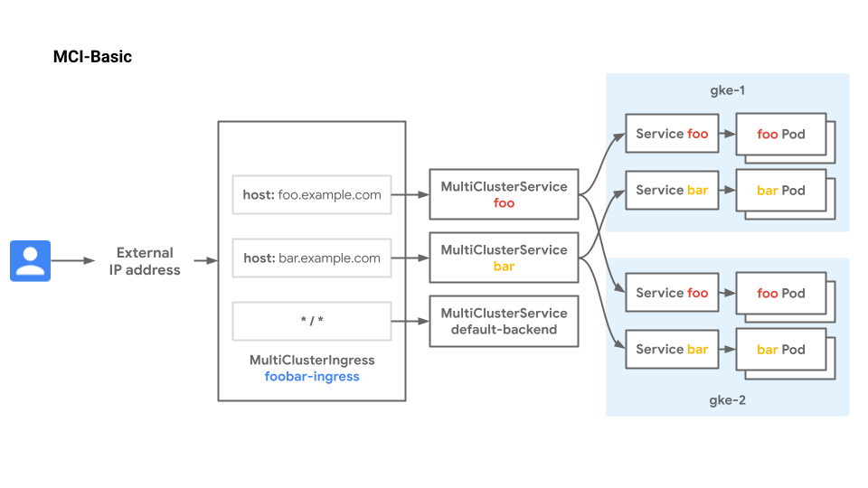

# Multi-cluster Ingress for External Load Balancing

[Multi-cluster Ingress](https://cloud.google.com/kubernetes-engine/docs/concepts/ingress-for-anthos) for GKE is a cloud-hosted Ingress controller for GKE clusters. It's a Google-hosted service that supports deploying shared load balancing resources across clusters and across regions.

## Use-cases

- Disaster recovery for internet traffic across clusters or regions
- Flexible migration between clusters
- Low-latency serving of traffic to globally distributed GKE clusters

## Relevant documentation

- [Multi-cluster Ingress Concepts](https://cloud.google.com/kubernetes-engine/docs/concepts/ingress-for-anthos)
- [Setting Up Multi-cluster Ingress](https://cloud.google.com/kubernetes-engine/docs/how-to/ingress-for-anthos-setup)
- [Deploying Ingress Across Clusters](https://cloud.google.com/kubernetes-engine/docs/how-to/ingress-for-anthos)
- [Google Cloud External HTTP(S) Load Balancing](https://cloud.google.com/load-balancing/docs/https)

## Versions

- GKE clusters on GCP
- All versions of GKE supported
- Tested and validated with 1.25.4-gke.1600 on Jan 3rd 2023

### Networking Manifests

This recipe demonstrates deploying Multi-cluster Ingress across two clusters to expose two different Services hosted across both clusters. The cluster `gke-1` is in `us-west1-a` and `gke-2` is hosted in `us-east1-b`, demonstrating multi-regional load balancing across clusters. All Services will share the same MultiClusterIngress and load balancer IP, but the load balancer will match traffic and send it to the right region, cluster, and Service depending on the request.

There are two applications in this example, foo and bar. Each is deployed on both clusters. The External HTTP(S) Load Balancer is designed to route traffic to the closest (to the client) available backend with capacity. Traffic from clients will be load balanced to the closest backend cluster depending on the traffic matching specified in the MultiClusterIngress resource.

The two clusters in this example can be backends to MCI only if they are registered through Hub. Hub is a central registry of clusters that determines which clusters MCI can function across. A cluster must first be registered to Hub before it can be used with MCI.



There are two Custom Resources (CRs) that control multi-cluster load balancing - the MultiClusterIngress (MCI) and the MultiClusterService (MCS). The MCI below describes the desired traffic matching and routing behavior. Similar to an Ingress resource, it can specify host and path matching with Services. This MCI specifies two host rules and a default backend which will recieve all traffic that does not have a match. The `serviceName` field in this MCI specifies the name of an MCS resource.

```yaml
apiVersion: networking.gke.io/v1
kind: MultiClusterIngress
metadata:
  name: foobar-ingress
  namespace: multi-cluster-demo
spec:
  template:
    spec:
      backend:
        serviceName: default-backend
        servicePort: 8080
      rules:
      - host: foo.example.com
        http:
          paths:
            - backend:
                serviceName: foo
                servicePort: 8080
      - host: bar.example.com
        http:
          paths:
            - backend:
                serviceName: bar
                servicePort: 8080
```

Similar to the Kubernetes Service, the MultiClusterService (MCS) describes label selectors and other backend parameters to group pods in the desired way. This `foo` MCS specifies that all Pods with the following characteristics will be selected as backends for  `foo`:

- Pods with the label `app: foo`
- In the `multi-cluster-demo` Namespace
- In any of the clusters that are registered as members to the Hub

If more clusters are added to the Hub, then any Pods in those clusters that match these characteristics will also be registered as backends to `foo`.

```yaml
apiVersion: networking.gke.io/v1
kind: MultiClusterService
metadata:
  name: foo
  namespace: multi-cluster-demo
  annotations:
    beta.cloud.google.com/backend-config: '{"ports": {"8080":"backend-health-check"}}'
spec:
  template:
    spec:
      selector:
        app: foo
      ports:
      - name: http
        protocol: TCP
        port: 8080
        targetPort: 8080
```

Each of the three MCS's referenced in the `foobar-ingress` MCI have their own manifest to describe the matching parameters of that MCS. A BackendConfig resource is also referenced. This allows settings specific to a Service to be configured. We use it here to configure the health check that the Google Cloud load balancer uses.

```yaml
apiVersion: cloud.google.com/v1
kind: BackendConfig
metadata:
  name: backend-health-check
  namespace: multi-cluster-demo
spec:
  healthCheck:
    requestPath: /healthz
    port: 8080
    type: HTTP
```

Now that you have the background knowledge and understanding of MCI, you can try it out yourself.

### Try it out

1. Download this repo and navigate to this folder

    ```bash
    $ git clone https://github.com/GoogleCloudPlatform/gke-networking-recipes.git
    Cloning into 'gke-networking-recipes'...

    $ cd gke-networking-recipes/ingress/multi-cluster/mci-basic
    ```

2. Set up Environment variables

    ```bash
    export PROJECT=$(gcloud config get-value project) # or your preferred project
    export GKE1_ZONE=GCP_CLOUD_REGION # Pick a supported Region/Zone for cluster gke-1
    export GKE2_ZONE=GCP_CLOUD_REGION # Pick a supported Region/Zone for cluster gke-2
    # TODO(abdelfettah@) make sure the zones are consistent across all the recipes
    ```

3. Deploy the two clusters `gke-1` and `gke-2` as specified in [cluster setup](../../../cluster-setup.md#Multi-cluster-environment-basic) and follow the steps for cluster registration with Hub and enablement of Multi-cluster Ingress.

   There are two manifests in this folder:
    - app.yaml is the manifest for the foo and bar Deployments. This manifest should be deployed on both clusters.
    - ingress.yaml is the manifest for the MultiClusterIngress and MultiClusterService resources. These will be deployed only on the `gke-1` cluster as this was set as the config cluster and is the  cluster that the MCI controlller is listening to for updates.

4. Separately log in to each cluster and deploy the app.yaml manifest. You can configure these contexts as shown [here](../../../cluster-setup.md).

    ```bash
    $ kubectl --context=gke-1 apply -f app.yaml
    namespace/multi-cluster-demo created
    deployment.apps/foo created
    deployment.apps/bar created
    deployment.apps/default-backend created

    $ kubectl --context=gke-2 apply -f app.yaml
    namespace/multi-cluster-demo created
    deployment.apps/foo created
    deployment.apps/bar created
    deployment.apps/default-backend created
    ```

5. Check workloads are deployed and running in both clusters

    ```bash
    $ kubectl --context=gke-2 get deploy -n multi-cluster-demo
    NAME              READY   UP-TO-DATE   AVAILABLE   AGE
    bar               2/2     2            2           44m
    default-backend   1/1     1            1           44m
    foo               2/2     2            2           44m

    $ kubectl --context=gke-1 get deploy -n multi-cluster-demo
    NAME              READY   UP-TO-DATE   AVAILABLE   AGE
    bar               2/2     2            2           44m
    default-backend   1/1     1            1           44m
    foo               2/2     2            2           44m
    ```

6. Now log into `gke-1` and deploy the ingress.yaml manifest.

    ```bash
    $ kubectl --context=gke-1 apply -f ingress.yaml
    multiclusteringress.networking.gke.io/foobar-ingress created
    multiclusterservice.networking.gke.io/foo created
    multiclusterservice.networking.gke.io/bar created
    multiclusterservice.networking.gke.io/default-backend created
    backendconfig.cloud.google.com/backend-health-check created
    ```

7. It can take up to 10 minutes for the load balancer to deploy fully. Inspect the MCI resource to watch for events that indicate how the deployment is going. Then capture the IP address for the MCI ingress resource.

    ```bash
    $ kubectl --context=gke-1 describe mci/foobar-ingress -n multi-cluster-demo
    Name:         foobar-ingress
    Namespace:    multi-cluster-demo
    Labels:       <none>
    Annotations:  kubectl.kubernetes.io/last-applied-configuration:
                    {"apiVersion":"networking.gke.io/v1","kind":"MultiClusterIngress","metadata":{"annotations":{},"name":"foobar-ingress","namespace":"multi-...
                  networking.gke.io/last-reconcile-time: Saturday, 14-Nov-20 21:46:46 UTC
    API Version:  networking.gke.io/v1
    Kind:         MultiClusterIngress
    Metadata:
      Resource Version:  144786
      Self Link:         /apis/networking.gke.io/v1/namespaces/multi-cluster-demo/multiclusteringresses/foobar-ingress
      UID:               47fe4406-9660-4968-8eea-0a2f028f03d2
    Spec:
      Template:
        Spec:
          Backend:
            Service Name:  default-backend
            Service Port:  8080
          Rules:
            Host:  foo.example.com
            Http:
              Paths:
                Backend:
                  Service Name:  foo
                  Service Port:  8080
            Host:                bar.example.com
            Http:
              Paths:
                Backend:
                  Service Name:  bar
                  Service Port:  8080
    Status:
      Cloud Resources:
        Backend Services:
          mci-8se3df-8080-multi-cluster-demo-bar
          mci-8se3df-8080-multi-cluster-demo-default-backend
          mci-8se3df-8080-multi-cluster-demo-foo
        Firewalls:
          mci-8se3df-default-l7
        Forwarding Rules:
          mci-8se3df-fw-multi-cluster-demo-foobar-ingress
        Health Checks:
          mci-8se3df-8080-multi-cluster-demo-bar
          mci-8se3df-8080-multi-cluster-demo-default-backend
          mci-8se3df-8080-multi-cluster-demo-foo
        Network Endpoint Groups:
          zones/us-east1-b/networkEndpointGroups/k8s1-b1f3fb3a-multi-cluste-mci-default-backend-svc--80-c7b851a2
          zones/us-east1-b/networkEndpointGroups/k8s1-b1f3fb3a-multi-cluster--mci-bar-svc-067a3lzs8-808-45cc57ea
          zones/us-east1-b/networkEndpointGroups/k8s1-b1f3fb3a-multi-cluster--mci-foo-svc-820zw3izx-808-c453c71e
          zones/us-west1-a/networkEndpointGroups/k8s1-0dfd9a8f-multi-cluste-mci-default-backend-svc--80-f964d3fc
          zones/us-west1-a/networkEndpointGroups/k8s1-0dfd9a8f-multi-cluster--mci-bar-svc-067a3lzs8-808-cd95ae93
          zones/us-west1-a/networkEndpointGroups/k8s1-0dfd9a8f-multi-cluster--mci-foo-svc-820zw3izx-808-3996ee76
        Target Proxies:
          mci-8se3df-multi-cluster-demo-foobar-ingress
        URL Map:  mci-8se3df-multi-cluster-demo-foobar-ingress
      VIP:        35.201.75.57
    Events:
      Type    Reason  Age                From                              Message
      ----    ------  ----               ----                              -------
      Normal  ADD     50m                multi-cluster-ingress-controller  multi-cluster-demo/foobar-ingress
      Normal  UPDATE  49m (x2 over 50m)  multi-cluster-ingress-controller  multi-cluster-demo/foobar-ingress
    ```

    ```bash
    # capture the IP address for the MCI resource
    $ export MCI_ENDPOINT=$(kubectl --context=gke-1 get mci -n multi-cluster-demo -o yaml | grep "VIP" | awk 'END{ print $2}')
    ```

8. Now use the IP address from the MCI output to reach the load balancer. Try hitting the load balancer on the different host rules to confirm that traffic is being routed correctly. We use `jq` to filter the output to make it easier to read but you could drop the `jq` portion of the command to see the full output.

    ```bash
    # Hitting the default backend
    $ curl -s ${MCI_ENDPOINT} | jq -r '.zone, .cluster_name, .pod_name'
    us-west1-a
    gke-1
    default-backend-6b9bd45db8-gzdjc

    # Hitting the foo Service
    $ curl -s -H "host: foo.example.com" ${MCI_ENDPOINT}  | jq -r '.zone, .cluster_name, .pod_name'
    us-west1-a
    gke-1
    foo-7b994cdbd5-wxgpk

    # Hitting the bar Service
    $ curl -s -H "host: bar.example.com" ${MCI_ENDPOINT}  | jq -r '.zone, .cluster_name, .pod_name'
    us-west1-a
    gke-1
    bar-5bdf58646c-rbbdn
    ```

9. Now to demonstrate the health checking and failover ability of MCI, let's crash the pods in `gke-1` for one of the Services. We'll update the replicas of the `foo` Deployment to zero so that there won't be any available backends in that cluster. To confirm that traffic is not dropped, we can set a continuous curl to watch as traffic fails over. In one shell, start a continous curl against the `foo` Service.

    ```bash
    $ while true; do curl -s -H "host: foo.example.com" ${MCI_ENDPOINT} | jq -c '{cluster: .cluster_name, pod: .pod_name}'; sleep 2; done

    {"cluster":"gke-1","pod":"foo-7b994cdbd5-p2n59"}
    {"cluster":"gke-1","pod":"foo-7b994cdbd5-2jnks"}
    {"cluster":"gke-1","pod":"foo-7b994cdbd5-2jnks"}
    {"cluster":"gke-1","pod":"foo-7b994cdbd5-p2n59"}
    ...
    ```

    **Note:** Traffic will be load balanced to the closest cluster to the client. If you are curling from your laptop then your traffic will be directed to the closest GKE cluster to you. Whichever cluster is recieving traffic in this step will be the closest one to you so fail pods in that cluster in the next step and watch traffic failover to the other cluster.

10. Open up a second shell to scale the replicas down to zero.

    ```bash
    # Do this in the same cluster where the response came from in the previous step
    $ kubectl --context=gke-1 scale --replicas=0 deploy foo -n multi-cluster-demo
    deployment.apps/foo scaled

    $ kubectl get deploy -n multi-cluster-demo foo
    NAME   READY   UP-TO-DATE   AVAILABLE   AGE
    foo    0/0     0            0           63m
    ```

11. Watch how traffic switches from one cluster to another as the Pods dissappear from `gke-1`. Because the `foo` Pods from both clusters are active-active backends to the load balancer, there is no traffic interuption or delay when switching over traffic from one cluster to the other. Traffic is seamllessly routed to the available backends in the other cluster.

    ```bash
    ...
    {"cluster":"gke-1","pod":"foo-7b994cdbd5-2jnks"}
    {"cluster":"gke-1","pod":"foo-7b994cdbd5-p2n59"}
    {"cluster":"gke-1","pod":"foo-7b994cdbd5-2jnks"}
    {"cluster":"gke-2","pod":"foo-7b994cdbd5-hnfsv"} # <----- cutover happens here
    {"cluster":"gke-2","pod":"foo-7b994cdbd5-hnfsv"}
    {"cluster":"gke-2","pod":"foo-7b994cdbd5-hnfsv"}
    {"cluster":"gke-2","pod":"foo-7b994cdbd5-97wmt"}
    {"cluster":"gke-2","pod":"foo-7b994cdbd5-97wmt"}
    {"cluster":"gke-2","pod":"foo-7b994cdbd5-97wmt"}
    {"cluster":"gke-2","pod":"foo-7b994cdbd5-hnfsv"}
    ...
    ```

### Cleanup

```bash

kubectl --context=gke-1 delete -f app.yaml
kubectl --context=gke-1 delete -f ingress.yaml # this is unnecessary as the namespace hosting these CRDs has already been deleted in the previous step
kubectl --context=gke-2 delete -f app.yaml
```
