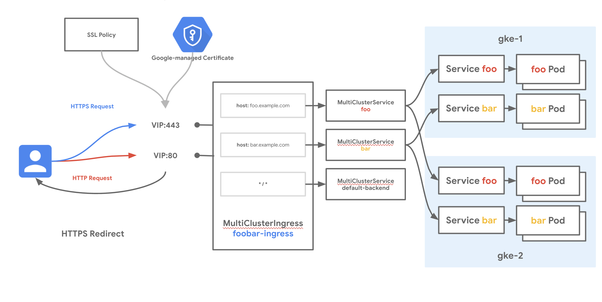

# Multi-cluster Ingress for External Load Balancing and FrontendConfig

[Multi-cluster Ingress](https://cloud.google.com/kubernetes-engine/docs/concepts/ingress-for-anthos) for GKE is a cloud-hosted Ingress controller for GKE clusters. It's a Google-hosted service that supports deploying shared load balancing resources across clusters and across regions.

[FrontendConfig](https://cloud.google.com/kubernetes-engine/docs/how-to/ingress-features#configuring_ingress_features_through_frontendconfig_parameters) is a Google developed [CRD](https://kubernetes.io/docs/concepts/extend-kubernetes/api-extension/custom-resources/) (Custom Resource Definition) for GKE that allows to:

- Implement HTTP to HTTPS redirect
- Customize the LoadBalancer [SSL policies](https://cloud.google.com/load-balancing/docs/use-ssl-policies#creating_an_ssl_policy_with_a_google-managed_profile)

## Use-cases

- HTTP to HTTPS Redirection
- Customizing SSL policies with Min TLS versions and TLS features
- Disaster recovery for internet traffic across clusters or regions
- Low-latency serving of traffic to globally distributed GKE clusters

## Relevant documentation

- [Multi-cluster Ingress Concepts](https://cloud.google.com/kubernetes-engine/docs/concepts/ingress-for-anthos)
- [Setting Up Multi-cluster Ingress](https://cloud.google.com/kubernetes-engine/docs/how-to/ingress-for-anthos-setup)
- [Deploying Ingress Across Clusters](https://cloud.google.com/kubernetes-engine/docs/how-to/ingress-for-anthos)
- [Google Cloud External HTTP(S) Load Balancing](https://cloud.google.com/load-balancing/docs/https)
- [SSL policies](https://cloud.google.com/load-balancing/docs/use-ssl-policies#creating_an_ssl_policy_with_a_google-managed_profile)
- [FrontendConfig CRD](https://cloud.google.com/kubernetes-engine/docs/how-to/ingress-features#configuring_ingress_features_through_frontendconfig_parameters)

## Versions

- GKE clusters on GCP
- All versions of GKE supported
- Tested and validated with 1.21.4-gke.2300 on Oct 26th 2021

### Networking Manifests

This recipe demonstrates deploying Multi-cluster Ingress across two clusters to expose two different Services hosted across both clusters. The cluster `gke-1` is in `REGION#1` and `gke-2` is hosted in `REGION#2`, demonstrating multi-regional load balancing across clusters. All Services will share the same MultiClusterIngress and load balancer IP, but the load balancer will match traffic and send it to the right region, cluster, and Service depending on the request.

This Recipes also demonstrates the following:

- How to enable HTTPS on Multi-cluster Ingress
- How to Configure HTTP to HTTPS redirect
- How to Customize the LoadBalancer Min TLS version and Features via [SSL policies](https://cloud.google.com/load-balancing/docs/use-ssl-policies#creating_an_ssl_policy_with_a_google-managed_profile).

There are two applications in this example, foo and bar. Each is deployed on both clusters. The External HTTPS Load Balancer is designed to route traffic to the closest (to the client) available backend with capacity. Traffic from clients will be load balanced to the closest backend cluster depending on the traffic matching specified in the MultiClusterIngress resource. HTTP requests are redirected to HTTPS.

The two clusters in this example can be backends to MCI only if they are registered through Hub. Hub is a central registry of clusters that determines which clusters MCI can function across. A cluster must first be registered to Hub before it can be used with MCI.

<!-- Fix Me -->


There are two Custom Resources (CRs) that control multi-cluster load balancing - the MultiClusterIngress (MCI) and the MultiClusterService (MCS). The MCI below describes the desired traffic matching and routing behavior. Similar to an Ingress resource, it can specify host and path matching with Services. This MCI specifies two host rules and a default backend which will receive all traffic that does not have a match. The `serviceName` field in this MCI specifies the name of an MCS resource.

The MCI below also defines via annotations:

- A [Google-Managed Certificate](https://cloud.google.com/kubernetes-engine/docs/how-to/multi-cluster-ingress#google-managed_certificates)
- A public [Static IP](https://cloud.google.com/compute/docs/ip-addresses/reserve-static-external-ip-address) used to provision Google-Managed Certificates
- A [FrontendConfig](https://cloud.google.com/kubernetes-engine/docs/how-to/ingress-features#configuring_ingress_features_through_frontendconfig_parameters) Object

```yaml
apiVersion: networking.gke.io/v1
kind: MultiClusterIngress
metadata:
  name: foobar-ingress
  namespace: multi-cluster-demo
  annotations:
    networking.gke.io/frontend-config: "frontend-config"
    networking.gke.io/static-ip: x.x.x.x
    networking.gke.io/pre-shared-certs: "mci-certs"
spec:
  template:
    spec:
      backend:
        serviceName: default-backend
        servicePort: 8080
      rules:
      - host: foo.$DOMAIN
        http:
          paths:
            - backend:
                serviceName: foo
                servicePort: 8080
      - host: bar.$DOMAIN
        http:
          paths:
            - backend:
                serviceName: bar
                servicePort: 8080
```

Similar to the Kubernetes Service, the MultiClusterService (MCS) describes label selectors and other backend parameters to group pods in the desired way. This `foo` MCS specifies that all Pods with the following characteristics will be selected as backends for  `foo`:

- Pods with the label `app: foo`
- In the `multi-cluster-demo` Namespace
- In any of the clusters that are registered as members to the Hub

If more clusters are added to the Hub, then any Pods in those clusters that match these characteristics will also be registered as backends to `foo`.

```yaml
apiVersion: networking.gke.io/v1
kind: MultiClusterService
metadata:
  name: foo
  namespace: multi-cluster-demo
  annotations:
    beta.cloud.google.com/backend-config: '{"ports": {"8080":"backend-health-check"}}'
spec:
  template:
    spec:
      selector:
        app: foo
      ports:
      - name: http
        protocol: TCP
        port: 8080
        targetPort: 8080
```

Each of the three MCS's referenced in the `foobar-ingress` MCI have their own manifest to describe the matching parameters of that MCS. A BackendConfig resource is also referenced. This allows settings specific to a Service to be configured. We use it here to configure the health check that the Google Cloud load balancer uses.

```yaml
apiVersion: cloud.google.com/v1
kind: BackendConfig
metadata:
  name: backend-health-check
  namespace: multi-cluster-demo
spec:
  healthCheck:
    requestPath: /healthz
    port: 8080
    type: HTTP
```

Last is the FrontEndConfig object which customizes the SSL policy and tells the LoadBalancer to perform the HTTP to HTTPS redirect. The redirectToHttps instructs the LoadBalancer to reply with `FOUND` or Response Code `302` to [redirect](https://cloud.google.com/kubernetes-engine/docs/how-to/ingress-features#https_redirect) the client to the HTTPS URL. There is also a reference to an ssl policy `ssl-policy` which will created via `gcloud`.

```yaml
apiVersion: networking.gke.io/v1beta1
kind: FrontendConfig
metadata:
  name: frontend-config
  namespace: multi-cluster-demo
spec:
  sslPolicy: ssl-policy
  redirectToHttps:
    enabled: true
    responseCodeName: FOUND
```

Now that you have the background knowledge and understanding of MCI, you can try it out yourself.

## Try it out

1. Download this repo and navigate to this folder

    ```bash
    git clone https://github.com/GoogleCloudPlatform/gke-networking-recipes.git
    Cloning into 'gke-networking-recipes'...

    cd gke-networking-recipes/ingress/multi-cluster-ingress/mci-frontend-config
    ```

2. Set up Environment variables

    ```bash

    export PROJECT=$(gcloud config get-value project) # or your preferred project
    export GKE1_ZONE=GCP_CLOUD_ZONE # Pick a supported Zone for cluster gke-1
    export GKE2_ZONE=GCP_CLOUD_ZONE # Pick a supported Zone for cluster gke-2
    ```

    NB: This tutorial uses Zonal Clusters, you can also use Regional Clusters. Replace a Zone with a region and use the ```--region``` flag instead of ```--zone``` in the next steps

3. Deploy the two clusters `gke-1` and `gke-2` as specified in [cluster setup](../../../cluster-setup.md#multi-cluster-environment-basic). Once done, come back to the next step.

4. Create a Static IP for the LoadBalancer and register it to DNS

    In order to use Google-Managed Certificated, a static IP needs to be reserved and registered with your DNS Server.

    Start by creating a public Static IP.

    ```bash
    gcloud compute addresses create mci-address --global
    ```

    Get the reserved IP.

    ```bash
    gcloud compute addresses list
    ```

    Copy the IP address (not the name the actual IP in the form x.x.x.x). You will need to register it as an A record with your DNS Server for every host you intend to configure the LoadBalancer for. In this example you will need the IP address to be mapped to ```bar.$DOMAIN``` and ```foo.$DOMAIN```. Replace ```$DOMAIN``` with your own domain, Exp: ```mycompany.com```.

    Save the IP address for later.

5. Provision Google-Managed Certificates

    Export you domain suffix as an environment variable

    ```bash
    export DOMAIN=mycompany.com
    ```

    We will use Google-Managed Certificates in this example to provision and HTTPS LoadBalancer, run the following command.

    ```bash
    gcloud compute ssl-certificates create mci-certs --domains=foo.${DOMAIN},bar.${DOMAIN} --global
    ```

    Check that the certificates have been created

    ```bash
    gcloud compute ssl-certificates list
    ```

    The MANAGED_STATUS will indicate ```PROVISIONNING```. This is normal, the certificates will be provisionned when you deploy the MCI

6. Create the SSL Policy.

    Create an [SSL policy](https://cloud.google.com/load-balancing/docs/use-ssl-policies#creating_an_ssl_policy_with_a_google-managed_profile) with Min TLS version 1.2 and a RESTRICTED profile. This is just for demo purposes. Later we will try to connect to the Loadbalancer with TLS v1.1 and see that the connection will rejected.

    ```bash
    gcloud compute ssl-policies create ssl-policy --profile RESTRICTED --min-tls-version 1.2 
    ```

7. Log in to each cluster and deploy the app.yaml manifest.

    ```bash
    kubectl --context=gke-1 apply -f app.yaml
    namespace/multi-cluster-demo created
    deployment.apps/foo created
    deployment.apps/bar created
    deployment.apps/default-backend created

    kubectl --context=gke-2 apply -f app.yaml
    namespace/multi-cluster-demo created
    deployment.apps/foo created
    deployment.apps/bar created
    deployment.apps/default-backend created

    # Shows that all pods are running and happy
    kubectl --context=gke-1 get deploy -n multi-cluster-demo
    NAME              READY   UP-TO-DATE   AVAILABLE   AGE
    bar               2/2     2            2           44m
    default-backend   1/1     1            1           44m
    foo               2/2     2            2           44m
    
    kubectl --context=gke-2 get deploy -n multi-cluster-demo
    NAME              READY   UP-TO-DATE   AVAILABLE   AGE
    bar               2/2     2            2           44m
    default-backend   1/1     1            1           44m
    foo               2/2     2            2           44m
    ```

8. Edit the ingress.yaml file and update:

    ```networking.gke.io/static-ip``` value with the IP address you reserved earlier.
    ```$DOMAIN``` with your own domain.

9. Now log into `gke-1` and deploy the ingress.yaml manifest.

    ```bash
    kubectl --context=gke-1 apply -f ingress.yaml
    multiclusteringress.networking.gke.io/foobar-ingress created
    multiclusterservice.networking.gke.io/foo created
    multiclusterservice.networking.gke.io/bar created
    multiclusterservice.networking.gke.io/default-backend created
    backendconfig.cloud.google.com/backend-health-check created
    ```

10. It can take up to 10 minutes for the load balancer to deploy fully. Inspect the MCI resource to watch for events that indicate how the deployment is going. Then capture the IP address for the MCI ingress resource.

    ```bash
    kubectl --context=gke-1 describe mci/foobar-ingress -n multi-cluster-demo
    Name:         foobar-ingress
    Namespace:    multi-cluster-demo
    Labels:       <none>
    Annotations:  kubectl.kubernetes.io/last-applied-configuration:
                    {"apiVersion":"networking.gke.io/v1","kind":"MultiClusterIngress","metadata":{"annotations":{},"name":"foobar-ingress","namespace":"multi-...
                  networking.gke.io/last-reconcile-time: Saturday, 14-Nov-20 21:46:46 UTC
    API Version:  networking.gke.io/v1
    Kind:         MultiClusterIngress
    Metadata:
      Resource Version:  144786
      Self Link:         /apis/networking.gke.io/v1/namespaces/multi-cluster-demo/multiclusteringresses/foobar-ingress
      UID:               47fe4406-9660-4968-8eea-0a2f028f03d2
    Spec:
      Template:
        Spec:
          Backend:
            Service Name:  default-backend
            Service Port:  8080
          Rules:
            Host:  foo.example.com
            Http:
              Paths:
                Backend:
                  Service Name:  foo
                  Service Port:  8080
            Host:                bar.example.com
            Http:
              Paths:
                Backend:
                  Service Name:  bar
                  Service Port:  8080
    Status:
      Cloud Resources:
        Backend Services:
          mci-8se3df-8080-multi-cluster-demo-bar
          mci-8se3df-8080-multi-cluster-demo-default-backend
          mci-8se3df-8080-multi-cluster-demo-foo
        Firewalls:
          mci-8se3df-default-l7
        Forwarding Rules:
          mci-8se3df-fw-multi-cluster-demo-foobar-ingress
        Health Checks:
          mci-8se3df-8080-multi-cluster-demo-bar
          mci-8se3df-8080-multi-cluster-demo-default-backend
          mci-8se3df-8080-multi-cluster-demo-foo
        Network Endpoint Groups:
          zones/us-east1-b/networkEndpointGroups/k8s1-b1f3fb3a-multi-cluste-mci-default-backend-svc--80-c7b851a2
          zones/us-east1-b/networkEndpointGroups/k8s1-b1f3fb3a-multi-cluster--mci-bar-svc-067a3lzs8-808-45cc57ea
          zones/us-east1-b/networkEndpointGroups/k8s1-b1f3fb3a-multi-cluster--mci-foo-svc-820zw3izx-808-c453c71e
          zones/us-west1-a/networkEndpointGroups/k8s1-0dfd9a8f-multi-cluste-mci-default-backend-svc--80-f964d3fc
          zones/us-west1-a/networkEndpointGroups/k8s1-0dfd9a8f-multi-cluster--mci-bar-svc-067a3lzs8-808-cd95ae93
          zones/us-west1-a/networkEndpointGroups/k8s1-0dfd9a8f-multi-cluster--mci-foo-svc-820zw3izx-808-3996ee76
        Target Proxies:
          mci-8se3df-multi-cluster-demo-foobar-ingress
        URL Map:  mci-8se3df-multi-cluster-demo-foobar-ingress
      VIP:        35.201.75.57
    Events:
      Type    Reason  Age                From                              Message
      ----    ------  ----               ----                              -------
      Normal  ADD     50m                multi-cluster-ingress-controller  multi-cluster-demo/foobar-ingress
      Normal  UPDATE  49m (x2 over 50m)  multi-cluster-ingress-controller  multi-cluster-demo/foobar-ingress
    ```

11. Now use the hosts defined in the MCI to reach the load balancer. Start by checking HTTP to HTTPS redirect works (you can also check in your browser). We use curl with the -v for verbose and -L to tell curl to follow the returns HTTPS link flags

    ```bash
    # Hitting the default backend
    $ curl -v -L foo.${DOMAIN} 
    *   Trying x.x.x.x...
    * TCP_NODELAY set
    * Connected to foo.$DOMAIN (x.x.x.x) port 80 (#0)
    > GET / HTTP/1.1
    > Host: foo.$DOMAIN
    > User-Agent: curl/7.64.1
    > Accept: */*
    > 
    < HTTP/1.1 302 Found
    < Cache-Control: private
    < Content-Type: text/html; charset=UTF-8
    < Referrer-Policy: no-referrer
    < Location: https://foo.$DOMAIN/
    < Content-Length: 221
    < Date: Wed, 27 Oct 2021 15:46:31 GMT
    < 
    * Ignoring the response-body
    * Connection #0 to host foo.$DOMAIN left intact
    * Issue another request to this URL: 'https://foo.$DOMAIN/'
    *   Trying x.x.x.x...
    * TCP_NODELAY set
    * Connected to foo.$DOMAIN (x.x.x.x) port 443 (#1)
    * ALPN, offering h2
    * ALPN, offering http/1.1
    * successfully set certificate verify locations:
    *   CAfile: /etc/ssl/cert.pem
      CApath: none
    * TLSv1.2 (OUT), TLS handshake, Client hello (1):
    * TLSv1.2 (IN), TLS handshake, Server hello (2):
    * TLSv1.2 (IN), TLS handshake, Certificate (11):
    * TLSv1.2 (IN), TLS handshake, Server key exchange (12):
    * TLSv1.2 (IN), TLS handshake, Server finished (14):
    * TLSv1.2 (OUT), TLS handshake, Client key exchange (16):
    * TLSv1.2 (OUT), TLS change cipher, Change cipher spec (1):
    * TLSv1.2 (OUT), TLS handshake, Finished (20):
    * TLSv1.2 (IN), TLS change cipher, Change cipher spec (1):
    * TLSv1.2 (IN), TLS handshake, Finished (20):
    * SSL connection using TLSv1.2 / ECDHE-RSA-CHACHA20-POLY1305
    * ALPN, server accepted to use h2
    * Server certificate:
    *  subject: CN=foo.$DOMAIN
    *  start date: Oct 27 14:17:45 2021 GMT
    *  expire date: Jan 25 14:17:44 2022 GMT
    *  subjectAltName: host "foo.$DOMAIN" matched cert's "foo.$DOMAIN"
    *  issuer: C=US; O=Google Trust Services LLC; CN=GTS CA 1D4
    *  SSL certificate verify ok.
    * Using HTTP2, server supports multi-use
    * Connection state changed (HTTP/2 confirmed)
    * Copying HTTP/2 data in stream buffer to connection buffer after upgrade: len=0
    * Using Stream ID: 1 (easy handle 0x7fe198808200)
    > GET / HTTP/2
    > Host: foo.$DOMAIN
    > User-Agent: curl/7.64.1
    > Accept: */*
    > 
    * Connection state changed (MAX_CONCURRENT_STREAMS == 100)!
    < HTTP/2 200 
    < content-type: application/json
    < content-length: 357
    < access-control-allow-origin: *
    < server: Werkzeug/2.0.1 Python/3.8.11
    < date: Wed, 27 Oct 2021 15:46:31 GMT
    < via: 1.1 google
    < alt-svc: clear
    < 
    {
      "cluster_name": "gke-2", 
      "host_header": "foo.$DOMAIN", 
      "metadata": "foo", 
      "node_name": "gke-gke-2-default-pool-68298253-q0mx.c.gke-net-recipes.internal", 
      "pod_name": "foo-5db8bcc6ff-j2cf6", 
      "pod_name_emoji": "🦹🏿‍♀️", 
      "project_id": "gke-net-recipes", 
      "timestamp": "2021-10-27T15:46:31", 
      "zone": "europe-west6-a"
    }
    * Connection #1 to host foo.$DOMAIN left intact
    * Closing connection 0
    * Closing connection 1
    ```

    The LoadBalancer returns ```302 FOUND``` with an HTTPS URL. curl reconnected to that new URL, negociated TLS and returned the output of the app. This proofs HTTP to HTTPS redirect works

12. Now Let's try to connect with a TLS version < 1.2.

    ```bash
    curl --TLSV1.1 --tls-max 1.1 -L -v http://foo.$DOMAIN
    *   Trying x.x.x.x...
    * TCP_NODELAY set
    * Connected to foo.$DOMAIN (x.x.x.x) port 80 (#0)
    > GET / HTTP/1.1
    > Host: foo.$DOMAIN
    > User-Agent: curl/7.64.1
    > Accept: */*
    > 
    < HTTP/1.1 302 Found
    < Cache-Control: private
    < Content-Type: text/html; charset=UTF-8
    < Referrer-Policy: no-referrer
    < Location: https://foo.$DOMAIN/
    < Content-Length: 221
    < Date: Wed, 27 Oct 2021 15:51:30 GMT
    < 
    * Ignoring the response-body
    * Connection #0 to host foo.$DOMAIN left intact
    * Issue another request to this URL: 'https://foo.$DOMAIN/'
    *   Trying x.x.x.x...
    * TCP_NODELAY set
    * Connected to foo.$DOMAIN (x.x.x.x) port 443 (#1)
    * ALPN, offering h2
    * ALPN, offering http/1.1
    * successfully set certificate verify locations:
    *   CAfile: /etc/ssl/cert.pem
      CApath: none
    * TLSv1.1 (OUT), TLS handshake, Client hello (1):
    * TLSv1.1 (IN), TLS alert, protocol version (582):
    * error:1400442E:SSL routines:CONNECT_CR_SRVR_HELLO:tlsv1 alert protocol version
    * Closing connection 1

    ```

  The LoadBalancer returns ```302 FOUND``` with an HTTPS URL. curl tried to reconnect with TLSv1.1 but got a ```error:1400442E:SSL routines:CONNECT_CR_SRVR_HELLO:tlsv1 alert protocol version``` error

### Cleanup

```bash
kubectl --context=gke-1 delete -f ingress.yaml
kubectl --context=gke-1 delete -f app.yaml
kubectl --context=gke-2 delete -f app.yaml
gcloud compute addresses delete mci-address --global --quiet
gcloud compute ssl-certificates delete mci-certs --quiet
gcloud compute ssl-policies delete ssl-policy --quiet
```
