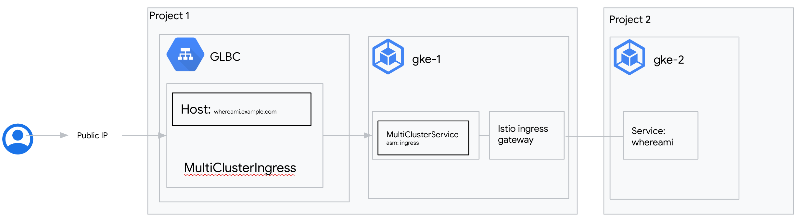

# Multi-cluster Ingress for External Load Balancing

[Multi-cluster Ingress](https://cloud.google.com/kubernetes-engine/docs/concepts/ingress-for-anthos) for GKE is a cloud-hosted Ingress controller for GKE clusters. It's a Google-hosted service that supports deploying shared load balancing resources across clusters and across regions.

## Use-cases

- Disaster recovery for internet traffic across clusters or regions
- Flexible migration between clusters
- Low-latency serving of traffic to globally distributed GKE clusters
- GKE clusters running in different Projects

## Relevant documentation

- [Multi-cluster Ingress Concepts](https://cloud.google.com/kubernetes-engine/docs/concepts/ingress-for-anthos)
- [Setting Up Multi-cluster Ingress](https://cloud.google.com/kubernetes-engine/docs/how-to/ingress-for-anthos-setup)
- [Deploying Ingress Across Clusters](https://cloud.google.com/kubernetes-engine/docs/how-to/ingress-for-anthos)
- [Google Cloud External HTTP(S) Load Balancing](https://cloud.google.com/load-balancing/docs/https)
- [Istio Vitual Service](https://istio.io/latest/docs/reference/config/networking/virtual-service)

## Versions

- GKE clusters on GCP
- All versions of GKE supported
- Tested and validated with 1.22.12-gke.2300 on Nov 14th 2022
- Tested and validated with ASM revision asm-managed-stable

### Networking Manifests

This recipe demonstrates how to use Multi-cluster Ingress (MCI) alongside Anthos Service Mesh (ASM) to publicly expose services deployed in a different projects. In this recipes we will deploy two clusters. The cluster `gke-1` is running in project that hosts the MCI configuration which implies that the GLBC is going to be running in the same project. The cluster `gke-2` is running in a different project. All services will share the same MultiClusterIngress and load balancer IP, but the load balancer will match traffic and send it to the right service depending on the request irrespective of the project.

Whereami service is going to be used to test this scenario, it's is the same service used in [Deploying Ingress across clusters](https://cloud.google.com/kubernetes-engine/docs/how-to/multi-cluster-ingress). The service is going to be deployed in `gke-2`.

Only `gke-1` in this example can host backends to MCI. The backends that are going to be used are the serverless ingress gateways. Once the requests ingresses the mesh, it gets routed using istio. Both clusters are registered to the same fleet.



There are two Custom Resources (CRs) that control multi-cluster load balancing - the MultiClusterIngress (MCI) and the MultiClusterService (MCS). The MCI below describes the desired traffic matching and routing behavior. Similar to an Ingress resource, it can specify host and path matching with Services. This MCI specifies two host rules and a default backend which will recieve all traffic that does not have a match. The `serviceName` field in this MCI specifies the name of an MCS resource.

```yaml
apiVersion: networking.gke.io/v1
kind: MultiClusterIngress
metadata:
  name: default-mci
  namespace: asmingress
spec:
  template:
    spec:
      backend:
        serviceName: default-mcs
        servicePort: 80
      rules:
        - host: whereami.example.com
          http:
            paths:
              - backend:
                  serviceName: default-mcs
                  servicePort: 80
```

Similar to the Kubernetes Service, the MultiClusterService (MCS) describes label selectors and other backend parameters to group pods in the desired way. This `default-mcs` MCS specifies that all Pods with the following characteristics will be selected as backends for `default-mcs`:

- Pods with the label `asm: ingressgateway`
- In the `asmingress` Namespace
- In `gke-1` cluster

If more clusters are added to the Hub, then any Pods in those clusters that match these characteristics will also be registered as backends to `foo`.

```yaml
apiVersion: networking.gke.io/v1
kind: MultiClusterService
metadata:
  name: default-mcs
  namespace: asmingress
  annotations:
    beta.cloud.google.com/backend-config: '{"ports": {"default":"ingress-backendconfig"}}'
spec:
  template:
    spec:
      selector:
        asm: ingressgateway
      ports:
        - name: http
          protocol: TCP
          port: 80
          targetPort: 80
```

A BackendConfig resource is used to configure the health check that the Google Cloud load balancer uses.

```yaml
apiVersion: cloud.google.com/v1
kind: BackendConfig
metadata:
  name: ingress-backendconfig
spec:
  healthCheck:
    requestPath: /healthz/ready
    port: 15021
    type: HTTP
```

Now that you have the background knowledge and understanding of MCI, you can try it out yourself.

### Try it out

1. Download this repo and navigate to this folder

   ```sh
   $ git clone https://github.com/GoogleCloudPlatform/gke-networking-recipes.git
   Cloning into 'gke-networking-recipes'...

   $ cd gke-networking-recipes/ingress/multi-cluster/mci-multi-projects
   ```

1. Set up Environment variables

   ```bash
   export PROJECT1_NAME=PROJECT1 # Configuration project name
   export PROJECT2_NAME=PROJECT2 # Service project name
   export PROJECT1=$(gcloud projects list | grep NAME:\ ${PROJECT1} -B 1 | head -1 | awk '{print $2}')
   export PROJECT2=$(gcloud projects list | grep NAME:\ ${PROJECT2} -B 1 | head -1 | awk '{print $2}')
   export GKE1_REGION=GCP_CLOUD_REGION # Pick a supported Region/Zone for cluster gke-1
   export GKE2_REGIOn=GCP_CLOUD_REGION # Pick a supported Region/Zone for cluster gke-2
   ```

1. Deploy two GKE clusters within your Google Cloud project.

   Note: `machine-type=e2-standard-4` and `num-nodes=4` are used to support Anthos Service Mesh (ASM) deployment. For more information about ASM minumum requirements for GKE, please [click here](https://cloud.google.com/service-mesh/v1.7/docs/scripted-install/gke-asm-onboard-1-7#requirements).

   ```sh
   gcloud container clusters create gke-1 \
   --machine-type=e2-standard-4 \
   --num-nodes=4 \
   --region ${GKE1_REGION} \
   --enable-ip-alias \
   --release-channel rapid \
   --workload-pool=${PROJECT1}.svc.id.goog --async
   --project=${PROJECT2}

   gcloud container clusters create gke-2 \
   --machine-type=e2-standard-4 \
   --num-nodes=4 \
   --region ${GKE1_REGION} \
   --enable-ip-alias \
   --release-channel rapid \
   --workload-pool=${PROJECT2}.svc.id.goog --async
   --project=${PROJECT2}
   ```

   Clusters creation takes around 5 min to complete

1. Ensure that the cluster is running:

   ```sh
   gcloud container clusters list --project=${PROJECT1}
   ```

   The output is similar to the following:

   ```sh
   NAME: gke-1
   LOCATION: us-east4
   MASTER_VERSION: 1.22.12-gke.2300
   MASTER_IP: 25.2.57.19
   MACHINE_TYPE: e2-standard-2
   NODE_VERSION: 1.22.12-gke.1200 *
   NUM_NODES: 4
   STATUS: RUNNING
   ```

   ```sh
   gcloud container clusters list --project=${PROJECT2}
   ```

   The output is similar to the following:

   ```sh
   NAME: gke-2
   LOCATION: us-central1
   MASTER_VERSION: 1.22.12-gke.2300
   MASTER_IP: 25.44.14.26
   MACHINE_TYPE: e2-standard-2
   NODE_VERSION: 1.22.12-gke.1200 *
   NUM_NODES: 4
   STATUS: RUNNING
   ```

1. Get the clusters credentials

   ```bash
   gcloud container clusters get-credentials gke-1 --region ${GKE1_REGION} --project=${PROJECT1}
   gcloud container clusters get-credentials gke-2 --region ${GKE2_REGION} --project=${PROJECT2}
   ```

1. Rename contextswest1

   The prior step will have added credentials for your new clusters to your `kubeconfig`, but let's rename the contexts to something a little shorter:

   ```bash
   kubectl config rename-context gke_${PROJECT1}_${GKE1_REGION}_gke-1 gke-1

   kubectl config rename-context gke_${PROJECT2}_${GKE2_REGION}_gke-2 gke-2
   ```

1. Enable the Hub, Anthos, and MultiClusterIngress APIs for your GCP project as described [here](https://cloud.google.com/kubernetes-engine/docs/how-to/ingress-for-anthos-setup#before_you_begin).

   ```bash
   gcloud services enable gkehub.googleapis.com --project=${PROJECT1}

   gcloud services enable anthos.googleapis.com --project=${PROJECT1}

   gcloud services enable multiclusteringress.googleapis.com --project=${PROJECT1}
   ```

1. [Register](https://cloud.google.com/kubernetes-engine/docs/how-to/ingress-for-anthos-setup#registering_your_clusters) your two clusters (`gke-1` and `gke-2`).

   There are a few steps to complete as part of the registration process. A quick hint to get you going is the `gke-uri` for your GKE clusters.

   Register the clusters with Hub.

   ```bash
    gcloud container hub memberships register gke-1 \
     --gke-cluster ${GKE1_REGION}/gke-1 \
     --enable-workload-identity
     --project=${PROJECT1}

    gcloud container hub memberships register gke-2 \
     --gke-uri https://container.googleapis.com/v1/projects/${PROJECT2}/locations/${GKE2_REGION}/clusters/gke-2 \
     --enable-workload-identity
     --project=${PROJECT1}
   ```

   Confirm that they are registered with Hub. Your EXTERNAL_ID values might be different.

   ```bash
      gcloud container hub memberships list
   ```

   The output is similar to the following:

   ```bash
   NAME: gke-1
   EXTERNAL_ID: 3b231edd-0116-4f1c-8c7e-ba406a3cc3a0
   LOCATION: global
   NAME: gke-2
   EXTERNAL_ID: 548dc83a-dc1c-48e3-9dd5-08485213031a
   LOCATION: global
   ```

1. Now enable Multi-cluster Ingress and specify `gke-1` as your config cluster.

```bash
gcloud container hub ingress enable \
--config-membership=projects/${PROJECT1}/locations/global/memberships/gke-1 --project=${PROJECT1}
```

1. Confirm that MCI is configured properly. The error for gke-2 is expected because the cluster is running in another project

   ```bash
   gcloud container hub ingress describe --project=${PROJECT1}
   ```

   The output is similar to the following:

   ```bash
     createTime: '2022-11-09T13:43:24.727268857Z'
     labels:
       managed-by-cnrm: 'true'
     membershipStates:
       projects/164649664340/locations/global/memberships/gke-1:
         state:
           code: OK
           updateTime: '2022-11-24T16:30:58.333847347Z'
       projects/663644364358/locations/global/memberships/gke-2
         state:
           code: ERROR
           description: 'Error AVMBR110: container.clusters.get permission missing for
             GKE Cluster "projects/project-2/locations/us-central1/clusters/gke-2".'
           updateTime: '2022-11-24T16:29:08.855420159Z'
     name: projects/project-1/locations/global/features/multiclusteringress
     resourceState:
       state: ACTIVE
     spec:
       multiclusteringress:
         configMembership: projects/project-1/locations/global/memberships/gke-1
     state:
       state:
         code: OK
         description: Ready to use
         updateTime: '2022-11-18T10:38:55.992248726Z'
     updateTime: '2022-11-24T16:30:58.986638800Z'
   ```

1. Now follow the steps for cluster registration with Hub and enablement of Multi-cluster Ingress.

   There are two manifests in this folder:

   - namespace.yaml describes the namespace where the service is going to be running. This namespace should be deployed in both clusters. Because `gke-1` will host the application service definition. Make sure the asm revision matches the asm revision in the namespace.
   - app.yaml is the manifest for the whereami deployment. This manifest should be deployed on the service cluster.
   - service.yaml is the manifest that defines the whereami service. This manifest should be deployed on both clusters.
   - ingress.yaml is the manifest for the MultiClusterIngress and MultiClusterService resources. These will be deployed only on the `gke-1` cluster as this was set as the config cluster and is the cluster that the MCI controlller is listening to for updates.
   - ingress_gw.yaml is the manifest to deploy the istio ingress gw. This manifest should be deployed on the MCI configuration cluster.
   - virtual_service_ingress.yaml is the manifest describing the istio virtual service that should be deploy in the MCI configuration cluster.
   - virtual_service_app.yaml is the manifest describing the istio virtual service that should be deployed to expose the service running in the service cluster. It should be deployed only in the service project

1. It can take up to 10 minutes for the load balancer to deploy fully. Inspect the MCI resource to watch for events that indicate how the deployment is going. Then capture the IP address for the MCI ingress resource.

   ```sh
   $ kubectl --context=gke-1 describe mci/default-mci -n asmingress
     Name:         default-mci
     Namespace:    asmingress
     Labels:       app.kubernetes.io/managed-by=configmanagement.gke.io
                   configsync.gke.io/declared-version=v1
     API Version:  networking.gke.io/v1
     Kind:         MultiClusterIngress
     Metadata:
       Creation Timestamp:  2022-11-09T13:38:28Z
       Finalizers:
         mci.finalizer.networking.gke.io
       Generation:  5
       Managed Fields:
         API Version:  networking.gke.io/v1
         Fields Type:  FieldsV1
         fieldsV1:
           f:metadata:
             f:annotations:
               f:config.k8s.io/owning-inventory:
               f:config.kubernetes.io/origin:
             f:labels:
               f:app.kubernetes.io/managed-by:
               f:configsync.gke.io/declared-version:
           f:spec:
             f:template:
               f:spec:
                 f:backend:
                   f:serviceName:
                   f:servicePort:
                 f:rules:
         Manager:      configsync.gke.io
         Operation:    Apply
         Time:         2022-11-21T16:30:03Z
         API Version:  networking.gke.io/v1beta1
         Fields Type:  FieldsV1
         fieldsV1:
           f:metadata:
             f:annotations:
               f:networking.gke.io/last-reconcile-time:
             f:finalizers:
               .:
               v:"mci.finalizer.networking.gke.io":
           f:status:
             .:
             f:CloudResources:
               .:
               f:BackendServices:
               f:ForwardingRules:
               f:HealthChecks:
               f:NetworkEndpointGroups:
               f:TargetProxies:
               f:UrlMap:
             f:VIP:
         Manager:         Google-Multi-Cluster-Ingress
         Operation:       Update
         Time:            2022-11-16T14:12:00Z
       Resource Version:  33612969
       UID:               5b886589-a075-4365-8f6e-5ebfe815319d
     Spec:
       Template:
         Spec:
           Backend:
             Service Name:  mcs-service
             Service Port:  80
           Rules:
             Host:  whereami.example.com
             Http:
               Paths:
                 Backend:
                   Service Name:  mcs-service
                   Service Port:  80
     Status:
       Cloud Resources:
         Backend Services:
           mci-b8wct4-80-asmingress-mcs-service
         Forwarding Rules:
           mci-b8wct4-fw-asmingress-default-mci
         Health Checks:
           mci-b8wct4-80-asmingress-mcs-service
         Network Endpoint Groups:
           zones/us-east4-a/networkEndpointGroups/k8s1-ffef0386-aasmingre-default-mci-mcs-service-svc-k7qwrn58i-8-ddf538d9
           zones/us-east4-b/networkEndpointGroups/k8s1-ffef0386-aasmingre-default-mci-mcs-service-svc-k7qwrn58i-8-ddf538d9
           zones/us-east4-c/networkEndpointGroups/k8s1-ffef0386-aasmingre-default-mci-mcs-service-svc-k7qwrn58i-8-ddf538d9
         Target Proxies:
           mci-b8wct4-asmingress-default-mci
         URL Map:  mci-b8wct4-asmingress-default-mci
       VIP:        49.99.10.25
     Events:       <none>
   ```

   ```bash
   # capture the IP address for the MCI resource
   $ export MCI_ENDPOINT=$(kubectl --context=gke-1 get mci/default-mci -n asmingress -o yaml | awk '/VIP/{ print $2}')
   ```

1. Now use the IP address from the MCI output to reach the load balancer. Try hitting the load balancer on the different host rules to confirm that traffic is being routed correctly.

   ```bash
   $ curl -s -H "host: whereami.example.com" ${MCI_ENDPOINT}
    {
      "cluster_name": "gke-2",
      "host_header": "whereami.example.com",
      "pod_name": "whereami-857dc49746-4qmcp",
      "pod_name_emoji": "🐯",
      "project_id": "svc-project-076f",
      "timestamp": "2022-11-24T19:54:44",
      "zone": "us-central1-b"
    }
   ```
