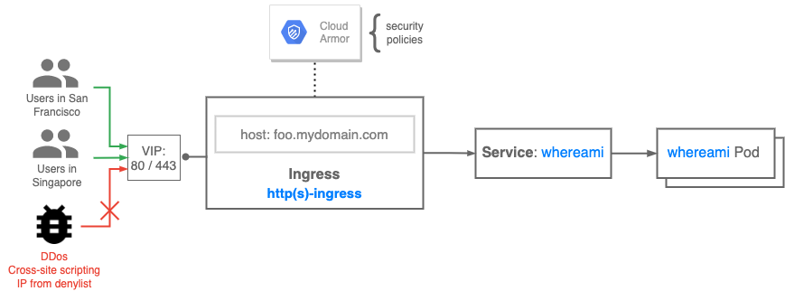

# Google Cloud Armor enabled ingress

The following recipe provides a walk-through for setting up [GKE Ingress](https://cloud.google.com/kubernetes-engine/docs/concepts/ingress)
with [Google Cloud Armor](https://cloud.google.com/armor) protection.

Google Cloud Armor protects your applications and websites against denial of service and web attacks.
Since GKE Ingresses use **proxy-based** [Google Cloud HTTP(s) Load Balancers](https://cloud.google.com/load-balancing/docs/https),
**protection against L3 and L4 DDos attacks is enabled by default**.

Applications can be also protected with Layer7 filtering by using Google Cloud Armor
[security policies](https://cloud.google.com/armor/docs/security-policy-overview). Once Google Cloud
Armor security policy is configured, it can be used to protect services associated with a given ingress.

## Use cases

* Protect backend services at the networking edge with Layer7 filtering rules

## Relevant documentation

* [Cloud Armor overview](https://cloud.google.com/armor)
* [Cloud Armor security policy](https://cloud.google.com/armor/docs/security-policy-overview)
* [GKE ingress overview](https://cloud.google.com/kubernetes-engine/docs/concepts/ingress)

## Versions & Compatibility

* GKE version 1.19.10+ *(for GA of this feature)*
* Works with [External Ingress](https://cloud.google.com/kubernetes-engine/docs/how-to/load-balance-ingress)
  *(single-cluster)*
* Tested and validated with GKE version 1.19.10 on Jul 2nd 2021

---



Google Cloud Armor protection is integrated with ingress for GKE by leveraging [BackendConfig CRD](https://github.com/kubernetes/ingress-gce/tree/master/pkg/apis/backendconfig).
This object is associated with a given service and allows to specify configuration for HTTPs Load Balancer
that handles incoming traffic. Google Cloud Armor policy can be can be enabled for a service by specifying
`securityPolicy` block with `name` key that defines name of the policy that will be applied.

**NOTE**: GKE creates [default backend](https://cloud.google.com/kubernetes-engine/docs/concepts/ingress#default_backend)
service upon cluster creation. This default service returns `404` HTTP response code and is used
on any Ingress as a default destination for unmatched requests - unless `defaultBackend` field with custom
service is specified. Keep in mind that **GKE default backend service has no associated `BackendConfig`
by default**, so you need to configure CloudArmor policy for it explicitly.

**NOTE**: applying `cloud.google.com/backend-config` annotation on an existing service, that is 
associated with an existing Ingress, makes no changes on underlying backend service.
Refer to [following issue for details](https://github.com/kubernetes/ingress-gce/issues/1503).

## Prerequisites:
* GKE cluster up and running *(check [Prerequisite: GKE setup](#prerequisite-gke-setup) below)*

## Walk-through
1. Create a Google Cloud Armor policy *(check [Configuring Google Cloud Armor security policies](https://cloud.google.com/armor/docs/configure-security-policies)
  guide)*. In this example, we create a Cloud Armor policy `allow-my-ip` that only allow one specific IP(34.83.21.159), and block all other traffics with 403 responses.

2. (Optional) Enable Google CloudArmor policy on a `default-http-backend` service

   * Create `BackendConfig` in a `kube-system` namespace. Substitute example policy name with your
   CloudArmor policy name

     ```bash
     cat << EOF | kubectl apply -f - -n kube-system
     apiVersion: cloud.google.com/v1
     kind: BackendConfig
     metadata:
       name: cloudarmor-test
     spec:
       securityPolicy:
         name: allow-my-ip
     EOF
     ```

   * Annotate `default-http-backend` service in a `kube-system` namespace with a newly created `BackendConfig`

     ```bash
     kubectl annotate services default-http-backend \
     beta.cloud.google.com/backend-config='{"default": "cloudarmor-test"}' -n kube-system
     ```

3. Replace `$POLICY_NAME` variable in `cloudarmor-ingress.yaml` file with your Google CloudArmor
policy name<YOUR_POLICY_NAME>.

   ```bash
   sed -i'.bak' 's/$POLICY_NAME/<YOUR_POLICY_NAME>/g' cloudarmor-ingress.yaml
   ```

4. Apply `cloudarmor-ingress.yaml` file

   ```bash
   $ kubectl apply -f cloudarmor-ingress.yaml
   ingress.networking.k8s.io/cloudarmor-test created
   backendconfig.cloud.google.com/cloudarmor-test created
   service/whereami created
   deployment.apps/whereami created
   ```

5. Wait until all created objects reach desired state
```bash
kubectl describe ingress
Name:             cloudarmor-test
Labels:           <none>
Namespace:        default
Address:          34.160.135.174
Ingress Class:    <none>
Default backend:  <default>
Rules:
  Host        Path  Backends
  ----        ----  --------
  *           
              /whereami   whereami:80 (10.24.0.31:8080,10.24.1.47:8080,10.24.2.39:8080)
Annotations:  ingress.kubernetes.io/backends:
                {"k8s1-02fed221-default-whereami-80-cda8fb8c":"HEALTHY","k8s1-02fed221-kube-system-default-http-backend-80-37075a2d":"HEALTHY"}
              ingress.kubernetes.io/forwarding-rule: k8s2-fr-20aeohkx-default-cloudarmor-test-0aa8l6ah
              ingress.kubernetes.io/target-proxy: k8s2-tp-20aeohkx-default-cloudarmor-test-0aa8l6ah
              ingress.kubernetes.io/url-map: k8s2-um-20aeohkx-default-cloudarmor-test-0aa8l6ah
              kubernetes.io/ingress.class: gce
Events:
  Type     Reason     Age                  From                     Message
  ----     ------     ----                 ----                     -------
  Normal   Sync       19m                  loadbalancer-controller  UrlMap "k8s2-um-20aeohkx-default-cloudarmor-test-0aa8l6ah" created
  Normal   Sync       19m                  loadbalancer-controller  TargetProxy "k8s2-tp-20aeohkx-default-cloudarmor-test-0aa8l6ah" created
  Normal   Sync       19m                  loadbalancer-controller  ForwardingRule "k8s2-fr-20aeohkx-default-cloudarmor-test-0aa8l6ah" created
  Normal   IPChanged  19m                  loadbalancer-controller  IP is now 34.160.135.174
  Normal   Sync       9m37s (x7 over 20m)  loadbalancer-controller  Scheduled for sync
```

6. Verify the policy is acting as expected by sending traffic to our Ingress VIP.
We should expect connection from the IP specified in the policy with path `/whereami` to receive a `whereami` response, whereas connections from different IPs with the same path generating 403s(based on the configured Cloud Armor policy). 
If step 2 is skipped, requests with non-matching paths should generate 404 responses from the default backend, no matter we are using allowed or blocked IPs. Otherwise, requests using blocked IPs would act depends on the Cloud Armor policy specification(in this example, we should receive 403s), and default 404 response is only received from IPs that allows traffics.

Using allowed IP 34.83.21.159:
```
curl 34.160.135.174/whereami
{"cluster_name":"gke-1","host_header":"34.160.135.174","pod_name":"whereami-59588795bb-7dx2c","pod_name_emoji":"\ud83c\udf24","zone":"us-west1-a"}
```

Using blocked IP 
```
curl 34.160.135.174/whereami
<!doctype html><meta charset="utf-8"><meta name=viewport content="width=device-width, initial-scale=1"><title>403</title>403 Forbidden
```

## Cleanup

```bash
kubectl delete -f internal-ingress-basic.yaml
```

If step2 is performed, also delete the `BackendConfig` and remove annotation for default-http-backend in the `kube-system` namespace, 
```
kubectl delete backendconfig  cloudarmor-test -n kube-system

kubectl annotate services default-http-backend beta.cloud.google.com/backend-config- -n kube-system
```