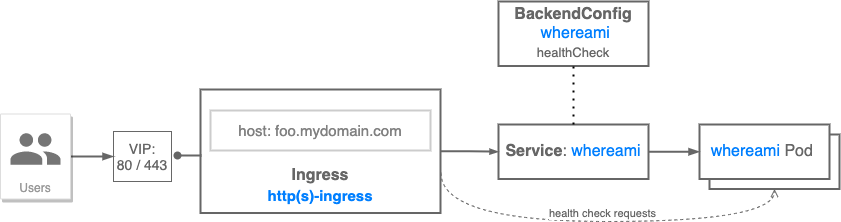

# GKE Ingress with custom HTTP health check
The following recipe provides a walk-through for setting up [GKE Ingress](https://cloud.google.com/kubernetes-engine/docs/concepts/ingress) with a custom HTTP health check.

GKE Ingresses use proxy-based [Google Cloud HTTP(s) Load Balancers](https://cloud.google.com/load-balancing/docs/https)
that can serve multiple backend services (Kubernetes services in GKE case). Each of those backend services
must reference [Google Cloud health check](https://cloud.google.com/load-balancing/docs/health-check-concepts).
GKE creates those health checks with parameters that are either explicitly configured, inferred or
have default values.

It is recommended practice to configure health check parameters explicitly for GKE Ingress backend services.

### Use cases

* Explicitly configure health check parameters for your service

### Relevant documentation

* [GKE Ingress overview](https://cloud.google.com/kubernetes-engine/docs/concepts/ingress)
* [GKE Ingress health checks](https://cloud.google.com/kubernetes-engine/docs/concepts/ingress#health_checks)
* [Custom health check configuration](https://cloud.google.com/kubernetes-engine/docs/how-to/ingress-features#direct_health)

---



GKE creates [Google Cloud health check](https://cloud.google.com/load-balancing/docs/health-check-concepts)
for each Ingress backend service in one of the following ways:

* If service references [BackendConfig CRD](https://github.com/kubernetes/ingress-gce/tree/master/pkg/apis/backendconfig)
with `healthCheck` information, then GKE uses that to create the health check.

Otherwise:

* If service Pods use Pod template with a container that has a readiness probe, GKE can infer some or
all of the parameters from that probe for health check configuration.
Check [Parameters from a readiness probe](https://cloud.google.com/kubernetes-engine/docs/concepts/ingress#interpreted_hc)
for details.

* If service Pods use Pod template with a container that **does not** have a container with a readiness
probe whose attribute can be interpreted as health check parameters, the [default values](https://cloud.google.com/kubernetes-engine/docs/concepts/ingress#def_inf_hc)
are used.

**NOTE**: keep in mind differences in destination port when configuring `healthCheck` parameters in
`BackendConfig` object for services that use [Container Native Load Balancing](https://cloud.google.com/kubernetes-engine/docs/how-to/container-native-load-balancing).

* When using container-native load balancing, the port should match `containerPort` of a serving Pod

* For backends based on instance groups, the port should match `nodePort` exposed by the service

### Networking Manifests
In this example, an external Ingress resource sends HTTP traffic to the `whereami` Service at port 80. A public IP is automatically provisioned by the Ingress controller which listens for internet traffic on port 80.

```yaml
apiVersion: networking.k8s.io/v1
kind: Ingress
metadata:
  name: hc-test
spec:
  rules:
  - http:
      paths:
      - path: "/"
        pathType: Prefix
        backend:
          service:
            name: whereami
            port:
              number: 80
```

In this recipe, a `BackendConfig` resource is used to configure a custom load balancer health check. The `whereami` service exposes the `/healthz` endpoint that responds with 200 if the application is running. This custom health check probes the `/healthz` endpoint every second at the Service `targetPort`.

```yaml
apiVersion: cloud.google.com/v1
kind: BackendConfig
metadata:
  name: hc-test
spec:
  healthCheck:
    timeoutSec: 1
    type: HTTP
    requestPath: /healthz
    port: 8080
```

The following `whereami` Service selects across the Pods from the `whereami` Deployment. This Deployment consists of three Pods which will get load balanced across. Note the use of the `cloud.google.com/neg: '{"ingress": true}'` annotation. This enables container-native load balancing which is a best practice. In GKE 1.17+ this is annotated by default.

```yaml
apiVersion: v1
kind: Service
metadata:
  name: whereami
  annotations:
    cloud.google.com/neg: '{"ingress": true}'
    beta.cloud.google.com/backend-config: '{"default": "hc-test"}'
spec:
  selector:
    app: whereami
  ports:
    - port: 80
      protocol: TCP
      targetPort: 8080
```

### Prerequisites

- GKE cluster up and running *(check [Cluster Setup](../../../cluster-setup.md))*

### Try it out

1. Download this repo and navigate to this folder

```bash
$ git clone https://github.com/GoogleCloudPlatform/gke-networking-recipes.git
Cloning into 'gke-networking-recipes'...

$ cd gke-networking-recipes/ingress/single-cluster/ingress-custom-http-health-check
```

2. Deploy the Ingress, BackendConfig, Deployment, and Service resources in the [custom-http-hc-ingress.yaml](custom-http-hc-ingress.yaml) manifest.

```bash
$ kubectl apply -f custom-http-hc-ingress.yaml
ingress.networking.k8s.io/hc-test created
backendconfig.cloud.google.com/hc-test created
service/whereami created
deployment.apps/whereami created
```

3. It will take up to a minute for the Pods to deploy and up to a few minutes for the Ingress resource to be ready. Validate their progress and make sure that no errors are surfaced in the resource events.

```yaml
$ kubectl get deploy whereami
NAME       READY   UP-TO-DATE   AVAILABLE   AGE
whereami   3/3     3            3           2m3s

$ kubectl describe ingress hc-test
Name:             hc-test
Labels:           <none>
Namespace:        default
Address:          34.149.233.143
Ingress Class:    <none>
Default backend:  <default>
Rules:
  Host        Path  Backends
  ----        ----  --------
  *
              /   whereami:80 (10.68.0.6:8080,10.68.2.7:8080,10.68.2.8:8080)
Annotations:  ingress.kubernetes.io/backends:
                {"k8s1-48c467ea-default-whereami-80-d9133039":"HEALTHY","k8s1-48c467ea-kube-system-default-http-backend-80-4fecb0c3":"HEALTHY"}
              ingress.kubernetes.io/forwarding-rule: k8s2-fr-t65dobq9-default-hc-test-mdufv3cy
              ingress.kubernetes.io/target-proxy: k8s2-tp-t65dobq9-default-hc-test-mdufv3cy
              ingress.kubernetes.io/url-map: k8s2-um-t65dobq9-default-hc-test-mdufv3cy
Events:
  Type     Reason     Age                  From                     Message
  ----     ------     ----                 ----                     -------
  Warning  Translate  7m8s (x5 over 7m9s)  loadbalancer-controller  Translation failed: invalid ingress spec: could not find service "default/whereami"
  Normal   Sync       5m53s                loadbalancer-controller  UrlMap "k8s2-um-t65dobq9-default-hc-test-mdufv3cy" created
  Normal   Sync       5m51s                loadbalancer-controller  TargetProxy "k8s2-tp-t65dobq9-default-hc-test-mdufv3cy" created
  Normal   Sync       5m43s                loadbalancer-controller  ForwardingRule "k8s2-fr-t65dobq9-default-hc-test-mdufv3cy" created
  Normal   IPChanged  5m43s                loadbalancer-controller  IP is now 34.149.233.143
  Normal   Sync       32s (x7 over 7m9s)   loadbalancer-controller  Scheduled for sync
```

4. Finally, we can validate the data plane by sending traffic to our Ingress VIP.

<!-- ```bash
$ curl 34.149.233.143
{
  "cluster_name": "gke-1",
  "gce_instance_id": "5672054038999820499",
  "gce_service_account": "square-pipe-192382.svc.id.goog",
  "headers": {
    "Accept": "*/*",
    "Connection": "Keep-Alive",
    "Host": "34.149.233.143",
    "User-Agent": "curl/7.74.0",
    "Via": "1.1 google",
    "X-Cloud-Trace-Context": "40591ad625685ac693cd5979612d1bb7/5151715693127206217",
    "X-Forwarded-For": "35.232.37.122, 34.149.233.143",
    "X-Forwarded-Proto": "http"
  },
  "host_header": "34.149.233.143",
  "pod_name": "whereami-6df48bf6bd-4w2bd",
  "pod_name_emoji": "👩",
  "project_id": "square-pipe-192382",
  "timestamp": "2023-01-20T19:15:14",
  "zone": "us-central1-a"
}
``` -->

### Cleanup

```bash
kubectl delete -f custom-http-hc-ingress.yaml
```
