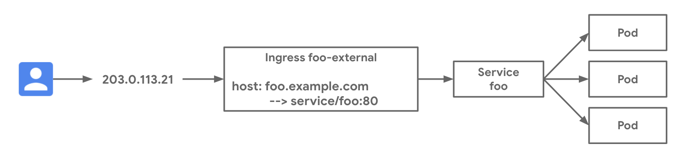

# Basic External Ingress

External Ingress on GKE deploys a global External HTTP(S) Load Balancer for public internet load balancing. This example deploys an application on GKE and exposes the application with a public load balanced IP address. See the [external-ingress-basic.yaml](external-ingress-basic.yaml) manifest for the full deployment spec.

### Use-cases

- Public exposure of a GKE application on the internet
- HTTP host and path-based load balancing for one to many Services behind the same public VIP

### Relevant documentation

- [Ingress for GKE](https://cloud.google.com/kubernetes-engine/docs/concepts/ingress)
- [Ingress for External HTTP(S) Load Balancing](https://cloud.google.com/kubernetes-engine/docs/concepts/ingress-xlb)

#### Versions

- All supported GKE versions





### Networking Manifests

In this example an external Ingress resource matches for HTTP traffic with `foo.example.com` and sends it to the `foo` Service at port 8080. A public IP is automatically provisioned by the Ingress controller which listens for internet traffic on port 80. The Ingress resource below shows that there is one host match. Any traffic which does not match this is sent to the default backend to provide 404 responses. 


```yaml
apiVersion: networking.k8s.io/v1
kind: Ingress
metadata:
  name: foo-external
  annotations:
    kubernetes.io/ingress.class: "gce"
spec:
  rules:
  - host: foo.example.com
    http:
      paths:
      - path: "/"
        pathType: Prefix
        backend:
          service:
            name: foo
            port:
              number: 8080
```

The following `foo` Service selects across the Pods from the `foo` Deployment. This Deployement consists of three Pods which will get load balanced across. Note the use of the `cloud.google.com/neg: '{"ingress": true}'` annotation. This enables container native load balancing which is a best practice. In GKE 1.17+ this is annotated by default.

```yaml
apiVersion: v1
kind: Service
metadata:
  name: foo
  annotations:
    cloud.google.com/neg: '{"ingress": true}'
spec:
  ports:
  - port: 8080
    targetPort: 8080
    name: http 
  selector:
    app: foo
  type: ClusterIP
```

### Try it out

1. Download this repo and navigate to this folder

```bash
$ git clone https://github.com/GoogleCloudPlatform/gke-networking-recipes.git
Cloning into 'gke-networking-recipes'...

$ cd gke-networking-recipes/ingress/single-cluster/ingress-external-basic/
```

2. Deploy the Ingress, Deployment, and Service resources in the [external-ingress-basic.yaml](external-ingress-basic.yaml) manifest.

```bash
$ kubectl apply -f external-ingress-basic.yaml
ingress.networking.k8s.io/foo-external created
service/foo created
deployment.apps/foo created
```


3. It will take up to a minute for the Pods to deploy and up to a few minutes for the Ingress resource to be ready. Validate their progress and make sure that no errors are surfaced in the resource events.


```yaml
$ kubectl get deploy foo
NAME   READY   UP-TO-DATE   AVAILABLE   AGE
foo    3/3     3            0           28s

$ kubectl describe ingress foo-external
Name:             foo-external
Namespace:        default
Address:          34.102.236.246
Default backend:  default-http-backend:80 (10.32.1.8:8080)
Rules:
  Host             Path  Backends
  ----             ----  --------
  foo.example.com
                      foo:80 ()
Annotations:
  ingress.kubernetes.io/url-map:                     k8s2-um-pnfsj460-default-foo-external-hbh8okhj
  kubectl.kubernetes.io/last-applied-configuration:  {"apiVersion":"networking.k8s.io/v1beta1","kind":"Ingress","metadata":{"annotations":{"kubernetes.io/ingress.class":"gce"},"name":"foo-external","namespace":"default"},"spec":{"rules":[{"host":"foo.example.com","http":{"paths":[{"backend":{"serviceName":"foo","servicePort":80}}]}}]}}

  kubernetes.io/ingress.class:            gce
  ingress.kubernetes.io/backends:         {"k8s-be-30721--ffac2c0f6f368e56":"Unknown","k8s1-ffac2c0f-default-foo-80-19f3e1c4":"Unknown"}
  ingress.kubernetes.io/forwarding-rule:  k8s2-fr-pnfsj460-default-foo-external-hbh8okhj
  ingress.kubernetes.io/target-proxy:     k8s2-tp-pnfsj460-default-foo-external-hbh8okhj
Events:
  Type     Reason     Age                    From                     Message
  ----     ------     ----                   ----                     -------
  Normal   ADD        2m48s                  loadbalancer-controller  default/foo-external
  Warning  Translate  2m48s (x7 over 2m48s)  loadbalancer-controller  error while evaluating the ingress spec: could not find service "default/foo"
  Normal   CREATE     2m                     loadbalancer-controller  ip: 34.102.236.246
```

4. Finally, we can validate the data plane by sending traffic to our Ingress VIP.

```bash
$ curl -H "host: foo.example.com" 34.102.236.246
{"cluster_name":"gke-us-west","host_header":"foo.example.com","node_name":"gke-gke-us-west-default-pool-8cdbdcce-smk6.c.church-243723.internal","pod_name":"foo-55dc6d64ff-66d4w","pod_name_emoji":"👨🏽‍🏭","project_id":"church-243723","timestamp":"2020-08-05T04:00:59","zone":"us-west1-a"}
```


### Cleanup

```bash
kubectl delete -f external-ingress-basic.yaml
```
