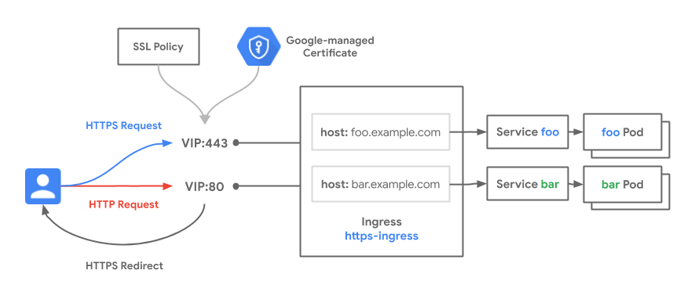
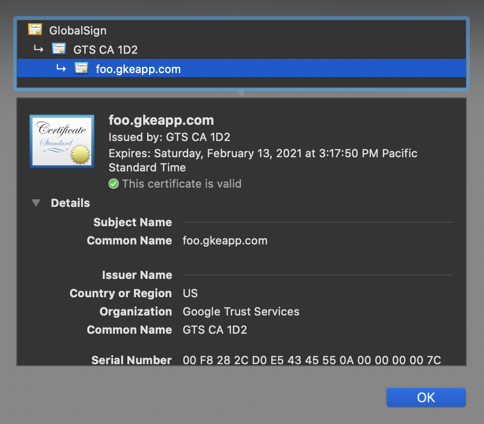

# Secure Ingress

[GKE Ingress](https://cloud.google.com/kubernetes-engine/docs/concepts/ingress) exposes much of the underlying functionality of the Google Cloud load balancers. This recipe focuses on several pieces of functionality that together provide secure, HTTPS encrypted Ingress for your GKE clusters. See the [secure-ingress.yaml](secure-ingress.yaml) manifest for the full deployment spec.

### Use-cases

- Exposing HTTPS encrypted Services securely over the internet
- Granular control of HTTPS functionality through SSL Policies and HTTPS redirects 

### Relevant documentation

- [GKE Ingress Concepts](https://cloud.google.com/kubernetes-engine/docs/concepts/ingress)
- [Ingress for External HTTP(S) Load Balancing](https://cloud.google.com/kubernetes-engine/docs/concepts/ingress-xlb)
- [HTTPS Redirects for GKE Ingress](https://cloud.google.com/kubernetes-engine/docs/how-to/ingress-features#https_redirect)
- [Google-managed SSL Certificates](https://cloud.google.com/kubernetes-engine/docs/how-to/managed-certs)

#### Versions & Compatibility

- HTTPS redirects is only supported on GKE [1.18.10](https://cloud.google.com/kubernetes-engine/docs/how-to/ingress-features#fnb)+
- External GKE Ingress with the HTTP(S) Load Balancer
- Tested and validated with 1.18.10-gke.1500 on Nov 15th 2020

This recipe exposes two Services hosted on GKE to the internet through an Ingress resource. The Ingress leverages HTTPS to encrypt all traffic between the internet client and the Google Cloud load balancer. This recipe also leverages [Google-managed certificates](https://cloud.google.com/load-balancing/docs/ssl-certificates/google-managed-certs) to autogenerate the public certificate and attach it to the Ingress resource. This removes the need to self-generate and provide certificates for the load balancer.

In addition to encrpting the traffic, additional security policies are used to more granularly control the HTTPS behavior. [SSL policies](https://cloud.google.com/load-balancing/docs/ssl-policies-concepts) give the administrator the ability to define what kind of SSL and TLS negotiations that are permitted with this Ingress resource. Lastly, [HTTPS redirects](https://cloud.google.com/kubernetes-engine/docs/how-to/ingress-features#https_redirect) are also specified on the Ingress, which redirects all 80/HTTP traffic to 443/HTTPS. This provides a more user-friendly method of redirecting clients to negotiate HTTPS than outright blocking port 80. When using HTTPS redirects, no traffic (besides the redirect) is capable of being transmitted unencrypted on port 80.




### Networking Manifests

Several declarative Kubernetes resources are used in the deployment of this recipe. The primary one is the Ingress resource. It uses the following annotations to link to enable the security features mentioned above:

- `kubernetes.io/ingress.class: "gce"` specifies that the External HTTP(S) Load Balancer will be deployed
- `kubernetes.io/ingress.global-static-ip-name` deploys the Ingress with a static IP. This allows the IP address to remain the same even if the Ingress is redeployed in the future.
- `networking.gke.io/managed-certificates` references a managed certificate resource which generates a public certificate for the hostnames in the Ingress resource
- `networking.gke.io/v1beta1.FrontendConfig` references a policy resource used to enable HTTPS redirects and an SSL policy

The Ingress resource also has routing rules for `foo.*.com` and `bar.*.com`. Note that Google-managed certificates requires that you have ownership over the certificate DNS domains. To complete this recipe will require that you replace `${DOMAIN}` with a domain you control.  This DNS domain must be mapped to the IP address used by the Ingress. This allows Google to do domain validation against it which is required for certificate provisioning. [Google domains](https://domains.google/) can be used to acquire domains that you can use for testing.

```yaml
apiVersion: networking.k8s.io/v1
kind: Ingress
metadata:
  name: secure-ingress
  annotations:
    kubernetes.io/ingress.class: "gce"
    kubernetes.io/ingress.global-static-ip-name: gke-foobar-public-ip
    networking.gke.io/managed-certificates: foobar-certificate
    networking.gke.io/v1beta1.FrontendConfig: ingress-security-config
spec:
  rules:
  - host: foo.${DOMAIN}.com
    http:
      paths:
      - path: "/"
        pathType: Prefix
        backend:
          service:
            name: foo
            port:
              number: 8080
  - host: bar.${DOMAIN}.com
    http:
      paths:
      - path: "/"
        pathType: Prefix
        backend:
          service:
            name: bar
            port:
              number: 8080
```

The next resource is the  `FrontendConfig` which provides configuration for the [frontend of the Ingress.](https://cloud.google.com/kubernetes-engine/docs/how-to/ingress-features#associating_frontendconfig_with_your_ingress) This config enables HTTPS redirects. Note that it is enabled for the entire Ingress and so it will apply to all Services in the Ingress resource. The other field references an SSL policy. You'll create an SSL policy as a separate Google Cloud resource where you can specify which ciphers can be negotiated in the TLS connection.

```yaml
apiVersion: networking.gke.io/v1beta1
kind: FrontendConfig
metadata:
  name: ingress-security-config
spec:
  sslPolicy: gke-ingress-ssl-policy-https
  redirectToHttps:
    enabled: true
```

The managed certificate generation is goverened via the [ManagedCertificate resource.](https://cloud.google.com/kubernetes-engine/docs/how-to/managed-certs) The spec below will create a single SSL certificate resource with these two hostnames as SANs to the cert. 

```yaml
apiVersion: networking.gke.io/v1
kind: ManagedCertificate
metadata:
  name: foobar-certificate
spec:
  domains:
    - foo.${DOMAIN}.com
    - bar.${DOMAIN}.com
```

With these three resources, you are capable of securing your Ingress for production-ready traffic.

### Try it out

1. Download this repo and navigate to this folder

```bash
$ git clone https://github.com/GoogleCloudPlatform/gke-networking-recipes.git
Cloning into 'gke-networking-recipes'...

$ cd gke-networking-recipes/ingress/single-cluster/ingress-https/
```

2. Deploy the cluster `gke-1` as specified in [cluster setup](../../../cluster-setup.md)

3. Create a static public IP address in your project.

```
$ gcloud compute addresses create --global gke-foobar-public-ip
Created [https://www.googleapis.com/compute/v1/projects/xxx/global/addresses/gke-foobar-public-ip].
```

4. Create an SSL policy. This policy specifies a broad set of modern ciphers and requires that clients negotiate using TLS 1.2 or higher.

```
$ gcloud compute ssl-policies create gke-ingress-ssl-policy-https \
    --profile MODERN \
    --min-tls-version 1.2
```

5. Now that all the Google Cloud resources have been created you can deploy your Kubernetes resources. Deploy the following manifest which deploys the foo and bar applications, the FrontendConfig, ManagedCertificate, and Ingress resource.

```bash
$ kubectl apply -f secure-ingress.yaml
ingress.networking.k8s.io/secure-ingress created
frontendconfig.networking.gke.io/ingress-security-config created
managedcertificate.networking.gke.io/foobar-certificate created
service/foo created
service/bar created
deployment.apps/foo created
deployment.apps/bar created
```

6. It will usually take up to 15 minutes for certificate to be provisioned if DNS records are set up beforehand. If DNS records are configured around the same time as the certificate, it could take up to 60 minutes to provision. For details, see [here](https://cloud.google.com/load-balancing/docs/ssl-certificates/google-managed-certs#replace-ssl).
You can determine the status by checking the Ingress resource events. When it is ready, the events should look like the following:


```bash
$ kubectl describe ingress secure-ingress
Name:             secure-ingress
Namespace:        default
Address:          xxx
Default backend:  default-http-backend:80 (10.8.2.7:8080)
Rules:
  Host            Path  Backends
  ----            ----  --------
  foo.gkeapp.com
                     foo:8080 (10.8.0.11:8080,10.8.1.9:8080)
  bar.gkeapp.com
                     bar:8080 (10.8.0.10:8080,10.8.0.9:8080)
Annotations:
  ingress.kubernetes.io/https-target-proxy:          k8s2-ts-j09o68xc-default-secure-ingress-jfepd28q
  ingress.kubernetes.io/target-proxy:                k8s2-tp-j09o68xc-default-secure-ingress-jfepd28q
  kubectl.kubernetes.io/last-applied-configuration:  {"apiVersion":"networking.k8s.io/v1beta1","kind":"Ingress","metadata":{"annotations":{"kubernetes.io/ingress.class":"gce","kubernetes.io/ingress.global-static-ip-name":"gke-foobar-public-ip","networking.gke.io/managed-certificates":"foobar-certificate"},"name":"secure-ingress","namespace":"default"},"spec":{"rules":[{"host":"foo.gkeapp.com","http":{"paths":[{"backend":{"serviceName":"foo","servicePort":8080}}]}},{"host":"bar.gkeapp.com","http":{"paths":[{"backend":{"serviceName":"bar","servicePort":8080}}]}}]}}

  kubernetes.io/ingress.class:                  gce
  kubernetes.io/ingress.global-static-ip-name:  gke-foobar-public-ip
  ingress.gcp.kubernetes.io/pre-shared-cert:    mcrt-49e7a559-5fe7-4f1d-abb1-8b047e8fd963
  ingress.kubernetes.io/forwarding-rule:        k8s2-fr-j09o68xc-default-secure-ingress-jfepd28q
  ingress.kubernetes.io/https-forwarding-rule:  k8s2-fs-j09o68xc-default-secure-ingress-jfepd28q
  networking.gke.io/managed-certificates:       foobar-certificate
  ingress.kubernetes.io/backends:               {"k8s-be-30401--0dfd9a8f1bfbe064":"HEALTHY","k8s1-0dfd9a8f-default-bar-8080-2c5d0692":"HEALTHY","k8s1-0dfd9a8f-default-foo-8080-4f0e99e4":"HEALTHY"}
  ingress.kubernetes.io/ssl-cert:               mcrt-49e7a559-5fe7-4f1d-abb1-8b047e8fd963
  ingress.kubernetes.io/url-map:                k8s2-um-j09o68xc-default-secure-ingress-jfepd28q
Events:
  Type    Reason  Age                   From                     Message
  ----    ------  ----                  ----                     -------
  Normal  Sync    118s (x115 over 17h)  loadbalancer-controller  Scheduled for sync

```

7. Now use your browser and connect to your URL (remember to use your own domain for this). You can validate the certificate by clicking on the lock icon in your browser. This will show that the foo.* and bar.* hostnames are both secured via the generated certificate.



You can try to reach your application on HTTP but you won't be able to.

```bash
$ curl http://foo.gkeapp.com

<HTML><HEAD><meta http-equiv="content-type" content="text/html;charset=utf-8">
<TITLE>301 Moved</TITLE></HEAD><BODY>
<H1>301 Moved</H1>
The document has moved
<A HREF="https://foo.gkeapp.com/">here</A>.
</BODY></HTML>
```

You are now ready to serve securely on the internet!

### Cleanup

```bash
$ kubectl delete -f secure-ingress.yaml
$ gcloud compute addresses delete --global gke-foobar-public-ip
$ gcloud compute ssl-policies delete gke-ingress-ssl-policy-https
```

### Testing
The test for this recipe will be skipped if the required environment variables are not set.
To run the test, you need to have a project($DNS_PROJECT) that has Cloud DNS enabled. In this project, set up a public DNS zone with a DNS domain you control. See `Create a managed public zone in Cloud DNS` in [setup guide](https://cloud.google.com/dns/docs/set-up-dns-records-domain-name).
Then export the zone name and DNS name as environment variables. Make sure the current service account has role/dns_admin access to the DNS project. 
```
export DNS_PROJECT=dns-project \
export DNS_ZONE=example-zone-name
export DNS_NAME=myzone.example.com
```
