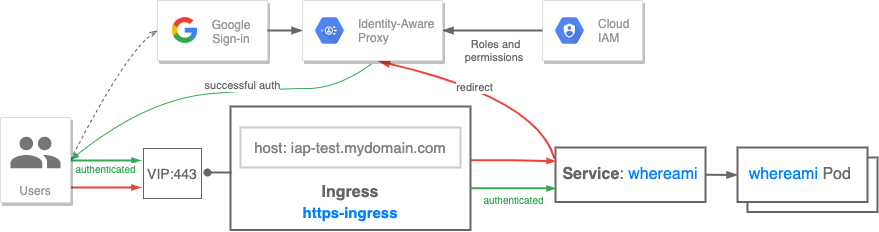

# IAP enabled ingress

Following recipe provides a walk-through for setting up secure [GKE Ingress](https://cloud.google.com/kubernetes-engine/docs/concepts/ingress)
with [Identity-Aware Proxy](https://cloud.google.com/iap/docs/concepts-overview) based authentication.

IAP enforces access control policies for backend services associated with an Ingress, so they can be
accessed only by authenticated users or applications with correct
[Identity and Access Management (IAM) role](https://cloud.google.com/iam/docs/understanding-roles).

## Use cases

* Protect backend services with central, managed authorization layer that leverages IAM roles
* Take advantages of application-level access control model for backend services instead of
relying on network-level solutions like firewalls or VPNs

## Relevant documentation

* [Identity-Aware Proxy](https://cloud.google.com/iap/docs/concepts-overview)
* [GKE ingress](https://cloud.google.com/kubernetes-engine/docs/concepts/ingress)
* [Enabling IAP for GKE](https://cloud.google.com/iap/docs/enabling-kubernetes-howto)

## Versions & Compatibility

* GKE version 1.10.5+ for [BackendConfig](https://cloud.google.com/kubernetes-engine/docs/concepts/backendconfig)
  support
* Tested and validated with GKE version 1.19.10 on Jun 16th 2021

---



IAP is integrated through ingress for GKE by leveraging [BackendConfig CRD](https://github.com/kubernetes/ingress-gce/tree/master/pkg/apis/backendconfig).
This object is associated with a given service and allows to specify configuration for HTTPs Load Balancer
that handles incoming traffic. IAP can be enabled for a service by specifying `iap` block with required
configuration parameters in a related `BackendConfig`.

Requests that are routed by Load Balancer to IAP protected service will be redirected to IAP
authentication server. IAP will perform identity check, redirecting to Google Account sign-in flow
if necessary. Once identity is validated, authentication server will check user's IAM roles and
validate if the user is authorized to access the resource.

## Walk-through

Prerequisites:

* `gcloud` setup *(check [Prerequisite: gcloud setup](#prerequisite-gcloud-setup) below)*
* GKE cluster up and running *(check [Prerequisite: GKE setup](#prerequisite-gke-setup) below)*
* IAP configured *(check [Prerequisite: IAP setup](#prerequisite-iap-setup) below)*

Steps:

1. Reserve global static IP address for an ingress

   ```bash
   gcloud compute addresses create iap-test --global
   ```

2. Configure DNS `A` record for your domain with IP address reserved above
  
    You can use `gcloud` command to get information about reserved address.

    ```bash
    $ gcloud compute addresses describe iap-test --global
    address: 123.213.53.69
    addressType: EXTERNAL
    ...(output omitted)...
    $
    ```

    Once configured, verify that your domain name resolves to the reserved IP address.

    ```bash
    $ nslookup -query=a iap-test.mydomain.com
    ...(output omitted)..

    Non-authoritative answer:
    Name:   iap-test.mydomain.comm
    Address: 123.213.53.69
    ```

3. Create kubernetes secret with oAuth client credentials from [IAP setup prerequisite](#prerequisite-iap-setup)

   ```bash
   kubectl create secret generic iap-test \
   --from-literal=client_id=ATA4NDY1Mzc3NTEyMS1taMWNp1yW50LmNvbQ== \
   --from-literal=client_secret=MjgySf4zSXF1Yk5uTlAwandOc0xrRjFY
   ```

4. Replace `$DOMAIN` variable in `iap-ingress.yaml` file with your domain name

   ```bash
   sed -i '.bak' 's/$DOMAIN/iap-test.mydomain.com/g' iap-ingress.yaml
   ```

5. Apply `iap-ingress.yaml` file

   ```bash
   $ kubectl apply -f iap-ingress.yaml
   ingress.networking.k8s.io/iap-test created
   managedcertificate.networking.gke.io/iap-test created
   backendconfig.cloud.google.com/iap-test created
   service/whereami created
   deployment.apps/whereami created
   $
   ```

6. Wait until all created objects reach desired state

7. Enable IAP on your backend service

   Once backend service is created, enable IAP protection on it and update IAM policies.
   This can be done from [Google Cloud Console](https://console.cloud.google.com/).

   * Browse to [Identity-Aware Proxy](https://console.cloud.google.com/security/iap) page
   * Locate your backend service on a resources list under *HTTPS Resources* tab
   * **Toggle IAP protection** for your backend service
   * Select checkbox next to your service so that info panel appears on the right
   * Click **Add Member** button on the right panel to add members
   * Add *Google Account* or  *Service Account* with **IAP-secured Web App User** role
  
8. Verify and enjoy

   Verification steps depends on Member type that was configured for a backend service in IAP configuration.

   * For Google account, simply browse to your domain i.e. `https://iap-test.mydomain.com` and
   authenticate with your user credentials (you might need to switch your browser to *incognito mode*)
   * For service accounts, follow [IAP Programmatic authentication](https://cloud.google.com/iap/docs/authentication-howto)
    guide

    Once authenticated,  *whereami* service used is this recipe will return JSON data, including
    client authentication request headers. Check below response example for reference:

    ```text
    {
      "cluster_name": "cluster-test",
      "headers": {
        "X-Goog-Authenticated-User-Email": "accounts.google.com:user@mydomain.com",
        "X-Goog-Authenticated-User-Id": "accounts.google.com:413563208703235040404",
        "X-Goog-Iap-Jwt-Assertion": "eyJhbGciOiJFUzI1NiIsInR5cCI6IkpXVCIsImtpZCI6IjBvZUxjUSJ9...",
        ...(output omitted)...
      },
      ...(output omitted)...
   }
    ```

### Prerequisite: gcloud setup

1. Authorize gcloud to access GCP

   ```bash
   gcloud auth login
   ```

2. Configure your project

   ```bash
   gcloud config set project my-project
   ```

### Prerequisite: GKE setup

1. Enable GKE API

   ```bash
   gcloud services enable container.googleapis.com
   ```

2. Create simple zonal GKE cluster for tests

   ```bash
   gcloud container clusters create cluster-test \
   --zone europe-central2-a \
   --release-channel regular \
   --enable-ip-alias
   ```

3. Configure client credentials for a new cluster

   ```bash
   gcloud container clusters get-credentials cluster-test \
   --zone europe-central2-a
   ````

### Prerequisite: IAP setup

IAP setup can be done from [Google Cloud Console](https://console.cloud.google.com/).

1. Configure oAuth consent screen

   * Browse to [OAuth consent screen](https://console.cloud.google.com/apis/credentials/consent)
   * Select desired usage type: *Internal* or *External* and click **Create** button
   * As a minimum, fill all required fields: **app name**, **user support email**,
     **developer contact email**
   * Click **Save and Continue** button

2. Configure oAuth credentials

   * Browse to [API & Services Credentials screen](https://console.cloud.google.com/apis/credentials/)
   * Click **Create Credentials** from bottom menu and select *OAuth Client ID* from drop-down list
   * Select *Web application* as application type
   * Fill name of your oAuth client
   * Click **Create** button
   * Once client is created, select it from the list to open details page
   * Notice **Client ID** and **Client Secret**  - you will use them in later configurations.
    They can be also downladed in JSON format.
   * Add **Authorized redirect URI** in a format `https://iap.googleapis.com/v1/oauth/clientIds/CLIENT_ID:handleRedirect`
    *(replace CLIENT_ID with your valid one)*

### Testing
The test for this recipe will be skipped if the required environment variables are not set.
To run the test, you need to have a project($DNS_PROJECT) that has Cloud DNS enabled. In this project, set up a public DNS zone with a DNS domain you control. See `Create a managed public zone in Cloud DNS` in [setup guide](https://cloud.google.com/dns/docs/set-up-dns-records-domain-name).
Then export the zone name and DNS name as environment variables. Make sure the current service account has role/dns_admin access to the DNS project. 
```
export DNS_PROJECT=dns-project \
export DNS_ZONE=example-zone-name
export DNS_NAME=myzone.example.com
```

You also need to have a support email that follows the requirement described in [Programmatic OAuth clients](https://cloud.google.com/iap/docs/programmatic-oauth-clients).
```
export SUPPORT_EMAIL=support-email
```
