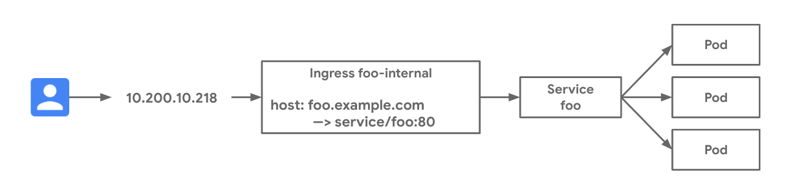

# Basic Internal Ingress

Internal Ingress on GKE deploys a regional Internal HTTP(S) Load Balancer for private HTTP(S) load balancing. This example deploys an application on GKE and exposes the application with a private load balanced IP address. See the [internal-ingress-basic.yaml](internal-ingress-basic.yaml) manifest for the full deployment spec.

### Use-cases

- Private exposure of a GKE HTTP(S) internal application
- HTTP host and path-based load balancing for one to many Services behind the same private VIP

### Relevant documentation

- [Ingress for GKE](https://cloud.google.com/kubernetes-engine/docs/concepts/ingress)
- [Ingress for Internal HTTP(S) Load Balancing](https://cloud.google.com/kubernetes-engine/docs/concepts/ingress-ilb)

### Versions

- 1.16.5-gke.1 and later.




### Networking Manifests

In this example an internal Ingress resource matches for HTTP traffic with `foo.example.com` and sends it to the `foo` Service at port 80. A private IP address is automatically provisioned by the Ingress controller which listens for traffic on port 80. This private IP address can only be reached privately: from the VPC, any other VPC privately connected or even from on-prem if privately connected via VPN or Interconnect, depending on your setup. The Ingress resource below shows that there is one host match. Any traffic which does not match this is sent to the default backend to provide 404 responses.


```yaml
apiVersion: networking.k8s.io/v1beta1
kind: Ingress
metadata:
  name: foo-internal
  annotations:
    kubernetes.io/ingress.class: "gce-internal"
spec:
  rules:
  - host: foo.example.com
    http:
      paths:
      - backend:
          serviceName: foo
          servicePort: 80
```

The following `foo` Service selects across the Pods from the `foo` Deployment. This Deployment consists of three Pods which will get load balanced across. Note the use of the `cloud.google.com/neg: '{"ingress": true}'` annotation. This enables container native load balancing which is a best practice. In GKE 1.17+ this is annotated by default.

```yaml
apiVersion: v1
kind: Service
metadata:
  name: foo
  annotations:
    cloud.google.com/neg: '{"ingress": true}'
spec:
  ports:
  - port: 80
    targetPort: 8080
    name: http
  selector:
    app: foo
  type: ClusterIP
```

### Try it out

1. Download this repo and navigate to this folder

```bash
$ git clone https://github.com/GoogleCloudPlatform/gke-networking-recipes.git
Cloning into 'gke-networking-recipes'...

$ cd gke-networking-recipes/ingress/internal-ingress-basic
```

2. Deploy the Ingress, Deployment, and Service resources in the [internal-ingress-basic.yaml](internal-ingress-basic.yaml) manifest.

```bash
$ kubectl apply -f internal-ingress-basic.yaml
ingress.networking.k8s.io/foo-internal created
service/foo created
deployment.apps/foo created

```


3. It will take up to a minute for the Pods to deploy and up to a few minutes for the Ingress resource to be ready. Validate their progress and make sure that no errors are surfaced in the resource events.


```
$ kubectl get deploy foo
NAME   READY   UP-TO-DATE   AVAILABLE   AGE
foo    3/3     3            0           28s

$ kubectl describe ingress foo-internal
Name:             foo-internal
Namespace:        default
Address:          10.200.10.218
Default backend:  default-http-backend:80 (10.200.20.7:8080)
Rules:
  Host             Path  Backends
  ----             ----  --------
  foo.example.com  
                      foo:80 (<none>)
Annotations:
  ingress.kubernetes.io/target-proxy:                k8s2-tp-odw4qjdd-default-foo-internal-uw14fm1v
  ingress.kubernetes.io/url-map:                     k8s2-um-odw4qjdd-default-foo-internal-uw14fm1v
  kubectl.kubernetes.io/last-applied-configuration:  {"apiVersion":"networking.k8s.io/v1beta1","kind":"Ingress","metadata":{"annotations":{"kubernetes.io/ingress.class":"gce-internal"},"name":"foo-internal","namespace":"default"},"spec":{"rules":[{"host":"foo.example.com","http":{"paths":[{"backend":{"serviceName":"foo","servicePort":80}}]}}]}}

  kubernetes.io/ingress.class:            gce-internal
  ingress.kubernetes.io/backends:         {"k8s1-e4c0c439-default-foo-80-f3d4a56a":"Unknown","k8s1-e4c0c439-kube-system-default-http-backend-80-dee9de2e":"HEALTHY"}
  ingress.kubernetes.io/forwarding-rule:  k8s2-fr-odw4qjdd-default-foo-internal-uw14fm1v
Events:
  Type     Reason     Age                  From                     Message
  ----     ------     ----                 ----                     -------
  Normal   ADD        23m                  loadbalancer-controller  default/foo-internal
  Warning  Translate  23m                  loadbalancer-controller  error while evaluating the ingress spec: could not find service "default/foo"
  Normal   CREATE     22m                  loadbalancer-controller  ip: 10.200.10.218
  Normal   XPN        22m (x4 over 23m)    loadbalancer-controller  Firewall change required by network admin: `gcloud compute firewall-rules create k8s-fw-l7--e4c0c439b5effdb3 --network vpc-prod --description "GCE L7 firewall rule" --allow tcp:30000-32767,tcp:8080 --source-ranges 130.211.0.0/22,209.85.152.0/22,209.85.204.0/22,35.191.0.0/16 --target-tags gke-egr-airbus-test-cluster-1-f53dc7d4-node --project myproject`
  Normal   XPN        5m16s (x3 over 15m)  loadbalancer-controller  Firewall change required by network admin: `gcloud compute firewall-rules update k8s-fw-l7--e4c0c439b5effdb3 --description "GCE L7 firewall rule" --allow tcp:30000-32767,tcp:8080 --source-ranges 130.211.0.0/22,209.85.152.0/22,209.85.204.0/22,35.191.0.0/16 --target-tags gke-egr-airbus-test-cluster-1-f53dc7d4-node --project myproject`
```

Please note in the event logs that some firewall rules should be manually configured for health checks.

4. Create a VM in the same VPC and the region as your GKE cluster to test the Internal Load Balancer as described in the [official documentation](https://cloud.google.com/kubernetes-engine/docs/how-to/internal-load-balance-ingress#step_5_validate_successful_ingress_deployment).

As an example, assuming you already have a Firewall Rule to allow SSH for instances with the "allow-ssh" tag:

```bash
gcloud compute instances create l7-ilb-client \
--image-family=debian-9 \
--image-project=debian-cloud \
--network=<YOUR_VPC> \
--subnet=<YOUR_SUBNET> \
--zone=us-<YOUR_REGION> \
--tags=allow-ssh
```

5. Finally, we can validate the data plane by sending traffic to our Ingress VIP from this VM we created in step 4.

```bash
# SSH into the test VM
$  gcloud compute ssh l7-ilb-client \
--zone=<YOUR_ZONE>
# Using curl from the test VM to the Internal Ingress VIP
$ curl -H "host: foo.example.com" 10.200.10.218

```
### Example Remarks


### Cleanup

```bash
kubectl delete -f internal-ingress-basic.yaml
```

Deleting the test VM created in step 4:

```bash
gcloud compute instances delete l7-ilb-client --zone <YOUR_ZONE>
```
