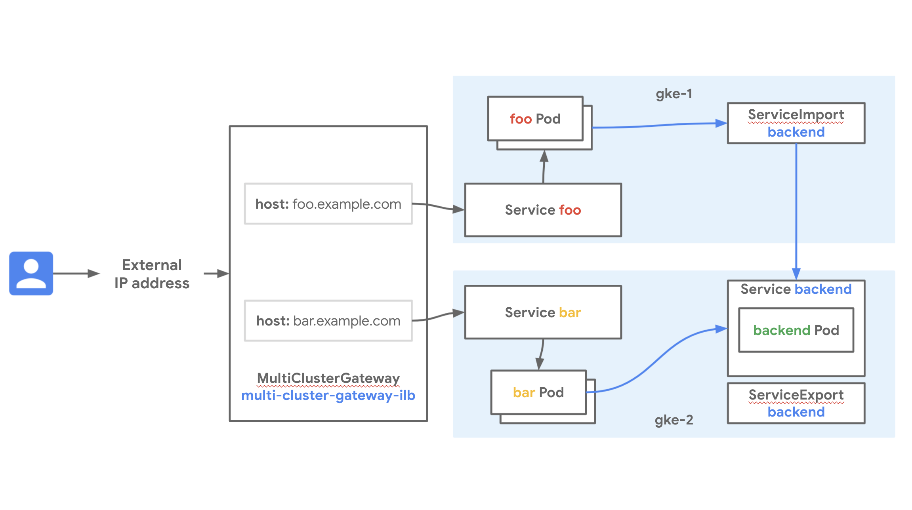

# Title

### Summary

TBD



### Relevant documentation

* TBD

### Versions
- GKE clusters on GCP
- 1.17 and later versions of GKE supported
- Tested and validated with 1.XX.XX-gke.XXXX on XXX XXth 2021

### Network Manifests

*TODO: Copy from folder and describe.*

### Try it out

1. 1. Download this repo and navigate to this folder

    ```sh
    $ git clone https://github.com/GoogleCloudPlatform/gke-networking-recipes.git
    Cloning into 'gke-networking-recipes'...

    $ cd gke-networking-recipes/multi-cluster-services/mcs-mcg
    ```

2. Deploy the two clusters `gke-1` and `gke-2` as specified in [cluster setup](../cluster-setup.md)

3. Now follow the steps for cluster registration with Hub and enablement of Multi-cluster Services.

    There are 5 manifests in this folder, separated by target cluster:

    `gke-1/gateway.yaml` creates the Multi Cluster Gateway
    `gke-1/foo-frontend.yaml` creates a Deployment and Service representing the stateless frontend in this cluster, called `foo`
    `gke-1/route.yaml` creates a HTTPRoute matching the hostname `foo.example.com` to the foo frontend's Service
    
    `gke-2/bar-frontend.yaml` creates a Deployment and Service representing the stateless frontend in this cluster, called `bar`
    `gke-2/route.yaml` creates a HTTPRoute matching the hostname `bar.example.com` to the bar frontend's Service
    `gke-2/exported-backend.yaml` creates a Deployment and Service for a backend; it also creates a ServiceExport for that backend so it can be accessed in either cluster, even though its Deployment only exists in this cluster

4. Deploy all the manifests into their respective cluster

    ```
    # First handle resources in the gke-1 context

    # Deploy the Multi Cluster Gateway
    $ kubectl --context gke-1 apply -f gke-1/gateway.yaml -n mcs-mcg

    # Deploy the foo frontend
    $ kubectl --context gke-1 apply -f gke-1/foo-frontend.yaml -n mcs-mcg

    # Deploy the HTTPRoute for the foo frontend
    $ kubectl --context gke-1 apply -f gke-1/route.yaml -n mcs-mcg

    # Now handle resources in the gke-2 context

    # Deploy the bar frontend
    $ kubectl --context gke-2 apply -f gke-2/bar-frontend.yaml -n mcs-mcg

    # Deploy the HTTPRoute for the bar frontend
    $ kubectl --context gke-2 apply -f gke-2/route.yaml -n mcs-mcg

    # Deploy the backend and its ServiceExport
    $ kubectl --context gke-2 apply -f gke-2/exported-backend.yaml
    ```


#### TODO:

* change to an [external load balancer GatewayClass](https://cloud.google.com/kubernetes-engine/docs/how-to/gatewayclass-capabilities) 
* add step to get $VIP of elb so you can check from external with `curl $VIP -H "host: foo.example.com"` and `curl $VIP -H "host: bar.example.com"`
* note that both of them return the same backend pod JSON particularly that the backend pod is reporting itself in gke-2
* add steps that migrate the `backend` pod:
   * deploy a backend pod in gke-1 and add a serviceexport
   * scale down the backend pod in gke-2
   * see that now if you curl foo.* or bar.* the backend is now reporting that it is from gke-1, even though you didn't change anything in the frontend config (since it's use the MCS DNS)
* maybe make the slide into a gif that shows the migration?


#### Cleanup

TBD