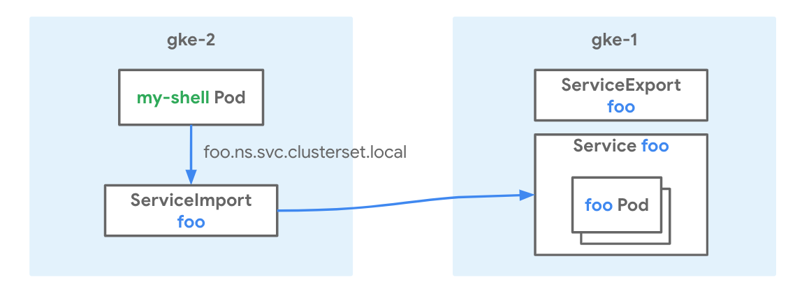
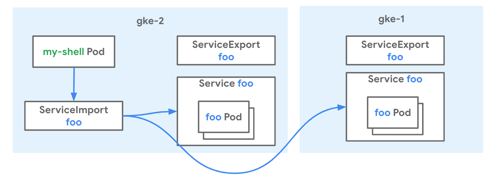

# Multi-cluster Services

[Multi-cluster Services](https://cloud.google.com/kubernetes-engine/docs/concepts/multi-cluster-services) for GKE enables existing Services to be discoverable and accessible across clusters with a virtual IP, matching the behavior of a [ClusterIP Service](https://cloud.google.com/kubernetes-engine/docs/concepts/service#services_of_type_clusterip)
accessible in a cluster.

### Use-cases

- High availability by running the same service across clusters
- Flexible migration between clusters

### Relevant documentation

- [Multi-cluster Services Concepts](https://cloud.google.com/kubernetes-engine/docs/concepts/multi-cluster-services)
- [Setting Up Multi-cluster Services](https://cloud.google.com/kubernetes-engine/docs/how-to/multi-cluster-services)
- [OSS Multi-cluster Services API](https://github.com/kubernetes/enhancements/tree/master/keps/sig-multicluster/1645-multi-cluster-services-api)

#### Versions

- GKE clusters on GCP
- 1.17 and later versions of GKE supported
- Tested and validated with 1.18.10-gke.1500 on Feb 15th 2021

### Networking Manifests

This recipe demonstrates deploying Multi-cluster Services in a cluster (`gke-1`) and make it accessible to other cluster (`gke-2`). The exported Services can be accessed via DNS name `$svc.$ns.svc.clusterset.local` or a VIP called `ClusterSetIP`. In later steps, it also demonstrates app migration to a new cluster (`gke-2`) by exporting the same Service from `gke-2`. You can also see how to use a legacy _routes-based_ cluster to consume (but not export) multicluster Services.



A Custom Resources (CRs) called `ServiceExport` is used to indicate a Service should be exported. When this CR is created, the Service with the same namespace and name in the cluster will be exported other clusters.

```yaml
apiVersion: net.gke.io/v1
kind: ServiceExport
metadata:
  name: whereami
  namespace: multi-cluster-demo
```

When Services are successfully exported, a CR called `ServiceImport` will be automatically created and Multi-cluster Services can be accessed via `$svc.$ns.svc.clusterset.local` or VIP specified in ServiceImport.

```yaml
apiVersion: net.gke.io/v1
kind: ServiceImport
metadata:
  name: whereami
  namespace: multi-cluster-demo
spec:
  ips:
  - 10.0.5.123
  type: ClusterSetIP
```

### Try it out

1. Download this repo and navigate to this folder

    ```sh
    $ git clone https://github.com/GoogleCloudPlatform/gke-networking-recipes.git
    Cloning into 'gke-networking-recipes'...

    $ cd gke-networking-recipes/multi-cluster-services/multi-cluster-services-basic
    ```

2. Deploy the two clusters `gke-1` and `gke-2` as specified in [cluster setup](../cluster-setup.md)

3. Now follow the steps for cluster registration with Hub and enablement of Multi-cluster Services.

    There are two manifests in this folder:

    - app.yaml is the manifest for the `whereami` Deployment and Service.
    - export.yaml is the manifest for the `ServiceExport`, which will be deployed to indicate exporting service.

4. Now log into `gke-1` and deploy the app.yaml manifest. You can configure these contexts as shown [here](../cluster-setup.md).

    ```bash
    $ kubectl --context=gke-1 apply -f app.yaml
    namespace/multi-cluster-demo unchanged
    deployment.apps/whereami created
    service/whereami created

    # Shows that pod is running and happy
    $ kubectl --context=gke-1 get deploy -n multi-cluster-demo
    NAME              READY   UP-TO-DATE   AVAILABLE   AGE
    whereami          1/1     1            1           44m
    ```


5. Now create ServiceExport in export.yaml to export service to other cluster.

    ```bash
    $ kubectl --context=gke-1 apply -f export.yaml
    serviceexport.net.gke.io/whereami created
    ```

6. It can take up to 5 minutes to propagate endpoints when initially exporting Service from a cluster. Create the same Namespace in `gke-2` to indicate you want to import service, and inspect ServiceImport and Endpoints.

    ```bash
    $ kubectl --context=gke-2 create ns multi-cluster-demo
    namespace/multi-cluster-demo created
    
    # Shows that service is imported and ClusterSetIP is assigned.
    $ kubectl --context=gke-2 get serviceimport -nmulti-cluster-demo
    NAME       TYPE           IP              AGE
    whereami   ClusterSetIP   [10.124.4.24]   4m50s
    
    # Shows that endpoints are propagated.
    $ kubectl --context=gke-2 get endpoints -nmulti-cluster-demo
    NAME                 ENDPOINTS        AGE
    gke-mcs-7pqvt62non   10.16.4.7:8080   6m1s
    ```

7. Now use `whereami.multi-cluster-demo.svc.clusterset.local` or `ClusterSetIP` to access endpoint from `gke-2`.

    ```bash
    $kubectl --context=gke-2 run -ti --rm --restart=Never --image=radial/busyboxplus:curl shell-$RANDOM -- curl whereami.multi-cluster-demo.svc.clusterset.local | jq -r '.zone, .cluster_name, .pod_name'
    us-west1-a
    gke-1
    whereami-559545767b-xrd4h
    ```

Now to demonstrate how MCS can be used for cluster upgrade, let's simulate migration scenario. Assuming `gke-2` is the new cluster, you can deploy and export the same service from `gke-2` together from `gke-1`.



1. Deploy and export the same service in `gke-2`.

    ```bash
    $ kubectl --context=gke-2 apply -f app.yaml -f export.yaml
    namespace/multi-cluster-demo unchanged
    deployment.apps/whereami created
    service/whereami created
    serviceexport.net.gke.io/whereami created
    ```

2. It can take up to 5 minutes to propagate endpoints when initially exporting Service from a cluster. Inspect ServiceImport and Endpoints.

    ```bash
    # Shows that ServiceImport is not changed
    $ kubectl --context=gke-2 get serviceimport -nmulti-cluster-demo
    NAME       TYPE           IP              AGE
    whereami   ClusterSetIP   [10.124.4.24]   34m50s

    # Shows that endpoints now include endpoints from both clusters
    $ kubectl --context=gke-2 get endpoints -nmulti-cluster-demo
    NAME                 ENDPOINTS                        AGE
    gke-mcs-7pqvt62non   10.16.4.7:8080,10.60.2.11:8080   36m
    whereami             10.60.2.11:8080                  3m41s
    ```  

3. Accessing service using `whereami.multi-cluster-demo.svc.clusterset.local`, you can see you get response from pods in both clusters.

    ```bash
    $ for i in {1..5}
    $ do
    $ kubectl --context=gke-2 run -ti --rm --restart=Never --image=radial/busyboxplus:curl shell-$RANDOM -- curl whereami.multi-cluster-demo.svc.clusterset.local | jq -r '.zone, .cluster_name, .pod_name'
    $ done
    us-east1-b
    gke-2
    whereami-559545767b-v8mmg
    
    us-west1-a
    gke-1
    whereami-559545767b-xrd4h
    
    us-east1-b
    gke-2
    whereami-559545767b-v8mmg
    
    us-east1-b
    gke-2
    whereami-559545767b-v8mmg
    
    us-west1-a
    gke-1
    whereami-559545767b-xrd4h
    ```

4. Now assume migragtion is done, stop exporting service from old cluster `gke-1` by deleting `ServiceExport`.

    ```bash
    $ kubectl --context=gke-1 delete serviceexport whereami -nmulti-cluster-demo
    serviceexport.net.gke.io "whereami" deleted

    # Service is now only exported from gke-2
    $ kubectl --context=gke-1 get endpoints -nmulti-cluster-demo
    NAME                 ENDPOINTS         AGE
    gke-mcs-7pqvt62non   10.60.2.11:8080   49m
    whereami             10.16.4.7:8080    56m
    ```

Now we can demonstrate consuming this `ServiceExport` in a legacy _routes-based_ cluster.  While VPC-native is the recommended type and the default for new clusters, non-VPC native clusters (also known as _routes-based clusters_) can still be configured to consume `ServiceExport`s from VPC-native clusters if you already have or need to use this cluster type. Note that non-VPC native clusters cannot export `ServiceExport`s, only consume them.

1. Make a third cluster that uses routes-based networking that will consume the newly migrated `ServiceExport` from `gke-2`. Making a routes-based cluster must be opted into with the flag `--no-enable-ip-alias`. Register it to your Hub the same way `gke-1` and `gke-2` were registered in cluster setup.

    ```
    gcloud container clusters create gke-routes-based --zone us-east1-b --release-channel rapid --workload-pool=${PROJECT}.svc.id.goog --no-enable-ip-alias

    gcloud container hub memberships register gke-routes-based --gke-cluster us-east1-b/gke-routes-based --enable-workload-identity
    ```

2. Create the same Namespace in `gke-routes-based` to indicate you want to import the service, and inspect `ServiceImport` and `Endpoints`.

    ```bash
    # you can set up the context for `gke-routes-based` like so
    kubectl config rename-context gke_${PROJECT}_us-east1-b_gke-routes-based gke-routes-based
    ```

    ```bash
    $ kubectl --context=gke-routes-based create ns multi-cluster-demo
    namespace/multi-cluster-demo created
    
    # Shows that service is imported and ClusterSetIP is assigned.
    $ kubectl --context=gke-routes-based get serviceimport -n multi-cluster-demo
    NAME       TYPE           IP              AGE
    whereami   ClusterSetIP   [10.124.4.24]   4m50s
    
    # Shows that endpoints are propagated.
    $ kubectl --context=gke-routes-based get endpoints -n multi-cluster-demo
    NAME                 ENDPOINTS        AGE
    gke-mcs-7pqvt62non   10.16.4.7:8080   6m1s
    ```

Now let's demonstrate some of the limitations of routes-based clusters. Routes-based clusters can *consume* multi cluster services from other VPC-native clusters in the same Hub, but *cannot export* services. Let's try it and show how it won't work.

1. Navigate to the `routes-based-cluster` folder to access another set of manifests exporting a similar Service as before, but named `whereami-routes` (to distinguish it from our prior service named `whereami`).

   ```bash
   $ cd ../routes-based-cluster
   ```

2. Deploy the `app-routes.yaml` and `export-routes.yaml` manifests into your `gke-routes-based` cluster.

   ```bash
   $ kubectl --context=gke-routes-based apply -f app-routes.yaml
   deployment.apps/whereami-routes created
   service/whereami-routes created

   $ kubectl --context=gke-routes-based apply -f export-routes.yaml
   serviceexport.net.gke.io/whereami-routes created
   ```

3. Like normal, the service will be available by its normal cluster-local DNS name when accessing it from the cluster it is in. However, while a `ServiceImport` will be created in `gke-1` (and `gke-2`), endpoints will not be propogated and connectivity will not work.

   ```bash
   # You CAN access the service by its normal cluster.local DNS name when you are in the gke-routes-based context
   $ kubectl --context=gke-routes-based  run -ti --rm --restart=Never --image=radial/busyboxplus:curl shell-$RANDOM -- curl whereami-routes.multi-cluster-demo.svc.cluster.local
   {"cluster_name":"gke-routes-based", ...

   # You CANNOT access the services by its multicluster clusterset.local DNS name in another cluster, such as gke-1
   $ kubectl --context=gke-1  run -ti --rm --restart=Never --image=radial/busyboxplus:curl shell-$RANDOM -- curl whereami-routes.multi-cluster-demo.svc.clusterset.local
   curl: (7) Failed to connect to whereami-routes.multi-cluster-demo.svc.clusterset.local port 80: Connection refused

    # The ServiceImport exists in other clusters, but the endpoints do not
    $ kubectl --context=gke-1 get serviceimports -n multi-cluster-demo
    NAME              TYPE           IP                 AGE
    whereami          ClusterSetIP   ["10.12.1.1"]      4h26m
    whereami-routes   ClusterSetIP   ["10.12.11.179"]   4h7m  # <-- ServiceImport for the Service exported from the routes-based cluster
   
    $ kubectl --context=gke-1 get endpoints -n multi-cluster-demo
    NAME                 ENDPOINTS       AGE
    gke-mcs-7pqvt62non   10.8.0.6:8080   4h25m
    whereami             10.8.0.6:8080   5d3h
    # no endpoints for whereami-routes
   ```

### Cleanup

```sh

kubectl --context=gke-1 delete -f app.yaml
kubectl --context=gke-2 delete -f app.yaml -f export.yaml
gcloud container hub memberships unregister gke-routes-based --gke-cluster us-west1-a/gke-routes-based
gcloud container clusters delete gke-routes-based --zone us-west1-a
```