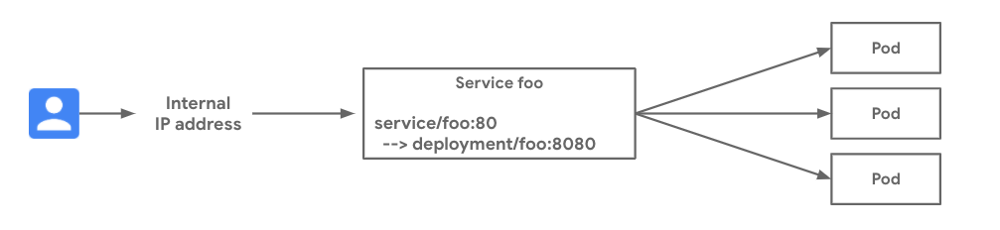

# Multi cluster service communication within same network

[Shared VPC](https://cloud.google.com/kubernetes-engine/docs/how-to/cluster-shared-vpc#managing_firewall_resources) Shared VPC enables multiple GKE clusters residing across different projects to be part of the same network. This enables different teams to manage their individual projects and communicate using the same shared VPC network centrally managed in the host project. Here we will look at how services residing across different clusters can communicate across cluster boundaries which are part of the same network.  

### Relevant documentation

- [Shared VPC Concepts](https://cloud.google.com/kubernetes-engine/docs/concepts/multi-cluster-services)
- [GCP Internal TCP load balancer](https://cloud.google.com/load-balancing/docs/internal)
- [Exposing kubernetes service via ILB](https://cloud.google.com/kubernetes-engine/docs/how-to/internal-load-balancing#create)

#### Versions

- GKE clusters on GCP
- 1.17 and later versions of GKE supported
- Tested and validated with v1.23.8-gke.1900 on Aug 23rd 2022

### Networking Scenario

This recipe demonstrates deploying a cluster (`gke-1`) and make it accessible to other cluster (`gke-2`) through Internal TCP/UDP Load Balancer. Both these clusters reside in the same network and for the sake of simplicity we will create them in the same project. The Services in gke-1 are exposed via an Internal Load Balancer on a private IP address in the network. The pods in gke-2 will be able to communicate with gke-1 services via the internal ip address as they belong to the same network. 




### Try it out

1. Download this repo and navigate to this folder

    ```sh
    $ git clone https://github.com/GoogleCloudPlatform/gke-networking-recipes.git
    Cloning into 'gke-networking-recipes'...

    $ cd gke-networking-recipes/services/multi-cluster/ilb
    ```

2. Deploy the two clusters `gke-1` and `gke-2` as specified in [cluster setup](../../../cluster-setup.md) . 
NOTE: Follow only steps 1-4 in the given link to create the cluster and set the context in kubectl client. Its not necessary to set up hub, MCS etc for communication
via ILB private IP address.

3. There is app.yaml kubernetes manifest file in this folder :

    - app.yaml is the manifest for the `whereami` Deployment and Service of type load balancer. It is also possible to specify the load balancer ip address belonging to subnet CIDR ranges to ensure a stable
    ip address endpoint for dependant services
  

4. Now set the context as `gke-1` and deploy the app.yaml manifest. 

    ```bash
    $ kubectl --context=gke-1 apply -f app.yaml
    namespace/multi-cluster-demo unchanged
    deployment.apps/whereami created
    service/whereami-ilb created

    # Shows that pod is running and happy
    $ kubectl --context=gke-1 get deploy -n multi-cluster-demo
    NAME              READY   UP-TO-DATE   AVAILABLE   AGE
    whereami          1/1     1            1           44m
    ```


5. Now describe the newly created service and note down the load balancer ip address.

    ```bash
    $ kubectl --context=gke-1 describe svc whereami-ilb -n multi-cluster-demo
        Name:                     whereami-ilb
        Namespace:                multi-cluster-demo1
        Labels:                   app=whereami-ilb
        Annotations:              cloud.google.com/load-balancer-type: Internal
                                cloud.google.com/neg: {"ingress":true}
        Selector:                 app=whereami
        Type:                     LoadBalancer
        IP Family Policy:         SingleStack
        IP Families:              IPv4
        IP:                       10.96.9.31
        IPs:                      10.96.9.31
        IP:                       10.138.1.20
        LoadBalancer Ingress:     10.138.1.20
        Port:                     http  80/TCP
        TargetPort:               8080/TCP
        NodePort:                 http  30782/TCP
        Endpoints:                10.92.3.21:8080
        Session Affinity:         None
    ```

The load balancer ip address created for the service is 10.138.1.20, which is based on the subnet CIDR range.

6. Now try to access the internal load balancer endpoint from `gke-2`. Pod in gke-2 will be able to access the service in gke-1 via the Internal Load balancer ip address. It is necessary to configure the firewalls to allow the gke-2 pod and subnet ip ranges to access the tcp ports for target instances in gke-1

    ```bash
    $kubectl --context=gke-2 run -ti --rm --restart=Never --image=radial/busyboxplus:curl shell-$RANDOM --  curl 10.138.1.20
    {"cluster_name":"gke-2","host_header":"10.138.1.20","metadata":"default-backend","node_name":"gke-gke-2-default-pool-8f72419f-zb6c.us-west1-a.c.kishorerjbloom.internal","pod_name":"whereami-6f467cb4d5-mvhpr","pod_name_emoji":"🇸🇪","project_id":"kishorerjbloom","timestamp":"2022-11-16T07:02:16","zone":"us-west1-a"}
    ```

    ```
7. Note: The load balancer internal ip address for the service will change if the service is destroyed and brought up again. Hence its recommended to specify the load balancer ip address as an additional attribute in the yaml to fix the endpoint address. This ip address should be within the range of the subnet in which the GKE cluster is created.
### Cleanup

```sh

kubectl --context=gke-1 delete -f app.yaml
```
