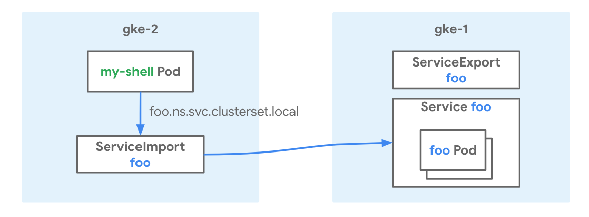
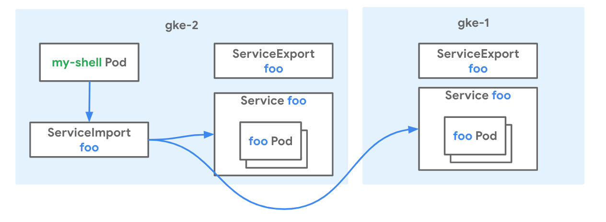

# Multi-cluster Services

[Multi-cluster Services](https://cloud.google.com/kubernetes-engine/docs/concepts/multi-cluster-services) for GKE enables existing Services to be discoverable and accessible across clusters with a virtual IP, matching the behavior of a [ClusterIP Service](https://cloud.google.com/kubernetes-engine/docs/concepts/service#services_of_type_clusterip)
accessible in a cluster.

### Use-cases

- High availability by running the same service across clusters
- Flexible migration between clusters

### Relevant documentation

- [Multi-cluster Services Concepts](https://cloud.google.com/kubernetes-engine/docs/concepts/multi-cluster-services)
- [Setting Up Multi-cluster Services](https://cloud.google.com/kubernetes-engine/docs/how-to/multi-cluster-services)
- [OSS Multi-cluster Services API](https://github.com/kubernetes/enhancements/tree/master/keps/sig-multicluster/1645-multi-cluster-services-api)

#### Versions

- GKE clusters on GCP
- 1.17 and later versions of GKE supported
- Tested and validated with 1.18.10-gke.1500 on Feb 15th 2021

### Networking Manifests

This recipe demonstrates deploying Multi-cluster Services in a cluster (`gke-1`) and make it accessible to other cluster (`gke-2`). The exported Services can be accessed via DNS name `$svc.$ns.svc.clusterset.local` or a VIP called `ClusterSetIP`. In later steps, it also demonstrates app migration to a new cluster (`gke-2`) by exporting the same Service from `gke-2`.



A Custom Resources (CRs) called `ServiceExport` is used to indicate a Service should be exported. When this CR is created, the Service with the same namespace and name in the cluster will be exported other clusters.

```yaml
apiVersion: net.gke.io/v1
kind: ServiceExport
metadata:
  name: whereami
  namespace: multi-cluster-demo
```

When Services are successfully exported, a CR called `ServiceImport` will be automatically created and Multi-cluster Services can be accessed via `$svc.$ns.svc.clusterset.local` or VIP specified in ServiceImport.

```yaml
apiVersion: net.gke.io/v1
kind: ServiceImport
metadata:
  name: whereami
  namespace: multi-cluster-demo
spec:
  ips:
  - 10.0.5.123
  type: ClusterSetIP
```

### Try it out

1. Download this repo and navigate to this folder

    ```bash
    $ git clone https://github.com/GoogleCloudPlatform/gke-networking-recipes.git
    Cloning into 'gke-networking-recipes'...

    $ cd gke-networking-recipes/services/multi-cluster/mcs-basic
    ```

2. Deploy the two clusters `gke-1` and `gke-2` as specified in [cluster setup](../../../cluster-setup.md)

3. Now follow the steps for cluster registration with Hub and enablement of Multi-cluster Services.

    There are two manifests in this folder:

    - app.yaml is the manifest for the `whereami` Deployment and Service.
    - export.yaml is the manifest for the `ServiceExport`, which will be deployed to indicate exporting service.

4. Now log into `gke-1` and deploy the app.yaml manifest. You can configure these contexts as shown [here](../../../cluster-setup.md).

    ```bash
    $ kubectl --context=gke-1 apply -f app.yaml
    namespace/multi-cluster-demo unchanged
    deployment.apps/whereami created
    service/whereami created

    # Shows that pod is running and happy
    $ kubectl --context=gke-1 get deploy -n multi-cluster-demo
    NAME              READY   UP-TO-DATE   AVAILABLE   AGE
    whereami          1/1     1            1           44m
    ```


5. Now create ServiceExport in export.yaml to export service to other cluster.

    ```bash
    $ kubectl --context=gke-1 apply -f export.yaml
    serviceexport.net.gke.io/whereami created
    ```

6. It can take up to 5 minutes to propagate endpoints when initially exporting Service from a cluster. Create the same Namespace in `gke-2` to indicate you want to import service, and inspect ServiceImport and Endpoints.

    ```bash
    $ kubectl --context=gke-2 create ns multi-cluster-demo
    namespace/multi-cluster-demo created
    
    # Shows that service is imported and ClusterSetIP is assigned.
    $ kubectl --context=gke-2 get serviceimport -nmulti-cluster-demo
    NAME       TYPE           IP              AGE
    whereami   ClusterSetIP   [10.124.4.24]   4m50s
    
    # Shows that endpoints are propagated.
    $ kubectl --context=gke-2 get endpoints -nmulti-cluster-demo
    NAME                 ENDPOINTS        AGE
    gke-mcs-7pqvt62non   10.16.4.7:8080   6m1s
    ```

7. Now use `whereami.multi-cluster-demo.svc.clusterset.local` or `ClusterSetIP` to access endpoint from `gke-2`.

    ```bash
    $kubectl --context=gke-2 run -ti --rm --restart=Never --image=radial/busyboxplus:curl shell-$RANDOM -- curl whereami.multi-cluster-demo.svc.clusterset.local | jq -r '.zone, .cluster_name, .pod_name'
    us-west1-a
    gke-1
    whereami-559545767b-xrd4h
    ```

Now to demonstrate how MCS can be used for cluster upgrade, let's simulate migration scenario. Assuming `gke-2` is the new cluster, you can deploy and export the same service from `gke-2` together from `gke-1`.



1. Deploy and export the same service in `gke-2`.

    ```bash
    $ kubectl --context=gke-2 apply -f app.yaml -f export.yaml
    namespace/multi-cluster-demo unchanged
    deployment.apps/whereami created
    service/whereami created
    serviceexport.net.gke.io/whereami created
    ```

2. It can take up to 5 minutes to propagate endpoints when initially exporting Service from a cluster. Inspect ServiceImport and Endpoints.

    ```bash
    # Shows that ServiceImport is not changed
    $ kubectl --context=gke-2 get serviceimport -nmulti-cluster-demo
    NAME       TYPE           IP              AGE
    whereami   ClusterSetIP   [10.124.4.24]   34m50s

    # Shows that endpoints now include endpoints from both clusters
    $ kubectl --context=gke-2 get endpoints -nmulti-cluster-demo
    NAME                 ENDPOINTS                        AGE
    gke-mcs-7pqvt62non   10.16.4.7:8080,10.60.2.11:8080   36m
    whereami             10.60.2.11:8080                  3m41s
    ```  

3. Accessing service using `whereami.multi-cluster-demo.svc.clusterset.local`, you can see you get response from pods in both clusters.

    ```bash
    $ for i in {1..5}
    $ do
    $ kubectl --context=gke-2 run -ti --rm --restart=Never --image=radial/busyboxplus:curl shell-$RANDOM -- curl whereami.multi-cluster-demo.svc.clusterset.local | jq -r '.zone, .cluster_name, .pod_name'
    $ done
    us-east1-b
    gke-2
    whereami-559545767b-v8mmg
    
    us-west1-a
    gke-1
    whereami-559545767b-xrd4h
    
    us-east1-b
    gke-2
    whereami-559545767b-v8mmg
    
    us-east1-b
    gke-2
    whereami-559545767b-v8mmg
    
    us-west1-a
    gke-1
    whereami-559545767b-xrd4h
    ```

4. Now assume migragtion is done, stop exporting service from old cluster `gke-1` by deleting `ServiceExport`.

    ```bash
    $ kubectl --context=gke-1 delete serviceexport whereami -nmulti-cluster-demo
    serviceexport.net.gke.io "whereami" deleted

    # Service is now only exported from gke-2
    $ kubectl --context=gke-1 get endpoints -nmulti-cluster-demo
    NAME                 ENDPOINTS         AGE
    gke-mcs-7pqvt62non   10.60.2.11:8080   49m
    whereami             10.16.4.7:8080    56m
    ```

### Cleanup

```bash

kubectl --context=gke-1 delete -f app.yaml
kubectl --context=gke-2 delete -f app.yaml -f export.yaml
```
