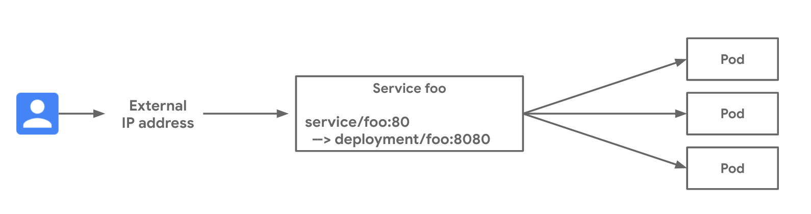

# External LoadBalancer Service

External Network Load Balancing on GKE deploys a regional TCP/UDP load balancer for public internet load balancing.  This example deploys an application on GKE and exposes the application with an external load balanced IP address.  See the [external-lb-service.yaml](external-lb-service.yaml) manifest for the full deployment spec.

### Use cases

- Public exposure of a GKE application on the internet
- Generic TCP or UDP load balancing for one or more Services

### Relevant documentation

- [Services of type LoadBalancer](https://cloud.google.com/kubernetes-engine/docs/concepts/service#services_of_type_loadbalancer)
- [Creating a Service of type LoadBalancer](https://cloud.google.com/kubernetes-engine/docs/how-to/exposing-apps#creating_a_service_of_type_loadbalancer)

#### Versions

- All suppported GKE versions



### Networking Manifests

In this example a Service matches TCP traffic destined to port 80 and load balances across pods from the `foo` Deployment on TCP port 8080.  Key aspects of this manifest include:

- The `type: LoadBalancer` designation is what causes GKE to create an external TCP/UDP Network Load Balancer for this Service.
- The `spec.ports.port` defines to port the external network load balancer will listen on, whereas the `spec.ports.targetPort` defines the port the pods in the Deployment will listen on.

```yaml
apiVersion: v1
kind: Service
metadata:
  name: foo
spec:
  ports:
  - port: 80
    targetPort: 8080
    name: http 
  selector:
    app: foo
  type: LoadBalancer
```

### Try it out

1. Download this repo and navigate to this folder.

```bash
$ git clone git@github.com:GoogleCloudPlatform/gke-networking-recipes.git
Cloning into 'gke-networking-recipes'...

$ cd gke-networking-recipes/services/external-lb-service
```

2. Deploy the Deployment and Service resources in the [external-lb-service.yaml](external-lb-service.yaml) manifest.

```bash
$ kubectl apply -f external-lb-service.yaml
service/foo created
deployment.apps/foo created
```

3. It may take up to a minute for the pods to deploy and up to a few minutes for the external IP address of the Service resource to be ready.  Validate their progress and make sure that no errors are surfaced in the resource events.

```bash
$ kubectl get deploy foo
NAME   READY   UP-TO-DATE   AVAILABLE   AGE
foo    3/3     3            3           6m19s

$ kubectl describe svc foo
Name:                     foo
Namespace:                default
Labels:                   <none>
Annotations:              cloud.google.com/neg: {"ingress":true}
Selector:                 app=foo
Type:                     LoadBalancer
IP:                       10.0.8.82
LoadBalancer Ingress:     34.105.93.145
Port:                     http  80/TCP
TargetPort:               8080/TCP
NodePort:                 http  32374/TCP
Endpoints:                10.8.0.6:8080,10.8.1.5:8080,10.8.2.6:8080
Session Affinity:         None
External Traffic Policy:  Cluster
Events:
  Type    Reason                Age    From                Message
  ----    ------                ----   ----                -------
  Normal  EnsuringLoadBalancer  6m44s  service-controller  Ensuring load balancer
  Normal  EnsuredLoadBalancer   6m5s   service-controller  Ensured load balancer
  Normal  UpdatedLoadBalancer   6m3s   service-controller  Updated load balancer with new hosts
```

4. Finally, we can validate the Service is accessible from the Internet by sending traffic to the VIP address.

```bash
$ curl -s 34.105.93.145 | jq ''
{
  "cluster_name": "gke-1",                                                                                                                                                     
  "host_header": "34.105.93.145",                                                                                                                                              
  "node_name": "gke-gke-1-default-pool-b289d5d6-jmbw.c.zachseils-gke-1.internal",                                                                                              
  "pod_name": "foo-66d75b5644-n98z4",                                                                                                                                          
  "pod_name_emoji": "🧖🏿‍♀",                                                                                                                                                   
  "project_id": "zachseils-gke-1",                                                                                                                                             
  "timestamp": "2020-08-28T13:48:31",                                                                                                                                          
  "zone": "us-west1-a"                                                                                                                                                         
}
```

### Cleanup

```bash
$ kubectl delete -f external-lb-service.yaml 
service "foo" deleted
deployment.apps "foo" deleted
``` 
